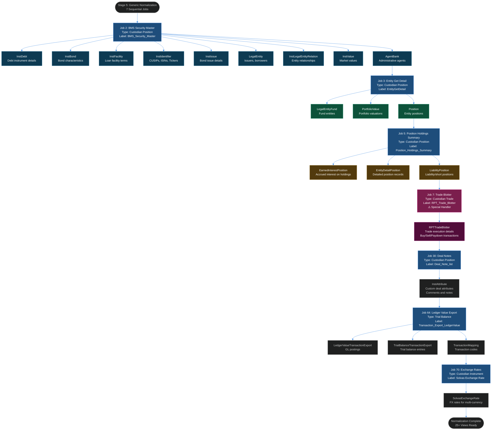
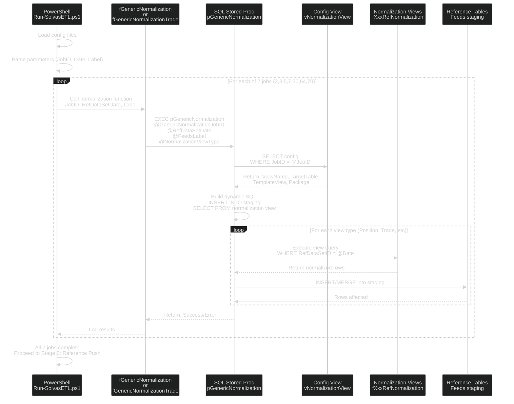

# Solvas ETL Pipeline - Complete Process Documentation

**Created:** 2026-07-06  
**Purpose:** Comprehensive documentation of the Solvas Portfolio data import and processing pipeline  
**Related:** PowerBI-ETL-Monitoring-Dashboard-Plan.md

---

## Overview

The Solvas ETL Pipeline is a comprehensive data integration process that extracts portfolio, trade, and reference data from the Solvas Portfolio system and loads it into the Siepe database architecture (Feeds → Reference → Core). The pipeline processes 45+ CSV files through multiple transformation stages before making the data available for portfolio analytics and calculations.

**Pipeline Stages:**
1. **Initialization** - Load config, parse parameters, setup logging
2. **Extraction** - 45+ CSV files extracted in parallel from Solvas
3. **Cleanup** - Remove carriage returns from comment fields
4. **Import** - 45 sequential jobs load CSV → Feeds staging tables
5. **Normalization** - **7 jobs transform staging → 25+ normalized views** _(see detailed breakdown in Stage 5)_
6. **Reference Push** - 13 push operations move master data to Reference DB
7. **Core Push** - Positions and trades loaded to Core DB
8. **SSIS Processing** - Structured payments and valuations
9. **Portal Calculations** - HTTP API triggers portfolio analytics

**Key Innovation:** The normalization layer (Stage 5) serves as the critical transformation engine, converting Solvas-native data structures into standardized Siepe reference views that can be consumed by downstream systems.

---

## Pipeline Architecture

```mermaid
%%{init: {'theme':'dark', 'themeVariables': { 'primaryColor':'#1e3a5f','primaryTextColor':'#ffffff','primaryBorderColor':'#4a90e2','lineColor':'#4a90e2','secondaryColor':'#2c5282','tertiaryColor':'#1a202c','fontFamily':'Arial','fontSize':'14px'}}}%%
flowchart TD
    Start([Start: Solvas ETL Pipeline]) --> Init[Load Config Files & Create Log]
    Init --> Params{Payload<br/>Received?}
    
    Params -->|Yes: CoreFundID| GetFund[Query Specific<br/>Portfolio IDs]
    Params -->|No| AllFunds[Process All<br/>Portfolios -1]
    
    GetFund --> DateCheck{StartDate<br/>Provided?}
    AllFunds --> DateCheck
    
    DateCheck -->|No| GetDate[Get Previous<br/>Business Day]
    DateCheck -->|Yes| UseDate[Use Provided<br/>StartDate]
    
    GetDate --> Setup[Setup Paths &<br/>Extract Job IDs]
    UseDate --> Setup
    
    Setup --> DateLoop{For Each<br/>Date in Range}
    
    DateLoop --> Extract[Run Parallel Extracts<br/>from Solvas<br/>45+ CSV Files]
    
    Extract --> Cleanup[Clean CSV Files<br/>Remove Carriage Returns<br/>from Comment Columns]
    
    Cleanup --> Import[Generic Import Jobs<br/>45 Sequential Jobs<br/>CSV → Feeds Staging Tables]
    
    Import --> Normalize[🔍 Generic Normalization<br/>7 Jobs → 25+ Views<br/>Staging → Normalized Format<br/>📊 See Detailed Breakdown Below]
    
    Normalize --> RefData[Push Reference Data<br/>to Reference DB]
    
    RefData --> RefEntity[LegalEntity]
    RefEntity --> RefInst[Instrument]
    RefInst --> RefIdent[InstIdentifier]
    RefIdent --> RefDebt[InstDebt]
    RefDebt --> RefIssue[InstIssue]
    RefIssue --> RefContract[InstContract]
    RefContract --> RefCash[InstCashflow]
    RefCash --> RefAmort[InstAmortSchedule]
    RefAmort --> RefRating[InstRating]
    RefRating --> RefDefault[InstDefault]
    RefDefault --> RefIssRating[IssuerRating]
    RefIssRating --> RefIndustry[IssuerIndustry]
    RefIndustry --> RefAttrib[InstAttributes]
    
    RefAttrib --> CoreData[Push Transactional Data<br/>to Core DB]
    
    CoreData --> Position[Position<br/>Reference → Core]
    Position --> Trade[Trade<br/>Reference → Core]
    
    Trade --> SSIS1[SSIS: PushInstStructuredPayment]
    SSIS1 --> SSIS2[SSIS: PushInstValue]
    
    SSIS2 --> Portal[Run Portal Calculations<br/>HTTP API Call]
    
    Portal --> NextDate{More<br/>Dates?}
    NextDate -->|Yes| DateLoop
    NextDate -->|No| End([End: ETL Complete])
    
    style Extract fill:#0d4f6e,stroke:#4a90e2,color:#ffffff
    style Import fill:#6e4a0d,stroke:#e2a04a,color:#ffffff
    style Normalize fill:#6e0d4f,stroke:#e24aa0,color:#ffffff
    style RefData fill:#0d6e1a,stroke:#4ae25f,color:#ffffff
    style CoreData fill:#6e1a0d,stroke:#e25f4a,color:#ffffff
    style Portal fill:#4f0d6e,stroke:#a04ae2,color:#ffffff
```



---

## Detailed Process Stages

### Stage 1: Initialization & Configuration

**Script Location:** PowerShell wrapper script (location varies by environment)

**Configuration Files Loaded:**
- `ConnectionStrings.config.ps1` - Database connection strings
- `IOFunctions.ps1` - Input/Output utility functions
- `DirLocations.Config.ps1` - Directory paths
- `fGenericImportJob.ps1` - Import job framework
- `fGenericNormalization.ps1` - Asset normalization functions
- `fGenericNormalizationTrade.ps1` - Trade normalization functions
- `fGetDataFromFile.ps1` - File reading utilities
- `fGenericPush.ps1` - Position push functions
- `fGenericPushTrade.ps1` - Trade push functions
- `TransformConfigurationFunctions_Internal.ps1` - Transformation logic
- `TransformConfigurationHelper.ps1` - Helper utilities
- `fGenericPushReferenceData.ps1` - Reference data push functions
- `RunPortalCalcWithStatus.ps1` - Portal calculation wrapper
- `fFileCleanUp.ps1` - CSV cleanup functions
- `fRunParallelExtracts.ps1` - Parallel extraction framework

**Parameters Accepted:**
- `CoreFundID` - Specific fund to process (optional)
- `StartDate` - Start date for processing (optional, defaults to previous business day)
- `Type` - Processing type indicator (optional)

**Actions:**
1. Create log folder if not exists: `$dirLogFolder`
2. Generate timestamped log file: `$PSScriptName.yyyyMMddTHHmmss.txt`
3. Parse input parameters or use defaults
4. Query portfolio IDs if specific fund provided
5. Calculate date range if not provided

---

### Stage 2: Data Extraction from Solvas

**Source System:** Solvas Portfolio Management System

**Extract Method:** Parallel execution via `fRunParallelExtracts`

**Extract Configuration:**
```sql
-- Extract IDs retrieved from:
SELECT ExtractID 
FROM Feeds.solvas_am.vJobExtract 
WHERE Job_Name = 'ExtractImport' 
  AND RefRecStatusID = 1
```

**Output Location:** Retrieved from `Feeds.dbo.vGenericImportJob`
```sql
SELECT TOP 1 SourceFolder, ArchiveLocation 
FROM Feeds.dbo.vGenericImportJob 
WHERE SchemaName = 'Solvas' 
  AND RefRecStatusID = 1 
  AND TableName = 'tBMSSecurityMaster'
```

**CSV Files Extracted (45+ files):**
- `solvas_am RPT_Trade_Blotter_*.csv` - Trade blotter data
- `solvas_am Facility_*.csv` - Facility/loan information
- `solvas_am Facility_Spread_*.csv` - Facility spread data
- `solvas_am Facility_get_*.csv` - Facility details
- `solvas_am Loan_interest_rate_history_list_*.csv` - Loan rate history
- `solvas_am Issue_interest_rate_history_list_*.csv` - Issue rate history
- `solvas_am BMS_Active_Contracts_*.csv` - Active contracts
- `solvas_am Issue_get_*.csv` - Issue details
- `solvas_am tBMSSecurityMaster_*.csv` - Security master data
- `solvas_am Transaction_*.csv` - Transaction data for GL
- `solvas_am TransactionExtractFull_*.csv` - Full transaction extract
- `solvas_am RPT_Cash_Transaction_Detail_*.csv` - Cash transaction details
- `solvas_am Expected_Transactions_*.csv` - Expected transaction reconciliation
- `solvas_am Transaction_Export_*.csv` - Transaction export for ledger
- Plus 31+ additional extract files

---

### Stage 3: CSV File Cleanup

**Purpose:** Remove carriage returns from comment/text fields that break CSV parsing

**Files Cleaned:**

#### Trade Blotter (`solvas_am RPT_Trade_Blotter*.csv`)
- Column 59: `counterparty_contact`
- Column 61: `settlement_instructions`

#### Facility Files (`solvas_am Facility *.csv`)
- Column 21: `facility_comments`

#### Facility Spread (`solvas_am Facility_Spread*.csv`)
- Column 14: `Comments`
- Column 33: `fs_comments`

#### Facility Get (`solvas_am Facility_get *.csv`)
- Column 42: `comments`
- Column 92: `facility_comments`

#### Loan Interest Rate History (`solvas_am Loan_interest_rate_history_list*.csv`)
- Column 16: `comments`
- Column 25: `interest_comments`

#### Issue Interest Rate History (`solvas_am Issue_interest_rate_history_list*.csv`)
- Column 18: `comments`
- Column 24: `interest_comments`

#### BMS Active Contracts (`solvas_am BMS_Active_Contracts*.csv`)
- Column 27: `Contract_Notes`

#### Issue Get (`solvas_am Issue_get*.csv`)
- Column 60: `Comments`

**Cleanup Function:** `fFileCleanUp $DirSourceFolder $worksheetNumber $columnNumber $isExcel $LogFile`

---

### Stage 4: Generic Import Jobs

**Target Database:** `Feeds`  
**Target Schema:** `solvas_am`  
**Number of Jobs:** 45

**Generic Import Job IDs:**
```
7, 1022, 2027, 2030, 2032, 2033, 2174, 2065, 2080, 2081, 2083, 2095, 
2109, 2115, 2117, 2138, 2139, 2162, 2165, 2168, 2169, 2170, 2176, 2190, 
2193, 2195, 2202, 2203, 2206, 2207, 2209, 2210, 2214, 2215, 2219, 2235, 
2237, 2238, 2243, 2244, 2245, 13, 2277, 2351, 2357
```

**Target Staging Tables (examples):**
- `Feeds.solvas_am.tBMSSecurityMaster`
- `Feeds.solvas_am.tRPT_Trade_Blotter`
- `Feeds.solvas_am.tFacility`
- `Feeds.solvas_am.tFacility_Spread`
- `Feeds.solvas_am.tFacility_get`
- `Feeds.solvas_am.tLoan_interest_rate_history_list`
- `Feeds.solvas_am.tIssue_interest_rate_history_list`
- `Feeds.solvas_am.tBMS_Active_Contracts`
- `Feeds.solvas_am.tIssue_get`
- Plus 36+ additional staging tables

**Process:** `fGenericImportJob $GenericImportJobID -pDirSourceFolder $ExportPath -pRefDataSetDate $null -pLabel $FeedsLabel -pLogFile $LogFile -pFileName $null -pDirArchiveFolder $ArchiveFolder ([Ref]$ReturnDate)`

**Output:** `$ReturnDate` variable set with RefDataSetDate for downstream processing

**Archive:** Processed files moved to `$ArchiveFolder\$strDateNow`

---

### Stage 5: Generic Normalization - DEEP DIVE

**Purpose:** Transform raw staging data from Solvas format into standardized Siepe reference format for downstream consumption

**Server:** `mos-sql-p.mos.siepe.local,52155`  
**Database:** `Feeds`  
**Schema:** `Solvas`

**Total Jobs:** 7 normalization jobs executing sequentially  
**Total Output Views:** 25+ normalized reference views

---

#### Normalization Architecture Diagram



---

#### Job 2: BMS Security Master Normalization

**Job Type:** Custodian Position  
**Feeds Label:** `BMS_Security_Master`  
**Source Staging Table:** `Feeds.Solvas.tBMSSecurityMaster` (CSV imported from Solvas)  
**Handler:** `fGenericNormalization` (standard)

**Purpose:** Normalize the comprehensive security master file from Solvas into multiple reference views for instruments, issuers, identifiers, and relationships.

**Output Views (9):**

1. **`vBMSSecurityMasterInstDebtRefNormalization`**
   - Debt instrument characteristics (seniority, collateral status, covenant details)
   - Maps Solvas debt types to Siepe instrument hierarchy
   - Prepares data for `Reference.dbo.tInstDebt`

2. **`vBMSSecurityMasterInstBondRefNormalization`**
   - Bond-specific attributes (coupon, maturity, call features)
   - Issue-level bond details
   - Feeds `Reference.dbo.tInstBond`

3. **`vBMSSecurityMasterInstFacilityRefNormalization`**
   - Loan facility details (commitment amounts, spread, pricing terms)
   - Facility-level characteristics for syndicated loans
   - Target: `Reference.dbo.tInstFacility`

4. **`vBMSSecurityMasterInstIdentifierRefNormalization`**
   - Security identifiers: CUSIP, ISIN, Bloomberg Ticker, Sedol
   - Cross-reference mapping for security lookup
   - Populates `Reference.dbo.tInstIdentifier`

5. **`vBMSSecurityMasterInstIssueRefNormalization`**
   - Issue-level data (original issue date, issue size, terms)
   - Structured product issue details
   - Feeds `Reference.dbo.tInstIssue`

6. **`vBMSSecurityMasterLegalEntityRefNormalization`**
   - Issuer and borrower legal entity records
   - Entity hierarchy and classifications
   - Maps to `Reference.dbo.tLegalEntity`

7. **`vBMSSecurityMasterInstLegalEntityRelationRefNormalization`**
   - Relationships: Issuer-to-Instrument, Guarantor-to-Debt
   - Parent-subsidiary relationships
   - Target: `Reference.dbo.tInstLegalEntityRelation`

8. **`vBMSSecurityMasterInstValueRefNormalization`**
   - Market value snapshots from Solvas pricing
   - Reference prices for valuation
   - Loads to `Reference.dbo.tInstValue`

9. **`vBMSSecurityMasterAgentBankRefNormalization`**
   - Administrative agent bank relationships
   - Loan servicing entity mappings
   - Feeds `Reference.dbo.tAgentBank`

**Key Transformations:**
- Solvas instrument types → Siepe instrument type taxonomy
- Solvas entity IDs → Siepe LegalEntity ID mapping
- Currency code standardization (Solvas → ISO codes)
- Date format conversions (Solvas → SQL datetime)
- Decimal precision normalization (Solvas % → decimal factors)

---

#### Job 3: Entity Get Detail Normalization

**Job Type:** Custodian Position  
**Feeds Label:** `EntityGetDetail`  
**Source Staging Table:** `Feeds.Solvas.tEntityGetDetail`  
**Handler:** `fGenericNormalization` (standard)

**Purpose:** Normalize fund entity hierarchies and portfolio structures from Solvas entity management system.

**Output Views (3):**

1. **`vEntityDetailLegalEntityFundRefNormalization`**
   - Fund-level legal entity records
   - Portfolio hierarchy (fund → sub-fund → account)
   - Entity classification codes
   - Target: `Reference.dbo.tLegalEntity` (fund entities)

2. **`vEntityDetailPortfolioValueRefNormalization`**
   - Portfolio-level NAV and valuation metrics
   - Fund value snapshots by date
   - AUM calculations
   - Feeds `Reference.dbo.tPortfolioValue`

3. **`vEntityDetailPositionRefNormalization`**
   - Entity-level position holdings
   - Portfolio composition by security
   - Position-to-entity linkage
   - Target: `Reference.dbo.tPosition` (entity view)

**Key Transformations:**
- Solvas entity hierarchy → Siepe legal entity structure
- Portfolio ID mapping across systems
- Entity status codes (active/inactive/closed)
- Fund type classification

---

#### Job 5: Position Holdings Summary Normalization

**Job Type:** Custodian Position  
**Feeds Label:** `Position_Holdings_Summary`  
**Source Staging Table:** `Feeds.Solvas.tPositionHoldingsSummary`  
**Handler:** `fGenericNormalization` (single portfolio mode)  
**Special Flag:** `pIsSinglePortfolioLoad = 1`

**Purpose:** Transform position-level holdings data including lot details, cost basis, and accrued income.

**Output Views (3):**

1. **`vEarnedInterestPositionRefNormalization`**
   - Accrued interest on bond and loan positions
   - Interest income calculations by position
   - Earned but unpaid interest tracking
   - Target: `Reference.dbo.tAccruedInterest`

2. **`vEntityDetailPositionRefNormalization`**
   - Detailed position records with lot-level breakdowns
   - Cost basis tracking (FIFO, specific lot)
   - Quantity, market value, unrealized gain/loss
   - Primary feed for `Reference.dbo.tPosition`

3. **`vLiabilityPositionRefNormalization`**
   - Short positions and liabilities
   - Borrowing records for short sales
   - Negative position balances
   - Feeds `Reference.dbo.tPosition` (liability side)

**Key Transformations:**
- Quantity unit conversions (par, shares, contracts)
- Cost basis calculations (total cost → per-unit)
- Accrued interest calculations (days accrued, rate, principal)
- Position status codes (open, closed, pending settlement)

---

#### Job 7: Trade Blotter Normalization ⚠️

**Job Type:** Custodian Trade  
**Feeds Label:** `RPT_Trade_Blotter`  
**Source Staging Table:** `Feeds.Solvas.tRPTTradeBlotter` (77+ columns)  
**Handler:** `fGenericNormalizationTrade` (**Special trade handler**)  
**Special Flag:** `pIsSinglePortfolioLoad = 1`

**Purpose:** Normalize complex trade execution data including purchases, sales, paydowns, restructurings, and settlement details.

**Output View (1):**

1. **`vRPTTradeBlotterRefNormalization`**
   - Trade execution details (buy, sell, paydown, restructure)
   - Settlement instructions and counterparty info
   - Trade economics (price, accrued interest, fees, net amount)
   - Commission and fee breakdowns
   - Trade identifiers and cross-references
   - Target: `Reference.dbo.tTrade`

**Source Data Fields (77 columns including):**
- Trade identifiers: Trade ID, Trade Code, Allocation ID
- Parties: Counterparty, Trader, Administrative Agent
- Instruments: Issuer/Borrower Name, Security/Facility Name, Asset Type
- Identifiers: CUSIP, ISIN, Bloomberg ID (Issue Identifier 1-3)
- Dates: Trade Date, Settlement Date, Maturity Date, Ready Date
- Trade Type: Buy, Sell, Paydown, Restructure, Market Trade Type
- Economics:
  - Trade Par/Qty/Commitment ($)
  - Gross Trade Price (%)
  - Effective Trade Price (%)
  - Principal Amount ($)
  - Accrued Interest Amount ($)
  - Assignment Fee ($)
  - Upfront Fee ($)
  - Net Economic Benefit ($)
- Settlement: Settlement Instructions, Settlement Agent

**Key Transformations:**
- Trade type mapping: Solvas trade codes → Siepe trade type taxonomy
- Price conversions: Percentage prices → dollar prices
- Fee aggregations: Multiple fee types → total transaction cost
- Accrued interest calculations: Validate and standardize
- Settlement status: Trade date → expected settlement → actual settlement
- Currency: Trade currency normalization

**Why Special Handler?**
- Complex multi-party trade data (buyer, seller, agent)
- Fee calculations and allocations
- Settlement workflow tracking
- Trade matching and allocation logic
- Counterparty relationship handling

---

#### Job 30: Deal Note List Normalization

**Job Type:** Custodian Position  
**Feeds Label:** `Deal_Note_list`  
**Source Staging Table:** `Feeds.Solvas.tDeal_Note_list`  
**Handler:** `fGenericNormalization` (standard)

**Purpose:** Extract and normalize custom attributes, deal notes, comments, and metadata associated with instruments and facilities.

**Output View (1):**

1. **`vAccruedInterestdetInstAttributeRefNormalization`**
   - Custom instrument attributes from deal notes
   - Covenant details and restrictions
   - Commentary and analyst notes
   - Prepares data for `Reference.dbo.tInstAttribute`

**Key Transformations:**
- Attribute name standardization
- Comment field sanitization (remove line breaks, special chars)
- Attribute type classification (text, date, numeric, boolean)
- Attribute-to-instrument linkage

---

#### Job 64: Transaction Export Ledger Value Normalization

**Job Type:** Trial Balance  
**Feeds Label:** `Transaction_Export_LedgerValue`

**CSV Files Extracted:**
- `solvas_am Transaction_*.csv` → `tTransaction` table
- `solvas_am TransactionExtractFull_*.csv` → `tTransactionExtractFull` table
- `solvas_am RPT_Cash_Transaction_Detail_*.csv` → `tRPTCashTransactionDetail` table
- `solvas_am Expected_Transactions_*.csv` → `tExpectedTransactions` table
- `solvas_am Transaction_Export_*.csv` → `tTransaction_Export` table

**Source Folders:**
- `\\mos.siepe.local\SHARED\CLIENTS\998\MOS\PROD\Solvas\Solvas Portfolio\Transaction`
- `\\mos.siepe.local\SHARED\CLIENTS\998\MOS\PROD\Solvas\Solvas Portfolio\Transaction\TransactionExtractFull`
- `\\mos.siepe.local\shared\CLIENTS\998\MOS\PROD\Solvas\SolvasPortfolioExtracts`
- `\\mos.siepe.local\SHARED\CLIENTS\998\MOS\PROD\Solvas\SolvasPortfolioExtracts\Transactions`

**Source Staging Tables:** 
- `Feeds.Solvas.tTransaction` (Import Job ID: 2211)
- `Feeds.Solvas.tTransactionExtractFull` (Import Job ID: 2224)
- `Feeds.Solvas.tRPTCashTransactionDetail` (Import Job IDs: 2206, 2207)
- `Feeds.Solvas.tExpectedTransactions` (Import Job ID: 2124)
- `Feeds.Solvas.tTransaction_Export` (Import Job ID: 2132)

**Handler:** `fGenericNormalization` (standard)

**Purpose:** Normalize transaction-level data for general ledger posting, trial balance reconciliation, and cash movement tracking.

**Output Views (3):**

1. **`vLedgerValueTransactionExportRefNormalization`**
   - GL-ready transaction records
   - Debit/credit postings by account
   - Transaction classification codes
   - Target: `Core.dbo.tGLTransaction` (via Reference)

2. **`vTrialBalanceTransactionExportRefNormalization`**
   - Trial balance summary by account
   - Period-end balances
   - Balance sheet and income statement line items
   - Feeds `Core.dbo.tTrialBalance`

3. **`vTransactionMappingRefNormalization`**
   - Transaction type mapping codes
   - Chart of accounts cross-reference
   - Solvas transaction codes → Siepe GL codes
   - Lookup table for transaction categorization

**Key Transformations:**
- Transaction type mapping (Solvas → Siepe GL codes)
- Debit/credit determination based on transaction nature
- Account number standardization
- Transaction date vs. posting date handling
- Multi-currency transaction conversion

---

#### Job 70: Solvas Exchange Rate Normalization

**Job Type:** Custodian Instrument  
**Feeds Label:** `Solvas Exchange Rate`  
**Source Staging Table:** `Feeds.Solvas.tSolvasExchangeRates`  
**Handler:** `fGenericNormalization` (standard)

**Purpose:** Normalize foreign exchange rates for multi-currency portfolio valuation and reporting.

**Output Views (2):**

1. **`vSolvasExchangeRatesCurrent`** (via normalization framework)
   - Current exchange rates by currency pair
   - Spot rates for valuation
   - Target: `Reference.dbo.tExchangeRate`

2. **`vSolvasExchangeRatesRaw`** (historical view)
   - Historical FX rate series
   - Rate change tracking
   - Time-series analysis support

**Key Transformations:**
- Currency pair standardization (from/to currency codes)
- Rate direction (USD/EUR vs EUR/USD)
- Rate type classification (spot, forward, average)
- Effective date and validity period handling

---

#### Normalization Execution Summary

**Sequential Processing Order:**
```
Job 2 (BMS Security) → Job 3 (Entity Detail) → Job 5 (Position Holdings) → 
Job 7 (Trade Blotter) → Job 30 (Deal Notes) → Job 64 (Ledger Transactions) → 
Job 70 (Exchange Rates)
```

**Total Processing:**
- **Input:** 45+ CSV staging tables (from Stage 4 import)
- **Processing:** 7 normalization jobs
- **Output:** 25+ normalized reference views
- **Target Schemas:** All views in `Feeds.Solvas` schema with `RefNormalization` suffix

**Normalization Functions:**
- **Standard:** `fGenericNormalization` - Used by Jobs 2, 3, 30, 64, 70
- **Trade Specialized:** `fGenericNormalizationTrade` - Used by Job 7 (trade-specific logic)
- **Single Portfolio Mode:** Jobs 5 and 7 use `pIsSinglePortfolioLoad = 1` for portfolio-specific processing

**PowerShell Execution Examples:**

```powershell
# Standard Normalization (Jobs 2, 3, 30, 64, 70)
fGenericNormalization -pGenericNormalizationJobID $GenericNormalizeID `
    -pRefDatasetDate $ReturnDate `
    -pLogFile $LogFile `
    -pScriptName $null `
    -pLabel $DataSetLabel

# Position Normalization with Single Portfolio (Job 5)
fGenericNormalization -pGenericNormalizationJobID 5 `
    -pRefDatasetDate $ReturnDate `
    -pLogFile $LogFile `
    -pScriptName $null `
    -pLabel $DataSetLabel `
    -pIsSinglePortfolioLoad 1

# Trade Normalization with Special Handler (Job 7)
fGenericNormalizationTrade 7 `
    -pRefDatasetDate $ReturnDate `
    -pLogFile $LogFile `
    -pScriptName $null `
    -pLabel $DataSetLabel `
    -pIsSinglePortfolioLoad 1
```

**Key Design Principles:**
1. **View-Based Architecture:** All normalized data accessible via SQL views, no direct table updates
2. **RefDataSetID Tracking:** Each normalization tied to specific extract date via RefDataSetID
3. **Label-Based Filtering:** Labels enable multi-source and multi-portfolio processing
4. **Idempotent:** Re-running normalization with same RefDataSetID produces consistent results
5. **Separation of Concerns:** Security master separate from positions separate from trades

---

#### Normalization Execution: Procedures & Scripts

**Primary Stored Procedure:** `Feeds.dbo.pGenericNormalization`

**Location:** `mos-sql-p.mos.siepe.local,52155` → `Feeds` database  
**Type:** SQL Server Stored Procedure (7,968 characters)  
**Purpose:** Universal normalization engine that executes configured view-to-table mappings

**Procedure Parameters:**
```sql
EXEC [Feeds].[dbo].[pGenericNormalization]
    @GenericNormalizationJobID INT,        -- Job ID (2, 3, 5, 7, 30, 64, 70)
    @FeedsRefDatasource NVARCHAR(50),      -- Source name (e.g., 'Solvas')
    @FeedsRefDataSetType NVARCHAR(50),     -- Type (e.g., 'Position', 'Trade')
    @FeedsLabel NVARCHAR(50),              -- Label (e.g., 'BMS_Security_Master')
    @RefDataSetDate DATETIME,              -- Effective date for normalization
    @NormalizationViewType NVARCHAR(50)    -- View type (e.g., 'Position', 'Trade')
```

**How It Works:**
1. **Lookup Configuration:** Queries `dbo.vNormalizationView` to get job configuration
2. **Dynamic SQL Generation:** Builds INSERT/MERGE statements based on configuration
3. **Column Mapping:** Compares source view columns to target template columns
4. **Execute Normalization:** Runs view queries and inserts into Reference staging tables
5. **Error Handling:** Logs errors and provides detailed failure information

**Normalization Packages (SSIS Integration):**

Each job is associated with a normalization package that determines processing logic:

| Package Name | Used By Jobs | Purpose |
|--------------|--------------|---------|
| **NormalizeGenericPosition** | Jobs 2, 3, 5, 30 | Standard position/instrument normalization |
| **NormalizeGenericTrade** | Job 7 | Trade-specific normalization with special handling |
| **NormalizeGenericTrialBalance** | Job 64 | Trial balance and GL transaction normalization |
| **NormalizeGenericInstrument** | Job 70 | Instrument reference data (FX rates) normalization |

---

#### PowerShell Orchestration Scripts

**Main ETL Wrapper Script:** `{EnvironmentPath}\SolvasETL\Run-SolvasETL.ps1` (location varies)

**Configuration Files Referenced:**
- `ConnectionStrings.config.ps1` - Database connection strings
- `fGenericNormalization.ps1` - **Asset/Position normalization function**
- `fGenericNormalizationTrade.ps1` - **Trade normalization function**
- `fGenericImportJob.ps1` - CSV import orchestration
- `fGenericPush.ps1` - Position push to Core
- `fGenericPushTrade.ps1` - Trade push to Core
- `fGenericPushReferenceData.ps1` - Reference data push

**PowerShell Normalization Functions:**

**1. Standard Normalization Function** (`fGenericNormalization`)
```powershell
function fGenericNormalization {
    param(
        [int]$pGenericNormalizationJobID,      # Job ID (2, 3, 5, 30, 64, 70)
        [datetime]$pRefDatasetDate,             # Extract date
        [string]$pLogFile,                      # Log file path
        [string]$pScriptName,                   # Script name for logging
        [string]$pLabel,                        # Data set label
        [int]$pIsSinglePortfolioLoad = 0        # Single portfolio flag
    )
    
    # Calls SQL: EXEC Feeds.dbo.pGenericNormalization
    # Iterates through all NormalizationViewTypes for the job
    # Logs progress and errors
}
```

**Used by:** Jobs 2, 3, 5, 30, 64, 70

**2. Trade Normalization Function** (`fGenericNormalizationTrade`)
```powershell
function fGenericNormalizationTrade {
    param(
        [int]$pGenericNormalizationJobID = 7,  # Always Job 7
        [datetime]$pRefDatasetDate,
        [string]$pLogFile,
        [string]$pScriptName,
        [string]$pLabel,
        [int]$pIsSinglePortfolioLoad = 1        # Usually single portfolio
    )
    
    # Special handling for trade normalization
    # Calls SQL: EXEC Feeds.dbo.pGenericNormalization with 'Trade' type
    # Additional trade-specific validation and error handling
}
```

**Used by:** Job 7 only

---

#### Complete Job-to-View Mappings

**Job 2: BMS Security Master** (17 normalization views)
- NormalizationPackage: `NormalizeGenericPosition`
- Views executed by `pGenericNormalization`:

| View Type | View Name | Target |
|-----------|-----------|--------|
| Position | `Feeds.Solvas.fBMSSecurityMasterPositionRefNormalization` | Reference positions |
| PortfolioValue | `Feeds.Solvas.fAccountEntityMapPortfolioValueRefNormalization` | Portfolio NAV |
| InstPrice | `Feeds.Solvas.fBMSSecurityMasterPositionInstPriceRefNormalization` | Security prices |
| InstFacility | `Feeds.Solvas.vBMSSecurityMasterInstFacilityRefNormalization` | Loan facilities |
| InstIssue | `Feeds.Solvas.fBMSSecurityMasterInstIssueRefNormalization` | Bond issues |
| InstBond | `Feeds.Solvas.vBMSSecurityMasterInstBondRefNormalization` | Bond details |
| InstCashFlow | `Feeds.Solvas.fInstCashflowRefNormalization` | Payment schedules |
| InstCapFloor | `Feeds.Solvas.fSecurityMasterInstCapFloorRefNormalization` | Interest rate caps/floors |
| InstIdentifier | `Feeds.Solvas.fSolvasInstIdentifierRefNormalization` | CUSIPs, ISINs |
| InstIdentifier | `Feeds.Solvas.vBMSSecurityMasterInstIdentifierRefNormalization` | Additional identifiers |
| InstValue | `Feeds.Solvas.fFactorInstValueRefNormalization` | Factor-based valuations |
| InstValue | `Feeds.Solvas.fBMSSecurityMasterInstValueRefNormalization` | Market values |
| InstDebt | `Feeds.Solvas.fBMSSecurityMasterInstDebtRefNormalization` | Debt characteristics |
| InstContract | `Feeds.Solvas.fInstContractRefNormalization` | Loan contracts |
| InstDefault | `Feeds.Solvas.fBMSSecurityMasterInstDefaultRefNormalization` | Default events |
| InstAmortizationSchedule | `Feeds.Solvas.fAmortizationScheduleRefNormalization` | Amort schedules |
| InstAmortSchedule | `Feeds.Solvas.fInstAmortScheduleRefNormalization` | Additional amort data |

**Job 3: Entity Get Detail** (3 normalization views)
- NormalizationPackage: `NormalizeGenericPosition`
- Views: Position, PortfolioValue, Fund (LegalEntity)

| View Type | View Name | Target |
|-----------|-----------|--------|
| Position | `Feeds.Solvas.vEntityDetailPositionRefNormalization` | Entity positions |
| PortfolioValue | `Feeds.Solvas.vEntityDetailPortfolioValueRefNormalization` | Portfolio values |
| Fund | `Feeds.Solvas.vEntityDetailLegalEntityFundRefNormalization` | Fund entities |

**Job 5: Position Holdings Summary** (3 normalization views)
- NormalizationPackage: `NormalizeGenericPosition`
- Views: Position, PositionValue, PositionCashFlow

| View Type | View Name | Target |
|-----------|-----------|--------|
| Position | `Feeds.Solvas.fHoldingsSummaryPositionRefNormalization` | Holdings positions |
| PositionValue | `Feeds.Solvas.fHoldingsSummaryPositionValueRefNormalization` | Position valuations |
| PositionCashFlow | `Feeds.Solvas.fHoldingsSummaryPositionCashflowRefNormalization` | Position cash flows |

**Job 7: Trade Blotter** (1 normalization view) ⚠️ Special Handler
- NormalizationPackage: `NormalizeGenericTrade`
- PowerShell Function: `fGenericNormalizationTrade` (not standard `fGenericNormalization`)

| View Type | View Name | Target |
|-----------|-----------|--------|
| Trade | `Feeds.Solvas.fRPTTradeBlotterRefNormalization` | Trade executions |

**Job 30: Deal Note List** (8 normalization views)
- NormalizationPackage: `NormalizeGenericPosition`
- Views: Position, InstIssue (2x), InstCashFlow, InstRating, InstContract, InstStructuredPayment (2x), InstAttribute

| View Type | View Name | Target |
|-----------|-----------|--------|
| Position | `Feeds.Solvas.fLiabilityPositionRefNormalization` | Liability positions |
| InstIssue | `Feeds.Solvas.fLiabilityInstIssueRefNormalization` | Liability issues |
| InstIssue | `Feeds.Solvas.fAccruedInterestdetInstIssueRefNormalization` | Accrued interest issues |
| InstCashFlow | `Feeds.Solvas.fAccruedInterestdetInstCashFlowRefNormalization` | Accrued CF |
| InstRating | `Feeds.Solvas.fLiabilityInstRatingRefNormalization` | Liability ratings |
| InstContract | `Feeds.Solvas.fAccruedInterestdetInstContractRefNormalization` | Accrued contracts |
| InstStructuredPayment | `Feeds.Solvas.fLiabilityInstStructuredPaymentRefNormalization` | Structured payments |
| InstStructuredPayment | `Feeds.Solvas.fAccruedInterestdetInstStructuredPaymentRefNormalization` | Accrued structured |
| InstAttribute | `Feeds.Solvas.fLiabilityInstAttributeRefNormalization` | Custom attributes |

**Job 64: Transaction Export Ledger Value** (2 normalization views)
- NormalizationPackage: `NormalizeGenericTrialBalance`
- **CSV Files:** Transaction, TransactionExtractFull, RPT_Cash_Transaction_Detail, Expected_Transactions, Transaction_Export
- Views: TrialBalance, LedgerValue

| View Type | View Name | Target |
|-----------|-----------|--------|
| Trial Balance | `Feeds.Solvas.vTrialBalanceTransactionExportRefNormalization` | Trial balance entries |
| LedgerValue | `Feeds.Solvas.vLedgerValueTransactionExportRefNormalization` | GL transactions |

**Job 70: Exchange Rate** (2 normalization views)
- NormalizationPackage: `NormalizeGenericInstrument`
- Views: InstPrice, Instrument

| View Type | View Name | Target |
|-----------|-----------|--------|
| InstPrice | `Feeds.Solvas.fExchangeRateInstPriceRefNormalization` | FX rate as price |
| Instrument | `Feeds.Solvas.fExchangeRateInstRefNormalization` | FX rate instrument |

---

#### Execution Flow: PowerShell → SQL



---

#### Script Invocation Examples

**From Main ETL Script:**
```powershell
# Load normalization functions
. "$PSScriptRoot\fGenericNormalization.ps1"
. "$PSScriptRoot\fGenericNormalizationTrade.ps1"

# Set parameters
$RefDataSetDate = Get-Date "2026-07-05"
$DataSetLabel = "BMS_Security_Master|Portfolio123"
$LogFile = "C:\Logs\SolvasETL_20260705.log"

# Execute 7 normalization jobs sequentially
$Jobs = @(2, 3, 5, 7, 30, 64, 70)

foreach ($JobID in $Jobs) {
    Write-Log "Starting normalization job $JobID..." $LogFile
    
    if ($JobID -eq 7) {
        # Special handler for trades
        fGenericNormalizationTrade -pGenericNormalizationJobID 7 `
            -pRefDatasetDate $RefDataSetDate `
            -pLogFile $LogFile `
            -pLabel $DataSetLabel `
            -pIsSinglePortfolioLoad 1
    }
    elseif ($JobID -eq 5) {
        # Single portfolio mode for holdings
        fGenericNormalization -pGenericNormalizationJobID 5 `
            -pRefDatasetDate $RefDataSetDate `
            -pLogFile $LogFile `
            -pLabel $DataSetLabel `
            -pIsSinglePortfolioLoad 1
    }
    else {
        # Standard normalization
        fGenericNormalization -pGenericNormalizationJobID $JobID `
            -pRefDatasetDate $RefDataSetDate `
            -pLogFile $LogFile `
            -pLabel $DataSetLabel
    }
    
    Write-Log "Completed normalization job $JobID" $LogFile
}

Write-Log "All 7 normalization jobs complete. Proceeding to Reference Push..." $LogFile
```

**Direct SQL Execution (for testing):**
```sql
-- Test Job 2: BMS Security Master normalization
EXEC [Feeds].[dbo].[pGenericNormalization]
    @GenericNormalizationJobID = 2,
    @FeedsRefDatasource = 'Solvas',
    @FeedsRefDataSetType = 'Position',
    @FeedsLabel = 'BMS_Security_Master',
    @RefDataSetDate = '2026-07-05',
    @NormalizationViewType = 'Position'

-- Test Job 7: Trade Blotter normalization
EXEC [Feeds].[dbo].[pGenericNormalization]
    @GenericNormalizationJobID = 7,
    @FeedsRefDatasource = 'Solvas',
    @FeedsRefDataSetType = 'Trade',
    @FeedsLabel = 'RPT_Trade_Blotter',
    @RefDataSetDate = '2026-07-05',
    @NormalizationViewType = 'Trade'
```

---

#### Monitoring & Troubleshooting

**Log Locations:**
- PowerShell logs: `{LogFolder}\SolvasETL_{timestamp}.log`
- SQL Server logs: `Feeds.dbo.tProcessLog` (if available)
- SSIS execution logs: `SSISDB.catalog.executions`

**Verification Queries:**

```sql
-- Check if normalization completed for a date
SELECT 
    GenericNormalizationJobID,
    FeedsLabel,
    COUNT(*) AS RecordCount
FROM Feeds.dbo.tGenericNormalizationLog  -- If logging table exists
WHERE RefDataSetDate = '2026-07-05'
GROUP BY GenericNormalizationJobID, FeedsLabel
ORDER BY GenericNormalizationJobID

-- Verify normalized data exists
SELECT COUNT(*) AS NormalizedPositions
FROM Feeds.Solvas.vEntityDetailPositionRefNormalization
WHERE RefDataSetID IN (
    SELECT RefDataSetID FROM Feeds.dbo.tRefDataSet
    WHERE RefDataSetDate = '2026-07-05' AND Label = 'Position'
)
```

**Common Issues:**
1. **Missing RefDataSetID:** Import (Stage 4) didn't complete successfully
2. **Column mismatch errors:** Template view columns don't match normalization view
3. **Timeout errors:** Large data volumes, add index or partition views
4. **Duplicate key violations:** Re-running without cleaning prior run data
5. **Trade job failures:** Usually counterparty or settlement data quality issues

---

#### Quick Reference: 7 Normalization Jobs Summary

| Job ID | Type | Label | Source Table | Output Views | Handler | Special |
|--------|------|-------|--------------|--------------|---------|---------|
| **2** | Custodian Position | BMS_Security_Master | tBMSSecurityMaster | 17 views (InstDebt, InstBond, InstFacility, InstIdentifier, InstIssue, LegalEntity, InstLegalEntityRelation, InstValue, AgentBank, etc.) | Standard | - |
| **3** | Custodian Position | EntityGetDetail | tEntityGetDetail | 3 views (LegalEntityFund, PortfolioValue, Position) | Standard | - |
| **5** | Custodian Position | Position_Holdings_Summary | tPositionHoldingsSummary | 3 views (Position, PositionValue, PositionCashFlow) | Standard | Single Portfolio |
| **7** | Custodian Trade | RPT_Trade_Blotter | tRPTTradeBlotter | 1 view (Trade - 77 columns) | **Trade Specialized** | Single Portfolio |
| **30** | Custodian Position | Deal_Note_list | tDeal_Note_list | 8 views (Position, InstIssue, InstCashFlow, InstRating, InstContract, InstStructuredPayment, InstAttribute) | Standard | - |
| **64** | Trial Balance | Transaction_Export_LedgerValue | tTransaction, tTransactionExtractFull, tRPTCashTransactionDetail, tExpectedTransactions, tTransaction_Export (5 CSV files from 4 source folders) | 2 views (TrialBalance, LedgerValue) | Standard | - |
| **70** | Custodian Instrument | Solvas Exchange Rate | tSolvasExchangeRates | 2 views (InstPrice, Instrument) | Standard | - |

**Total Output:** 37 view executions across 7 jobs → 25+ distinct normalized reference views

---

### Stage 6: Reference Data Push

**Target Database:** `Reference`  
**Purpose:** Push master data from Feeds → Reference

**Push Operations (Sequential):**

1. **LegalEntity** - Issuers, counterparties, legal entities
   ```powershell
   fGenericPushReferenceData -pPushName 'LegalEntity' -pRefDatasetDate $ReturnDate -pLogFile $LogFile
   ```
   - Target: `Reference.dbo.tLegalEntity`

2. **Instrument** - Securities and financial instruments
   ```powershell
   fGenericPushReferenceData -pPushName 'Instrument' -pRefDatasetDate $ReturnDate -pLogFile $pLogFile
   ```
   - Target: `Reference.dbo.tInstrument`

3. **InstIdentifier** - CUSIPs, ISINs, Bloomberg tickers
   ```powershell
   fGenericPushReferenceData -pPushName 'InstIdentifier' -pRefDatasetDate $ReturnDate -pLogFile $pLogFile
   ```
   - Target: `Reference.dbo.tInstIdentifier`

4. **InstDebt** - Debt instrument details
   ```powershell
   fGenericPushReferenceData -pPushName 'InstDebt' -pRefDatasetDate $ReturnDate -pLogFile $pLogFile
   ```
   - Target: `Reference.dbo.tInstDebt`

5. **InstIssue** - Bond issues
   ```powershell
   fGenericPushReferenceData -pPushName 'InstIssue' -pRefDatasetDate $ReturnDate -pLogFile $pLogFile
   ```
   - Target: `Reference.dbo.tInstIssue`

6. **InstContract** - Loan contracts
   ```powershell
   fGenericPushReferenceData -pPushName 'InstContract' -pRefDatasetDate $ReturnDate -pLogFile $pLogFile
   ```
   - Target: `Reference.dbo.tInstContract`

7. **InstCashflow** - Payment schedules
   ```powershell
   fGenericPushReferenceData -pPushName 'InstCashflow' -pRefDatasetDate $ReturnDate -pLogFile $pLogFile
   ```
   - Target: `Reference.dbo.tInstCashflow`

8. **InstAmortSchedule** - Amortization schedules
   ```powershell
   fGenericPushReferenceData -pPushName 'InstAmortSchedule' -pRefDatasetDate $ReturnDate -pLogFile $pLogFile
   ```
   - Target: `Reference.dbo.tInstAmortizationSchedule`

9. **InstRating** - Instrument credit ratings
   ```powershell
   fGenericPushReferenceData -pPushName 'InstRating' -pRefDatasetDate $ReturnDate -pLogFile $pLogFile
   ```
   - Target: `Reference.dbo.tInstRating`

10. **InstDefault** - Default events
    ```powershell
    fGenericPushReferenceData -pPushName "InstDefault" -pRefDatasetDate $ReturnDate -pLogFile $LogFile
    ```
    - Target: `Reference.dbo.tInstDefault`

11. **IssuerRating** - Issuer credit ratings
    ```powershell
    fGenericPushReferenceData -pPushName 'IssuerRating' -pRefDatasetDate $ReturnDate -pLogFile $pLogFile
    ```
    - Target: `Reference.dbo.tIssuerRating`

12. **IssuerIndustry** - Industry classifications
    ```powershell
    fGenericPushReferenceData -pPushName 'IssuerIndustry' -pRefDatasetDate $ReturnDate -pLogFile $pLogFile
    ```
    - Target: `Reference.dbo.tIssuerIndustry`

13. **InstAttributes** - Custom instrument attributes (via stored procedure)
    ```sql
    EXEC GenericPushClient.pRunInstAttributePush
    ```
    - Target: `Reference.dbo.tInstAttribute`
    - Timeout: 300 seconds

---

### Stage 7: Transactional Data Push

**Target Database:** `Core`  
**Purpose:** Push positions and trades from Reference → Core

**Generic Push Job ID:** 1

**Operations:**

1. **Position Push**
   ```powershell
   fGenericPush $GenericPushJobID `
       -pRefDatasetDate $ReturnDate `
       -pLogFile $logFile `
       -pScriptName $PSScriptName `
       -pCoreLabel $PositionCoreLabel `
       -pRefLabel $PositionRefLabel `
       -pIsSinglePortfolioLoad 1
   ```
   - Target: `Core.dbo.tPosition`

2. **Trade Push**
   ```powershell
   fGenericPushTrade $GenericPushJobID `
       -pRefDatasetDate $ReturnDate `
       -pLogFile $logFile `
       -pScriptName $PSScriptName `
       -pCoreLabel $TradeCoreLabel `
       -pRefLabel $TradeRefLabel `
       -pIsSinglePortfolioLoad 1
   ```
   - Target: `Core.dbo.tTrade`

**Label Handling:** If fund-specific load, labels are suffixed with `|$PortfolioID`

---

### Stage 8: SSIS Package Execution

**Purpose:** Push additional structured data not handled by generic framework

#### Package 1: PushInstStructuredPayment

```powershell
& $DTEXEC32 /F "$dirSSISPush\PushInstStructuredPayment.dtsx" `
    /Reporting E `
    /set "\package.variables[Reference_RefDataSource].Value;$Reference_RefDataSource" `
    /set "\package.variables[RefDataSetDate].Value;$ReturnDate" `
    /set "\package.variables[PowerShellLocation].Value;$PSScriptName"
```

- **Target:** `Reference.dbo.tInstStructuredPayment`
- **Source Data:** Structured payment schedules
- **Variables:**
  - `Reference_RefDataSource = 'Solvas Portfolio'`
  - `RefDataSetDate = $ReturnDate`
  - `PowerShellLocation = $PSScriptName`

#### Package 2: PushInstValue

```powershell
& $DTEXEC32 /F "$dirSSISPush\PushInstValue.dtsx" `
    /Reporting E `
    /set "\package.variables[Reference_RefDataSource].Value;$Reference_RefDataSource" `
    /set "\package.variables[RefDataSetDate].Value;$ReturnDate" `
    /set "\package.variables[Core_RefDataSource].Value;$Core_RefDataSource" `
    /set "\package.variables[Core_RefDataSetType].Value;$Core_RefDataSetType" `
    /set "\package.variables[Label].Value;$Core_Label" `
    /set "\package.variables[PowerShellLocation].Value;$PSScriptName"
```

- **Target:** `Reference.dbo.tInstValue`
- **Source Data:** Instrument valuations
- **Variables:**
  - `Reference_RefDataSource = 'Solvas Portfolio'`
  - `Core_RefDataSource = 'Reference'`
  - `Core_RefDataSetType = 'InstValue'`
  - `Core_Label = 'tInstValue'`
  - `RefDataSetDate = $ReturnDate`
  - `PowerShellLocation = $PSScriptName`

---

### Stage 9: Portal Calculations

**Purpose:** Trigger analytics and derived metrics calculation

**Method:** HTTP API call to Portal Calc service

```powershell
Run-PortalCalc -HostName http://localhost:5050 `
    -StartDate $StartDate `
    -EndDate $StartDate `
    -LogFile $LogFile `
    -PortalCalcStatus ([ref]$summaryStatus)
```

**Parameters:**
- **HostName:** Portal calculation service URL
- **StartDate/EndDate:** Date range to calculate (same date for daily loads)
- **LogFile:** Log output destination
- **PortalCalcStatus:** Output variable for status tracking

**Calculations Triggered:**
- Portfolio valuations
- Risk metrics (VaR, duration, convexity)
- Performance attribution
- Compliance checks
- Custom analytics

---

### Stage 10: Date Loop Iteration

**Logic:** Increment date and repeat if processing date range

```powershell
$StartDate = $StartDate.AddDays(1)
if ($StartDate -le $EndDate) {
    # Loop back to Stage 2
}
```

---

## Database Tables

### Feeds Database (Staging)

**Schema:** `solvas_am`

**Staging Tables (45+):**
- `tBMSSecurityMaster` - Security master data
- `tRPT_Trade_Blotter` - Trade blotter
- `tFacility` - Facility information
- `tFacility_Spread` - Spread data
- `tFacility_get` - Facility details
- `tLoan_interest_rate_history_list` - Loan rates
- `tIssue_interest_rate_history_list` - Issue rates
- `tBMS_Active_Contracts` - Contracts
- `tIssue_get` - Issue details
- Plus 36+ additional tables

---

### Reference Database (Master Data)

**Schema:** `dbo`

**Master Data Tables (15):**
1. `tLegalEntity` - Issuers, counterparties
2. `tInstrument` - Securities/instruments
3. `tInstIdentifier` - CUSIPs, ISINs, tickers
4. `tInstDebt` - Debt instrument details
5. `tInstIssue` - Bond issues
6. `tInstContract` - Loan contracts
7. `tInstCashflow` - Payment schedules
8. `tInstAmortizationSchedule` - Amortization
9. `tInstRating` - Instrument ratings
10. `tInstDefault` - Default events
11. `tIssuerRating` - Issuer ratings
12. `tIssuerIndustry` - Industries
13. `tInstAttribute` - Custom attributes
14. `tInstStructuredPayment` - Structured payments
15. `tInstValue` - Valuations

---

### Core Database (Transactional)

**Schema:** `dbo`

**Transactional Tables (2):**
1. `tPosition` - Portfolio positions
2. `tTrade` - Trade transactions

---

## Logging & Monitoring

### Event Log Tables

This pipeline writes to multiple event logging tables tracked by the ETL Monitoring Dashboard:

#### Core Database
- `IRA.tProcessResult` - PowerShell process execution tracking
  - Fields: ProcessJournalID, Status, MessageBody, CreatedDate, Link
- `IRA.tProcessStatus` - Process status lookup
- `IRA.tProcessFlow` - Process flow definitions

#### Feeds Database
- `dbo.tSSISImportEventLog` - SSIS package execution log
  - Fields: EventID, EventType, PackageName, EventCode, EventDescription, PackageDuration, InsertCount, EventDate
- `solvas_am.tAssetLoaderSolvasProcessResults` - Asset loader results
  - Fields: tAssetLoaderSolvasProcessResultsID, [Date Processed], [Processed Successfully], [Processing Details]
- `solvas_am.tTradeLoaderSolvasProcessResults` - Trade loader results

### Log File Location

**Format:** `$dirLogFolder\$PSScriptName.yyyyMMddTHHmmss.txt`

**Example:** `C:\Logs\SolvasETL.20260706T093015.txt`

**Log Entries Include:**
- Start/End timestamps
- Parameter values
- Extract completion status
- File cleanup operations
- Import job progress
- Normalization job status
- Push operation results
- SSIS package output
- Portal calc status
- Error messages and stack traces

---

## Error Handling

### Common Failure Points

1. **Extraction Failures**
   - Solvas connection timeout
   - Missing extract definitions
   - Insufficient permissions

2. **File Cleanup Issues**
   - Locked files
   - Insufficient disk space
   - Invalid CSV format

3. **Import Failures**
   - Column count mismatch
   - Data type conversion errors
   - Constraint violations

4. **Normalization Errors**
   - Missing reference data
   - Business rule violations
   - Duplicate keys

5. **Push Failures**
   - Referential integrity violations
   - Target table locks
   - Network timeouts

6. **Portal Calc Issues**
   - Service unavailable
   - Calculation timeout
   - Missing required data

### Monitoring via Dashboard

All errors are captured in event log tables and surfaced in the **Power BI ETL Monitoring Dashboard**:

- **Preventative Alerts** page shows anomalies before failures
- **Process Drill-Down** page displays error details
- **Alert Matrix** highlights failing processes
- **Failure Rate Trend** tracks degradation over time

---

## Performance Considerations

### Parallel Execution

**Extracts:** Run in parallel via `fRunParallelExtracts`
- Group: 'MOS'
- Concurrent execution based on extract configuration

### Sequential Processing

**Imports:** 45 jobs run sequentially to maintain dependency order

**Normalizations:** 7 jobs run sequentially

**Reference Pushes:** 15 operations run sequentially to maintain referential integrity

### Optimization Opportunities

1. **Batch Processing:** Consider date range loads vs. daily
2. **Incremental Loads:** Only process changed records
3. **Index Tuning:** Ensure staging tables have appropriate indexes
4. **Partition Strategy:** Consider partitioning large staging tables
5. **Parallel Pushes:** Some reference pushes could run in parallel

---

## Scheduling & Execution

### Typical Schedule

**Frequency:** Daily  
**Time:** After market close (e.g., 6:00 PM EST)  
**Trigger:** SQL Agent Job or Windows Task Scheduler

### Execution Methods

1. **Manual Execution:**
   ```powershell
   .\SolvasETL.ps1 -CoreFundID 12345 -StartDate "2026-07-01" -Type "Full"
   ```

2. **Scheduled Job (All Funds):**
   ```powershell
   .\SolvasETL.ps1
   ```

3. **Date Range Load:**
   ```powershell
   .\SolvasETL.ps1 -StartDate "2026-07-01" -EndDate "2026-07-05"
   ```

### Dependencies

**Must Complete Before:**
- Portal calculations
- Overnight reporting
- Client data extracts

**Must Wait For:**
- Solvas end-of-day processing
- Market data feeds
- Custodian file delivery

---

## Running Stages Independently

The Solvas ETL pipeline is modular and allows **independent execution of individual stages** for troubleshooting, re-processing, or partial data loads. This is useful for:

- **Re-running failed stages** without re-processing entire pipeline
- **Debugging specific components** in isolation
- **Re-processing single portfolios** after data corrections
- **Manual data fixes** and validation
- **Performance testing** individual stages

### Method 1: PowerShell Functions (Stage-Level Execution)

Each stage has dedicated PowerShell function files that can be called independently after loading configuration files.

#### Configuration Loading (Required First)

```powershell
# Load required configuration modules
. ".\ConnectionStrings.config.ps1"
. ".\DirLocations.Config.ps1"
. ".\IOFunctions.ps1"

# Initialize log file
$LogFile = "C:\Logs\ManualRun_$(Get-Date -Format 'yyyyMMdd_HHmmss').txt"
```

#### Stage 4: Import Jobs Only

```powershell
# Load import framework
. ".\fGenericImportJob.ps1"

# Run specific import job (example: Job ID 2224 for TransactionExtractFull)
$GenericImportJobID = 2224
$ExportPath = "\\mos.siepe.local\SHARED\CLIENTS\998\MOS\PROD\Solvas\Solvas Portfolio\Transaction\TransactionExtractFull"
$FeedsLabel = "Transaction_Export_LedgerValue"
$ArchiveFolder = "\\mos.siepe.local\SHARED\CLIENTS\998\MOS\PROD\Solvas\Archive"
$ReturnDate = $null

fGenericImportJob $GenericImportJobID `
    -pDirSourceFolder $ExportPath `
    -pRefDataSetDate $null `
    -pLabel $FeedsLabel `
    -pLogFile $LogFile `
    -pFileName $null `
    -pDirArchiveFolder $ArchiveFolder `
    ([Ref]$ReturnDate)

Write-Host "Import completed. RefDataSetDate: $ReturnDate"
```

#### Stage 5: Normalization Only

```powershell
# Load normalization framework
. ".\fGenericNormalization.ps1"
. ".\fGenericNormalizationTrade.ps1"

# Run specific normalization job (example: Job 64 - Transaction Export)
fGenericNormalization -pGenericNormalizationJobID 64 `
    -pFeedsRefDataSource 'Solvas' `
    -pFeedsRefDataSetType 'Trial Balance' `
    -pFeedsLabel 'Transaction_Export_LedgerValue' `
    -pRefDataSetDate '2026-07-05' `
    -pLogFile $LogFile `
    -pIsSinglePortfolioLoad 0

# For trade normalization (Job 7), use specialized handler
fGenericNormalizationTrade 7 `
    -pFeedsRefDataSource 'Solvas' `
    -pFeedsRefDataSetType 'Trade' `
    -pFeedsLabel 'RPT_Trade_Blotter' `
    -pRefDataSetDate '2026-07-05' `
    -pLogFile $LogFile `
    -pIsSinglePortfolioLoad 1
```

**Available Normalization Jobs:**
- **Job 2:** BMS_Security_Master (17 views)
- **Job 3:** EntityGetDetail (3 views)
- **Job 5:** Position_Holdings_Summary (3 views)
- **Job 7:** RPT_Trade_Blotter (1 view) - Use `fGenericNormalizationTrade`
- **Job 30:** Deal_Note_list (8 views)
- **Job 64:** Transaction_Export_LedgerValue (2 views)
- **Job 70:** Solvas Exchange Rate (2 views)

#### Stage 6: Reference Data Push Only

```powershell
# Load reference push framework
. ".\fGenericPushReferenceData.ps1"

$ReturnDate = '2026-07-05'

# Push specific reference entity types
fGenericPushReferenceData -pPushName 'LegalEntity' -pRefDatasetDate $ReturnDate -pLogFile $LogFile
fGenericPushReferenceData -pPushName 'Instrument' -pRefDatasetDate $ReturnDate -pLogFile $LogFile
fGenericPushReferenceData -pPushName 'InstIdentifier' -pRefDatasetDate $ReturnDate -pLogFile $LogFile
fGenericPushReferenceData -pPushName 'InstDebt' -pRefDatasetDate $ReturnDate -pLogFile $LogFile
```

**Available Push Names:**
- LegalEntity, Instrument, InstIdentifier, InstDebt, InstIssue, InstContract
- InstCashflow, InstAmortSchedule, InstRating, InstDefault
- IssuerRating, IssuerIndustry, InstAttributes (uses stored procedure)

#### Stage 7: Core Data Push (Positions & Trades)

```powershell
# Load core push framework
. ".\fGenericPush.ps1"
. ".\fGenericPushTrade.ps1"

$GenericPushJobID = 1
$ReturnDate = '2026-07-05'
$PositionCoreLabel = 'SolvasPosition'
$PositionRefLabel = 'Position'
$TradeCoreLabel = 'SolvasTrade'
$TradeRefLabel = 'RPT_Trade_Blotter'

# Push positions to Core
fGenericPush $GenericPushJobID `
    -pRefDatasetDate $ReturnDate `
    -pLogFile $LogFile `
    -pScriptName "ManualPush.ps1" `
    -pCoreLabel $PositionCoreLabel `
    -pRefLabel $PositionRefLabel `
    -pIsSinglePortfolioLoad 1

# Push trades to Core
fGenericPushTrade $GenericPushJobID `
    -pRefDatasetDate $ReturnDate `
    -pLogFile $LogFile `
    -pScriptName "ManualPush.ps1" `
    -pCoreLabel $TradeCoreLabel `
    -pRefLabel $TradeRefLabel `
    -pIsSinglePortfolioLoad 1
```

---

### Method 2: SQL Stored Procedures (Direct Database Execution)

Run normalization jobs **directly from SQL Server** without PowerShell wrapper.

#### Execute Specific Normalization Job

```sql
-- Example: Run Job 64 (Transaction Export) normalization
EXEC [Feeds].[dbo].[pGenericNormalization]
    @GenericNormalizationJobID = 64,
    @FeedsRefDatasource = 'Solvas',
    @FeedsRefDataSetType = 'Trial Balance',
    @FeedsLabel = 'Transaction_Export_LedgerValue',
    @RefDataSetDate = '2026-07-05',
    @NormalizationViewType = 'TrialBalance'

-- Run second view for same job
EXEC [Feeds].[dbo].[pGenericNormalization]
    @GenericNormalizationJobID = 64,
    @FeedsRefDatasource = 'Solvas',
    @FeedsRefDataSetType = 'Trial Balance',
    @FeedsLabel = 'Transaction_Export_LedgerValue',
    @RefDataSetDate = '2026-07-05',
    @NormalizationViewType = 'LedgerValue'
```

#### Example: Run Job 5 (Position Holdings) Normalization

```sql
EXEC [Feeds].[dbo].[pGenericNormalization]
    @GenericNormalizationJobID = 5,
    @FeedsRefDatasource = 'Solvas',
    @FeedsRefDataSetType = 'Position',
    @FeedsLabel = 'Position_Holdings_Summary',
    @RefDataSetDate = '2026-07-05',
    @NormalizationViewType = 'Position'
```

#### Verify Normalization Results

```sql
-- Check if normalization completed successfully
SELECT 
    r.RefDataSetID,
    r.RefDataSetDate,
    r.Label,
    r.RefDataSource,
    COUNT(*) AS RecordCount
FROM Feeds.dbo.tRefDataSet r
WHERE r.RefDataSetDate = '2026-07-05'
  AND r.Label = 'Transaction_Export_LedgerValue'
GROUP BY r.RefDataSetID, r.RefDataSetDate, r.Label, r.RefDataSource

-- Verify normalized view data exists
SELECT COUNT(*) AS NormalizedRecords
FROM Feeds.Solvas.vLedgerValueTransactionExportRefNormalization
WHERE RefDataSetID IN (
    SELECT RefDataSetID FROM Feeds.dbo.tRefDataSet
    WHERE RefDataSetDate = '2026-07-05' 
      AND Label = 'Transaction_Export_LedgerValue'
)
```

---

### Method 3: SSIS Package Execution (Independent dtexec)

Run SSIS packages **directly via dtexec.exe** without PowerShell orchestration.

#### Package 1: PushInstStructuredPayment.dtsx

```powershell
# Define dtexec path
$DTEXEC32 = "C:\Program Files (x86)\Microsoft SQL Server\130\DTS\Binn\DTExec.exe"
$dirSSISPush = "\\ServerName\SSIS\Packages\Push"

# Execute package
& $DTEXEC32 /F "$dirSSISPush\PushInstStructuredPayment.dtsx" `
    /Reporting E `
    /set "\package.variables[Reference_RefDataSource].Value;Solvas Portfolio" `
    /set "\package.variables[RefDataSetDate].Value;2026-07-05" `
    /set "\package.variables[PowerShellLocation].Value;ManualRun_$(Get-Date -Format 'yyyyMMdd_HHmmss')"
```

**Package Details:**
- **Target Table:** `Reference.dbo.tInstStructuredPayment`
- **Source:** Structured payment schedules from normalized views
- **Purpose:** Load complex payment schedules not handled by generic framework

#### Package 2: PushInstValue.dtsx

```powershell
# Execute package
& $DTEXEC32 /F "$dirSSISPush\PushInstValue.dtsx" `
    /Reporting E `
    /set "\package.variables[Reference_RefDataSource].Value;Solvas Portfolio" `
    /set "\package.variables[RefDataSetDate].Value;2026-07-05" `
    /set "\package.variables[Core_RefDataSource].Value;Reference" `
    /set "\package.variables[Core_RefDataSetType].Value;InstValue" `
    /set "\package.variables[Label].Value;tInstValue" `
    /set "\package.variables[PowerShellLocation].Value;ManualRun_$(Get-Date -Format 'yyyyMMdd_HHmmss')"
```

**Package Details:**
- **Target Table:** `Reference.dbo.tInstValue`
- **Source:** Instrument valuations from BMS_Security_Master
- **Purpose:** Load instrument market values and pricing data

#### SSIS Execution from SQL Server Management Studio

Alternatively, execute from **SSISDB Catalog**:

```sql
-- Deploy package to SSISDB first, then execute
DECLARE @execution_id BIGINT
EXEC [SSISDB].[catalog].[create_execution] 
    @package_name = N'PushInstStructuredPayment.dtsx',
    @execution_id = @execution_id OUTPUT,
    @folder_name = N'SolvasETL',
    @project_name = N'Push',
    @use32bitruntime = True

-- Set parameters
EXEC [SSISDB].[catalog].[set_execution_parameter_value] 
    @execution_id, 
    @object_type = 50,
    @parameter_name = N'Reference_RefDataSource',
    @parameter_value = N'Solvas Portfolio'

EXEC [SSISDB].[catalog].[set_execution_parameter_value] 
    @execution_id,
    @object_type = 50,
    @parameter_name = N'RefDataSetDate',
    @parameter_value = N'2026-07-05'

-- Execute
EXEC [SSISDB].[catalog].[start_execution] @execution_id

-- Check status
SELECT * FROM [SSISDB].[catalog].[executions]
WHERE execution_id = @execution_id
```

---

### Method 4: Portal Calculations (HTTP API)

Trigger **analytics and derived metrics calculation** via HTTP API without running full ETL.

```powershell
# Load portal calc framework
. ".\RunPortalCalcWithStatus.ps1"

$StartDate = [DateTime]::Parse('2026-07-05')
$summaryStatus = $null

# Trigger portal calculations
Run-PortalCalc -HostName http://localhost:5050 `
    -StartDate $StartDate `
    -EndDate $StartDate `
    -LogFile $LogFile `
    -PortalCalcStatus ([ref]$summaryStatus)

Write-Host "Portal Calc Status: $summaryStatus"
```

**Alternative: Direct HTTP API Call**

```powershell
# Using Invoke-RestMethod
$uri = "http://localhost:5050/api/calculate"
$body = @{
    StartDate = "2026-07-05"
    EndDate = "2026-07-05"
    FundID = 12345  # Optional: specific fund
} | ConvertTo-Json

$response = Invoke-RestMethod -Uri $uri -Method Post -Body $body -ContentType "application/json"
Write-Host "Calculation Status: $($response.Status)"
```

---

### Common Use Cases

#### Use Case 1: Re-run Failed Normalization

```powershell
# Scenario: Job 64 normalization failed due to data issue
# After fixing source data, re-run normalization only

. ".\fGenericNormalization.ps1"

fGenericNormalization -pGenericNormalizationJobID 64 `
    -pFeedsRefDataSource 'Solvas' `
    -pFeedsRefDataSetType 'Trial Balance' `
    -pFeedsLabel 'Transaction_Export_LedgerValue' `
    -pRefDataSetDate '2026-07-05' `
    -pLogFile "C:\Logs\Job64_Rerun_$(Get-Date -Format 'yyyyMMdd_HHmmss').txt" `
    -pIsSinglePortfolioLoad 0
```

#### Use Case 2: Push Single Portfolio After Data Correction

```powershell
# Scenario: Portfolio 12345 had incorrect positions, data corrected in Feeds
# Re-run position push for single portfolio only

. ".\fGenericPush.ps1"

fGenericPush 1 `
    -pRefDatasetDate '2026-07-05' `
    -pLogFile "C:\Logs\Portfolio12345_Rerun.txt" `
    -pScriptName "SinglePortfolioPush.ps1" `
    -pCoreLabel "SolvasPosition|12345" `
    -pRefLabel "Position|12345" `
    -pIsSinglePortfolioLoad 1
```

#### Use Case 3: Re-process Specific Reference Entity Type

```powershell
# Scenario: New issuer ratings received, need to reload only tIssuerRating table

. ".\fGenericPushReferenceData.ps1"

fGenericPushReferenceData -pPushName 'IssuerRating' `
    -pRefDatasetDate '2026-07-05' `
    -pLogFile "C:\Logs\IssuerRating_Reload.txt"
```

#### Use Case 4: Debug Specific Import Job

```powershell
# Scenario: TransactionExtractFull import timing out, test in isolation

. ".\fGenericImportJob.ps1"

$GenericImportJobID = 2224
$ExportPath = "\\mos.siepe.local\SHARED\CLIENTS\998\MOS\PROD\Solvas\Solvas Portfolio\Transaction\TransactionExtractFull"
$ReturnDate = $null

# Enable verbose logging
$VerbosePreference = 'Continue'

fGenericImportJob $GenericImportJobID `
    -pDirSourceFolder $ExportPath `
    -pRefDataSetDate $null `
    -pLabel "Transaction_Export_LedgerValue_Debug" `
    -pLogFile "C:\Logs\Job2224_Debug_$(Get-Date -Format 'yyyyMMdd_HHmmss').txt" `
    -pFileName $null `
    -pDirArchiveFolder $null `  # Don't archive during debug
    ([Ref]$ReturnDate) `
    -Verbose
```

#### Use Case 5: Trigger Portal Calc After Manual Data Fix

```powershell
# Scenario: Manual position adjustment in Core, need to recalculate analytics

. ".\RunPortalCalcWithStatus.ps1"

Run-PortalCalc -HostName http://localhost:5050 `
    -StartDate ([DateTime]::Parse('2026-07-05')) `
    -EndDate ([DateTime]::Parse('2026-07-05')) `
    -LogFile "C:\Logs\PortalCalc_ManualFix.txt" `
    -PortalCalcStatus ([ref]$status)
```

---

### Execution Dependencies & Order

When running stages independently, **maintain proper execution order** to avoid referential integrity issues:

**Required Sequence:**
1. **Import** → Loads staging tables (Stage 4)
2. **Normalize** → Creates normalized views (Stage 5)
3. **Reference Push** → Loads master data (Stage 6)
4. **Core Push** → Loads positions/trades (Stage 7)
5. **SSIS Packages** → Loads complex structures (Stage 8)
6. **Portal Calc** → Calculates analytics (Stage 9)

**Key Dependencies:**
- Normalization requires `RefDataSetID` from completed import
- Reference push requires normalized views to exist
- Core push requires reference data (instruments, entities) to exist
- Portal calc requires positions/trades in Core

**Safe to Re-run:**
- Normalization (views are recreated)
- SSIS packages (handle MERGE/UPSERT)
- Portal calc (recalculates all metrics)

**Requires Cleanup Before Re-run:**
- Import jobs (may duplicate records)
- Core push (check for duplicate position keys)

---

## Troubleshooting Guide

### Issue: Extraction Timeout

**Symptoms:** Extract jobs hang or timeout  
**Check:**
- Solvas system availability
- Network connectivity
- Extract configuration in `Feeds.solvas_am.vJobExtract`

**Resolution:**
- Verify Solvas system status
- Check extract query performance
- Review extract timeout settings

---

### Issue: CSV Parse Errors

**Symptoms:** Import job fails with "Column count mismatch"  
**Check:**
- File cleanup completed successfully
- Column headers match table definition
- Special characters in data

**Resolution:**
- Run `fFileCleanUp` manually on problem file
- Review column mappings in `Feeds.dbo.vGenericImportJobColumn`
- Check for unescaped delimiters in data

---

### Issue: Normalization Failures

**Symptoms:** Normalization job completes with errors  
**Check:**
- Reference data completeness
- Business rule validations
- Duplicate key violations

**Resolution:**
- Review normalization logic
- Validate source data quality
- Check for missing mappings

---

### Issue: Push Constraint Violations

**Symptoms:** Reference or Core push fails with FK violations  
**Check:**
- Prerequisite push operations completed
- Reference data exists
- Data consistency

**Resolution:**
- Verify push order (LegalEntity before Instrument, etc.)
- Check for orphaned records
- Review referential integrity rules

---

### Issue: Portal Calc Fails

**Symptoms:** HTTP call returns error or timeout  
**Check:**
- Portal service status (http://localhost:5050)
- Required data presence
- Date range validity

**Resolution:**
- Restart Portal service
- Verify all pushes completed successfully
- Check service logs

---

## Maintenance Tasks

### Daily
- Monitor log files for errors
- Verify completion in ETL dashboard
- Check row counts vs. expected

### Weekly
- Review archive folder size
- Analyze performance trends
- Clean up old log files

### Monthly
- Archive old staging data
- Review and tune indexes
- Update documentation for changes

### Quarterly
- Performance optimization review
- Capacity planning analysis
- Disaster recovery test

---

## Related Documentation

- **Power BI ETL Monitoring Dashboard:** `PowerBI-ETL-Monitoring-Dashboard-Plan.md`
- **Connection Strings:** `MOSSystemConnectionsReference.md`
- **Generic Import Framework:** `Feeds.dbo.vGenericImportJob` configuration
- **Generic Normalization Framework:** `Feeds.dbo.vGenericNormalizationJob` configuration
- **Generic Push Framework:** `Feeds.dbo.vGenericPushJobStep` configuration

---

## Appendix: Configuration Tables

### Generic Import Job Configuration

```sql
-- Query to see import job configuration
SELECT 
    GenericImportJobID,
    Label,
    SchemaName,
    TableName,
    SourceFolder,
    ArchiveLocation,
    FileNamePattern
FROM Feeds.dbo.vGenericImportJob
WHERE SchemaName = 'solvas_am'
  AND RefRecStatusID = 1
ORDER BY GenericImportJobID
```

### Generic Normalization Configuration

```sql
-- Query to see normalization job configuration
SELECT 
    GenericNormalizationJobID,
    ReferenceLabel,
    NormalizationProcedureName,
    SourceSchema,
    SourceTable
FROM Feeds.dbo.vGenericNormalizationJob
WHERE RefRecStatusID = 1
ORDER BY GenericNormalizationJobID
```

### Extract Configuration

```sql
-- Query to see extract configuration
SELECT 
    ExtractID,
    Extract_Name,
    Extract_Description,
    Extract_Query,
    Output_Folder
FROM Feeds.solvas_am.vJobExtract
WHERE Job_Name = 'ExtractImport'
  AND RefRecStatusID = 1
ORDER BY ExtractID
```

---

**Document Version:** 1.0  
**Last Updated:** 2026-07-06  
**Next Review:** 2026-10-06  
**Maintained By:** Data Engineering Team
