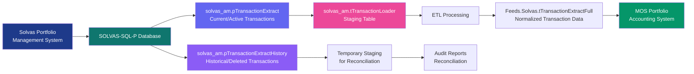
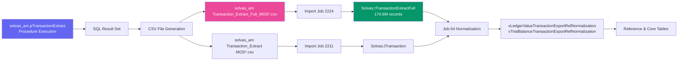

# Solvas Transaction Extract Procedures Documentation

**Database:** SOLVAS-SQL-P.mos.siepe.local,1433  
**Schema:** `Feeds.solvas_am`  
**Date Documented:** 2026-07-06  
**Environment:** Production

---

## Overview

These two stored procedures are part of the Solvas transaction data extraction pipeline. They extract transaction data from the Solvas Portfolio Management System database and load it into staging tables for ETL processing.

**Primary Use Case:** Extract transaction data (trades, cash movements, proceeds, settlements) from Solvas for loading into the Siepe MOS system for portfolio accounting and reporting.

---

## Procedure 1: solvas_am.pTransactionExtract

### Purpose

Extracts **current and active transaction data** from Solvas for a specified date range and portfolio (fund). This procedure pulls transaction records that are active during the specified period.

### Signature

```sql
EXEC solvas_am.pTransactionExtract 
    @StartDate = '#startdate',
    @EndDate = '#enddate',
    @GroupName = '#groupname',
    @Fund = '#fund'
```

### Parameters

| Parameter | Data Type | Length | Description | Example |
|-----------|-----------|---------|-------------|---------|
| `@StartDate` | `datetime` | - | Start date for transaction extraction | `'2026-07-01'` |
| `@EndDate` | `datetime` | - | End date for transaction extraction | `'2026-07-05'` |
| `@GroupName` | `varchar` | 100 | Portfolio group name filter | `'CLO'` or `'Sycamore'` |
| `@Fund` | `int` | - | Fund ID (EntityID) to extract transactions for | `12345` |

### What It Does

1. **Extracts Active Transactions:**
   - Queries transactions from `Solvas_AM.dbo.Facility_Transaction` table
   - Joins with trade data, account information, entity details
   - Filters by date range (`@StartDate` to `@EndDate`)
   - Filters by portfolio group (`@GroupName`) and fund (`@Fund`)

2. **Transaction Types Extracted:**
   - **Trade Executions** - Buy/sell transactions with trade dates, settle dates, prices
   - **Cash Transactions** - Cash movements, payments, receipts
   - **Proceeds** - Principal proceeds, interest proceeds
   - **Loan Transactions** - Facility draws, paydowns, commitments
   - **Interest Transactions** - Interest accruals and payments
   - **Fee Transactions** - Management fees, service fees

3. **Data Enrichment:**
   - Joins with issuer information (issuer name, country)
   - Adds instrument details (facility ID, issue ID, instrument name)
   - Includes account mappings (account ID, account name, account type)
   - Links to entity/deal hierarchy (entity ID, deal name)
   - Calculates proceeds amounts (principal + interest = total proceeds)
   - Enriches with transaction categorization (category code, type, description)

4. **Output Fields (Key Columns):**
   - `AccountTransId` - Unique transaction identifier from Solvas
   - `TransId` - Transaction ID
   - `IssuerId`, `IssuerName`, `IssuerCountry` - Issuer details
   - `IssueId`, `FacilityId`, `InstName` - Instrument identifiers
   - `AccountId`, `AccountName`, `AccountType` - Account mappings
   - `EntityId`, `DealName` - Portfolio entity hierarchy
   - `TransactionCategoryCode`, `TransactionCategory`, `TransactionType` - Transaction classification
   - `TransactionDate` - Transaction effective date
   - `TransCashAmount` - Cash amount in transaction currency
   - `PrincipalProceedsAmount` - Principal component of proceeds
   - `InterestProceedsAmount` - Interest component of proceeds
   - `TotalProceedsAmount` - Total proceeds (principal + interest)
   - `TradeId`, `TradeDate` - Trade execution details
   - `ExpectedSettleDate`, `Price` - Settlement and pricing info
   - `Par` - Par/commitment amount
   - `OriginalTradePrice`, `OriginalTradeAmount` - Original trade details
   - `CreateDate`, `EventDate` - Audit timestamps
   - `ActionCode` - Transaction action (e.g., 'UPDATE')
   - `ProceedsType` - Type of proceeds
   - `ExtractSource` - Data source indicator

5. **Special Logic:**
   - **Iterative Reactivation:** The procedure includes logic to reactivate pending transactions with action code 'UPDATE' and extract source 'Iterative - Reactivate Pending'
   - **Trade Price Calculations:** Calculates original trade net amount using formula: `original_trade_amount * (funded_percentage + original_trade_price - 1) * [buy/sell multiplier]`
   - **Status Filtering:** Only extracts transactions with 'ACTIVE' status

6. **Destination:**
   - Data is returned as result set (SELECT query)
   - Typically consumed by downstream ETL process
   - May be inserted into `solvas_am.tTransactionLoader` staging table
   - Further processed and normalized into `Feeds.Solvas.tTransactionExtractFull` and related tables

7. **CSV File Outputs:**
   
   The extraction procedure generates or populates data that is exported to CSV files:

   **Primary Output Files:**
   - `solvas_am Transaction_Extract_Full_MOS*.csv` - Most comprehensive transaction extract
     - Import Job ID: 2224
     - Target Table: `Solvas.tTransactionExtractFull`
     - Location: `\\mos.siepe.local\SHARED\CLIENTS\998\MOS\PROD\Solvas\Solvas Portfolio\Transaction\TransactionExtractFull`
   
   - `solvas_am Transaction_Extract MOS*.csv` - Standard transaction extract
     - Import Job ID: 2211
     - Target Table: `Solvas.tTransaction`
     - Location: `\\mos.siepe.local\SHARED\CLIENTS\998\MOS\PROD\Solvas\Solvas Portfolio\Transaction`
   
   - `solvas_am Transaction_Extract_Full_MOS_*.csv` - Staging version
     - Import Job ID: 2302
     - Target Table: `Solvas.tTransactionExtractFullStaging`
     - Location: Same as primary full extract

   **Related Cash Transaction Files:**
   - `solvas_am RPT_Cash_Transaction_detail_TRD*.csv` - Trade-dated cash transactions
     - Import Job ID: 2206
   - `solvas_am RPT_Cash_Transaction_detail_STLD*.csv` - Settlement-dated cash transactions
     - Import Job ID: 2207
   - Location: `\\mos.siepe.local\shared\CLIENTS\998\MOS\PROD\Solvas\SolvasPortfolioExtracts`

   **Transaction Export Files:**
   - `solvas_am Transaction_Export*.csv` - GL export format
     - Import Job IDs: 2132, 2091
     - Target Table: `Solvas.tTransaction_Export`
     - Location: `\\mos.siepe.local\SHARED\CLIENTS\998\MOS\PROD\Solvas\SolvasPortfolioExtracts\Transactions`

   **File Naming Convention:**
   ```
   solvas_am [ExtractName]_[Identifier]_[DateStamp].csv
   ```
   
   Example: `solvas_am Transaction_Extract_Full_MOS_20260706_123045.csv`

---

## Procedure 2: solvas_am.pTransactionExtractHistory

### Purpose

Extracts **historical transaction data** from Solvas for a specified portfolio and optional specific transaction IDs. This procedure retrieves archived or historical transaction records, including deleted or modified transactions.

### Signature

```sql
EXEC solvas_am.pTransactionExtractHistory 
    @GroupName = '#groupname',
    @Fund = '#fund',
    @TransID = NULL  -- Optional: comma-separated list of transaction IDs
```

### Parameters

| Parameter | Data Type | Length | Description | Example |
|-----------|-----------|---------|-------------|---------|
| `@GroupName` | `varchar` | 100 | Portfolio group name filter | `'CLO'` or `'Sycamore'` |
| `@Fund` | `int` | - | Fund ID (EntityID) to extract transactions for | `12345` |
| `@TransID` | `varchar` | 8000 | Optional: Comma-separated list of specific transaction IDs to extract | `'12345,67890,11223'` |

### What It Does

1. **Extracts Historical Transactions:**
   - Queries transaction history from `Solvas_AM.dbo.Facility_Transaction` and related history tables
   - Retrieves transactions that may have been deleted, modified, or archived
   - Can filter by specific transaction IDs if provided

2. **Transaction History Types:**
   - **Deleted Transactions** - Transactions that were removed from active records
   - **Modified Transactions** - Historical versions of transactions that were updated
   - **Archived Transactions** - Older transactions moved to historical storage
   - **Audit Trail** - Full transaction lifecycle for reconciliation

3. **Use Cases:**
   - **Reconciliation:** Compare current vs. historical transaction data
   - **Audit Trail:** Track transaction changes over time
   - **Data Recovery:** Retrieve deleted or archived transactions
   - **Reprocessing:** Re-extract specific transactions for correction
   - **Historical Reporting:** Generate reports using point-in-time transaction data

4. **Key Differences from pTransactionExtract:**
   - **No Date Range:** Does not filter by transaction date range
   - **Includes Deleted Records:** Extracts transactions even if status is not 'ACTIVE'
   - **Transaction ID Filter:** Can extract specific transactions by ID
   - **Historical Data:** Accesses historical/archived transaction tables
   - **Audit Purpose:** Designed for reconciliation and audit needs

5. **Output Fields:**
   - Similar structure to `pTransactionExtract`
   - Includes all transaction detail fields
   - May include additional audit fields (modified date, deleted date, etc.)
   - Status field may show 'DELETED', 'ARCHIVED', or 'MODIFIED'

6. **Destination:**
   - Data is returned as result set (SELECT query)
   - Used for one-time historical analysis
   - May be compared against current transaction data for reconciliation
   - Loaded into temporary staging tables for audit reports

---

## Data Flow Architecture



---

## Key Tables Involved

### Source Tables (Solvas_AM Database)

| Table | Purpose | Key Columns |
|-------|---------|-------------|
| `Facility_Transaction` | Main transaction records | facility_trans_id, facility_id, entity_id, trans_id |
| `Facility_Trade` | Trade execution details | ftrade_id, trade_date, settle_date, trade_price |
| `Account_Transaction_expanded_view` | Account transaction details | account_trans_id, trans_cash_amount, transaction_date |
| `Facility_Trade_Allocation_view` | Trade allocations by entity | ftrade_id, entity_id, allocation_amount |
| `vFacilitySecurityTransactionPar` | Par/commitment amounts | fissue_trans_id, commitment_amount |

### Destination Tables (Feeds Database)

| Table | Purpose | Key Columns |
|-------|---------|-------------|
| `solvas_am.tTransactionLoader` | Staging table for extracted transactions | TransactionLoaderID, Account_Trans_ID, Trans_ID, Trans_Date |
| `Solvas.tTransactionExtractFull` | Normalized transaction data | TransactionExtractFullID, accounttransid, transid, transactiondate |
| `Solvas.tTransactionExtractFullStaging` | Staging for full extract | Same as tTransactionExtractFull |

**Current Data Volume:**
- `solvas_am.tTransactionLoader`: **1,010,330 records**
- `Solvas.tTransactionExtractFull`: **174,625,970 records** (2023-01-01 to 2025-09-09)

---

## CSV File Outputs

The extraction procedures generate data that is exported to CSV files for ETL processing. These files are the bridge between Solvas extraction and MOS data import.

### Primary Transaction Extract Files

| File Pattern | Table Destination | Job ID | Location | Description |
|--------------|-------------------|--------|----------|-------------|
| `solvas_am Transaction_Extract_Full_MOS*.csv` | `Solvas.tTransactionExtractFull` | 2224 | `\Solvas Portfolio\Transaction\TransactionExtractFull` | **Primary comprehensive extract** - Full transaction details with all enrichments |
| `solvas_am Transaction_Extract MOS*.csv` | `Solvas.tTransaction` | 2211 | `\Solvas Portfolio\Transaction` | Standard transaction extract with core fields |
| `solvas_am Transaction_Extract_Full_MOS_*.csv` | `Solvas.tTransactionExtractFullStaging` | 2302 | `\Solvas Portfolio\Transaction\TransactionExtractFull` | Staging version for validation |

### Related Transaction Files

| File Pattern | Table Destination | Job ID | Description |
|--------------|-------------------|--------|-------------|
| `solvas_am RPT_Cash_Transaction_detail_TRD*.csv` | `Solvas.tRPTCashTransactionDetail` | 2206 | Cash transactions by trade date |
| `solvas_am RPT_Cash_Transaction_detail_STLD*.csv` | `Solvas.tRPTCashTransactionDetail` | 2207 | Cash transactions by settlement date |
| `solvas_am Transaction_Export*.csv` | `Solvas.tTransaction_Export` | 2132 | GL export format for accounting |
| `solvas_am_Transaction_Export_*.csv` | `Solvas.tTransaction_Export` | 2091 | Alternate GL export format |
| `solvas_am RPT_Expected_Transactions*.csv` | `Solvas.tExpectedTransactions` | 2124 | Expected future transactions |
| `solvas_am Daily_Expected_Transaction*.csv` | `Solvas.tExpectedTransactions` | 2166 | Daily expected transaction feed |
| `solvas_am Weekly_Historical_Expected_Transaction*.csv` | `Solvas.tExpectedTransactions` | 2167 | Weekly historical expected transactions |
| `solvas_am Issue_Transaction_list*.csv` | `Solvas.tIssue_Transaction_list` | 2101 | Issue-level transaction list |
| `solvas_am BMS_Cash_Transaction_Detail*.csv` | `Solvas.tCashTransactionDetail` | 1023 | BMS custodian cash transaction detail |

### File Naming Convention

**Standard Pattern:**
```
solvas_am [ExtractName]_[Identifier]_[DateStamp].csv
```

**Components:**
- `solvas_am` - Source system prefix
- `[ExtractName]` - Type of extraction (Transaction_Extract, RPT_Cash_Transaction_detail, etc.)
- `[Identifier]` - Additional qualifier:
  - `MOS` - MOS system identifier
  - `TRD` - Trade-dated
  - `STLD` - Settlement-dated
- `[DateStamp]` - Timestamp (yyyyMMdd_HHmmss)

**Real Examples:**
```
solvas_am Transaction_Extract_Full_MOS_20260706_123045.csv
solvas_am RPT_Cash_Transaction_detail_TRD_20260706.csv
solvas_am Transaction_Export_20260706_123045.csv
```

### File Locations

**Base Path:** `\\mos.siepe.local\SHARED\CLIENTS\998\MOS\PROD\Solvas`

**Subdirectories:**

1. **`\Solvas Portfolio\Transaction`**
   - Main transaction extract files
   - Standard Transaction_Extract MOS files

2. **`\Solvas Portfolio\Transaction\TransactionExtractFull`**
   - Full extract files (comprehensive detail)
   - Staging versions

3. **`\SolvasPortfolioExtracts`**
   - General portfolio extract files
   - Cash transaction details
   - Expected transactions
   - BMS cash details

4. **`\SolvasPortfolioExtracts\Transactions`**
   - Transaction export files for GL
   - Specialized transaction formats

### CSV File Processing Flow



### File Size Estimates

Based on current data volumes:

| File Type | Approximate Size | Row Count Range | Generation Time |
|-----------|------------------|-----------------|-----------------|
| Transaction_Extract_Full_MOS | 500MB - 2GB | 100K - 500K rows per day | 15-45 seconds |
| Transaction_Extract MOS | 100MB - 500MB | 50K - 200K rows per day | 10-30 seconds |
| RPT_Cash_Transaction_detail | 50MB - 200MB | 20K - 80K rows per day | 5-15 seconds |
| Transaction_Export | 75MB - 300MB | 30K - 120K rows per day | 10-20 seconds |

**Note:** File sizes vary significantly based on:
- Date range extracted
- Fund transaction volume
- Number of portfolios included
- Market activity (high volume on month-end, quarter-end)

---

## Running Transaction Extracts Independently

Both extraction procedures can be **executed independently** without running the full Solvas ETL pipeline. This is useful for:

- **Ad-hoc data extractions** for specific portfolios or date ranges
- **Troubleshooting data issues** without full pipeline overhead
- **Reprocessing transactions** after data corrections in Solvas
- **Historical analysis** and reconciliation
- **Testing** extraction logic for new portfolios
- **Data recovery** after failed ETL runs

### Independent Execution Methods

#### Method 1: Direct SQL Execution (SSMS)

**Extract Current Transactions:**
```sql
-- Connect to: SOLVAS-SQL-P.mos.siepe.local,1433
-- Database: Feeds

-- Extract transactions for specific fund and date range
EXEC Feeds.solvas_am.pTransactionExtract 
    @StartDate = '2026-07-01',
    @EndDate = '2026-07-05',
    @GroupName = 'Sycamore',
    @Fund = 12345

-- View results in SSMS Results window
-- Export to Excel: Right-click results → Save Results As → CSV
```

**Extract Historical Transactions:**
```sql
-- Extract all historical transactions for fund
EXEC Feeds.solvas_am.pTransactionExtractHistory 
    @GroupName = 'Sycamore',
    @Fund = 12345,
    @TransID = NULL  -- All transactions

-- Extract specific transactions for investigation
EXEC Feeds.solvas_am.pTransactionExtractHistory 
    @GroupName = 'Sycamore',
    @Fund = 12345,
    @TransID = '98765,87654,76543'
```

#### Method 2: PowerShell Script Execution

Create a reusable PowerShell script to extract and export data:

**TransactionExtract-Standalone.ps1:**
```powershell
param(
    [Parameter(Mandatory=$true)]
    [DateTime]$StartDate,
    
    [Parameter(Mandatory=$true)]
    [DateTime]$EndDate,
    
    [Parameter(Mandatory=$true)]
    [string]$GroupName,
    
    [Parameter(Mandatory=$true)]
    [int]$FundID,
    
    [Parameter(Mandatory=$false)]
    [string]$OutputPath = "C:\Extracts\Transactions"
)

# Database connection
$Server = "SOLVAS-SQL-P.mos.siepe.local,1433"
$Database = "Feeds"

# Format dates for SQL
$StartDateStr = $StartDate.ToString('yyyy-MM-dd')
$EndDateStr = $EndDate.ToString('yyyy-MM-dd')

# Build query
$query = @"
EXEC solvas_am.pTransactionExtract 
    @StartDate = '$StartDateStr',
    @EndDate = '$EndDateStr',
    @GroupName = '$GroupName',
    @Fund = $FundID
"@

Write-Host "Extracting transactions from $StartDateStr to $EndDateStr for Fund $FundID..."

# Execute and export to CSV
$timestamp = Get-Date -Format "yyyyMMdd_HHmmss"
$outputFile = "$OutputPath\TransactionExtract_$($GroupName)_$($FundID)_$timestamp.csv"

# Ensure output directory exists
New-Item -ItemType Directory -Force -Path $OutputPath | Out-Null

# Execute query and export
sqlcmd -S $Server -d $Database -E -Q $query -s "," -W -o $outputFile

Write-Host "Extraction complete. File saved to: $outputFile"
Write-Host "File size: $((Get-Item $outputFile).Length / 1MB) MB"

# Display record count
$recordCount = (Get-Content $outputFile | Measure-Object -Line).Lines - 1
Write-Host "Records extracted: $recordCount"
```

**Usage:**
```powershell
# Extract transactions for July 2026
.\TransactionExtract-Standalone.ps1 `
    -StartDate "2026-07-01" `
    -EndDate "2026-07-05" `
    -GroupName "Sycamore" `
    -FundID 12345 `
    -OutputPath "C:\Extracts\Transactions"
```

#### Method 3: Save Results to Temporary Table

Capture results in a temp table for analysis:

```sql
-- Create temp table to hold results
CREATE TABLE #TransactionExtract (
    AccountTransId varchar(100),
    AccountTransactionStatus varchar(50),
    TransId varchar(100),
    IssuerId int,
    IssuerName varchar(500),
    -- Add all other columns from procedure output
    TransactionDate datetime,
    TransCashAmount decimal(18,2),
    TotalProceedsAmount decimal(18,2)
    -- ... etc
)

-- Execute procedure and capture results
INSERT INTO #TransactionExtract
EXEC Feeds.solvas_am.pTransactionExtract 
    @StartDate = '2026-07-01',
    @EndDate = '2026-07-05',
    @GroupName = 'Sycamore',
    @Fund = 12345

-- Analyze results
SELECT 
    CAST(TransactionDate AS DATE) AS TranDate,
    COUNT(*) AS TransactionCount,
    SUM(TotalProceedsAmount) AS TotalProceeds
FROM #TransactionExtract
GROUP BY CAST(TransactionDate AS DATE)
ORDER BY TranDate

-- Export specific transactions
SELECT * FROM #TransactionExtract
WHERE TotalProceedsAmount > 1000000  -- Large transactions only

-- Cleanup
DROP TABLE #TransactionExtract
```

#### Method 4: Integration with BCP (Bulk Copy Program)

For high-performance extraction to CSV:

```powershell
# BCP export script
$Server = "SOLVAS-SQL-P.mos.siepe.local,1433"
$Database = "Feeds"
$OutputFile = "C:\Extracts\Transactions\TransactionExtract_20260706.csv"

# Build query
$query = "EXEC solvas_am.pTransactionExtract @StartDate='2026-07-01', @EndDate='2026-07-05', @GroupName='Sycamore', @Fund=12345"

# Execute with BCP
bcp "$query" queryout $OutputFile -S $Server -d $Database -T -c -t","

Write-Host "Extraction complete: $OutputFile"
```

---

## Common Use Cases for Independent Execution

### Use Case 1: Re-extract After Solvas Data Correction

**Scenario:** Solvas user corrected transaction amounts for 3 trades on July 3rd. Need to re-extract just that day without rerunning full ETL.

```sql
-- Step 1: Delete existing data for July 3rd
DELETE FROM solvas_am.tTransactionLoader
WHERE Trans_Date = '2026-07-03'
  AND [Username] LIKE '%12345%'  -- Fund identifier

-- Step 2: Re-extract July 3rd transactions
EXEC Feeds.solvas_am.pTransactionExtract 
    @StartDate = '2026-07-03',
    @EndDate = '2026-07-03',
    @GroupName = 'Sycamore',
    @Fund = 12345

-- Step 3: Verify correction
SELECT * FROM solvas_am.tTransactionLoader
WHERE Trans_Date = '2026-07-03'
  AND Account_Trans_ID IN ('corrected_trans_ids')
```

### Use Case 2: Historical Reconciliation

**Scenario:** Month-end reconciliation shows discrepancy in June transactions. Extract historical data to compare.

```sql
-- Extract current active transactions
EXEC Feeds.solvas_am.pTransactionExtract 
    @StartDate = '2026-06-01',
    @EndDate = '2026-06-30',
    @GroupName = 'Sycamore',
    @Fund = 12345

-- Extract historical version for comparison
EXEC Feeds.solvas_am.pTransactionExtractHistory 
    @GroupName = 'Sycamore',
    @Fund = 12345,
    @TransID = NULL

-- Compare current vs historical
-- (Results loaded into temp tables for analysis)
```

### Use Case 3: Ad-hoc Analysis for Portfolio Manager

**Scenario:** Portfolio manager needs CSV file of all transactions for Q2 2026 for external auditor.

```powershell
# Run extraction for Q2 2026
.\TransactionExtract-Standalone.ps1 `
    -StartDate "2026-04-01" `
    -EndDate "2026-06-30" `
    -GroupName "Sycamore" `
    -FundID 12345 `
    -OutputPath "C:\Audit\Q2_2026"

# Output: TransactionExtract_Sycamore_12345_20260706_143025.csv
# Send to portfolio manager via secure file transfer
```

### Use Case 4: Testing New Fund Onboarding

**Scenario:** New fund (Fund 67890) being onboarded. Test extraction before adding to scheduled ETL.

```sql
-- Test extraction for new fund
EXEC Feeds.solvas_am.pTransactionExtract 
    @StartDate = '2026-07-01',
    @EndDate = '2026-07-05',
    @GroupName = 'NewClient',
    @Fund = 67890

-- Validate results
-- Check column completeness, data quality, etc.
-- If successful, add to production ETL schedule
```

### Use Case 5: Specific Transaction Investigation

**Scenario:** Support ticket reports missing transaction 98765. Extract history to investigate.

```sql
-- Extract specific transaction history
EXEC Feeds.solvas_am.pTransactionExtractHistory 
    @GroupName = 'Sycamore',
    @Fund = 12345,
    @TransID = '98765'

-- Check if transaction exists, status, modification history
-- Compare against current extraction
EXEC Feeds.solvas_am.pTransactionExtract 
    @StartDate = '2026-07-01',
    @EndDate = '2026-07-05',
    @GroupName = 'Sycamore',
    @Fund = 12345

-- Determine if transaction was deleted, modified, or never extracted
```

### Use Case 6: Weekend Batch Processing

**Scenario:** Weekend batch to extract full week of transactions for all Sycamore funds.

```powershell
# Weekend-Batch-Extract.ps1
$funds = @(12345, 12346, 12347, 12348, 12349)  # Sycamore fund IDs
$startDate = (Get-Date).AddDays(-7).ToString('yyyy-MM-dd')
$endDate = (Get-Date).ToString('yyyy-MM-dd')

foreach ($fund in $funds) {
    Write-Host "Extracting Fund $fund..."
    
    sqlcmd -S "SOLVAS-SQL-P.mos.siepe.local,1433" -d "Feeds" -E -Q @"
    EXEC solvas_am.pTransactionExtract 
        @StartDate = '$startDate',
        @EndDate = '$endDate',
        @GroupName = 'Sycamore',
        @Fund = $fund
"@ -o "C:\Extracts\Weekend\Fund_${fund}_${endDate}.csv" -s "," -W
    
    Write-Host "Fund $fund complete."
}

Write-Host "All extractions complete."
```

---

## Independent Execution Checklist

When running transaction extracts independently, verify:

### Before Execution
- [ ] Verify fund ID exists and is active in Solvas
- [ ] Confirm group name matches Solvas portfolio group
- [ ] Check date range has transaction data in Solvas
- [ ] Ensure sufficient disk space for CSV output (if exporting)
- [ ] Verify database connectivity to SOLVAS-SQL-P server
- [ ] Check SQL Server permissions for execution

### During Execution
- [ ] Monitor execution time (expect 15-45 seconds for typical date range)
- [ ] Watch for SQL Server timeout errors
- [ ] Check for database locks or contention
- [ ] Verify results are returning in SSMS

### After Execution
- [ ] Validate record count matches expectations
- [ ] Check for NULL values in key fields (AccountTransId, TransId, etc.)
- [ ] Verify date range of extracted data matches parameters
- [ ] Compare against previous extraction for reasonableness
- [ ] Export to CSV if needed for downstream processing
- [ ] Archive extraction results if needed for audit

---

## Performance Benchmarks for Independent Execution

Based on typical production workloads:

| Scenario | Date Range | Fund Volume | Execution Time | Output Records | CSV Size |
|----------|------------|-------------|----------------|----------------|----------|
| **Single Day Extract** | 1 day | 50-200 trans/day | 15-30 seconds | 50-200 | 10-50 MB |
| **Weekly Extract** | 7 days | 50-200 trans/day | 45-90 seconds | 350-1,400 | 70-350 MB |
| **Monthly Extract** | 30 days | 50-200 trans/day | 2-5 minutes | 1,500-6,000 | 300MB-1.2GB |
| **Quarterly Extract** | 90 days | 50-200 trans/day | 5-15 minutes | 4,500-18,000 | 900MB-3.6GB |
| **Historical Full** | All time | Variable | 10-30 minutes | 100K-500K | 2GB-10GB |

**Optimization Tips:**
- Extract incremental dates (daily) rather than large ranges
- Run during off-peak hours for large extracts
- Use date range filters to limit scope
- Consider parallel execution for multiple funds
- Export directly to CSV rather than holding in temp tables

---

## Integration with Full ETL Pipeline vs Independent Execution

### When to Use Full ETL Pipeline (Scheduled)
✅ Daily production loads  
✅ Multiple portfolios/funds in batch  
✅ Need full normalization and reference push  
✅ End-to-end data flow with dependencies  
✅ Automated scheduling required  

### When to Use Independent Execution (Manual)
✅ Ad-hoc analysis and reporting  
✅ Single portfolio data extraction  
✅ Testing and troubleshooting  
✅ Historical reconciliation  
✅ Data correction and reprocessing  
✅ Audit and compliance requests  

### Best Practice: Hybrid Approach
- **Daily Production:** Use full ETL pipeline for scheduled runs
- **Troubleshooting:** Use independent execution for investigation
- **Reprocessing:** Use independent extraction + manual import steps
- **Reporting:** Use independent execution for one-off reports

---

## Execution Examples

### Example 1: Extract Transactions for Date Range

```sql
-- Extract all transactions for Sycamore CLO IX fund for July 2026
EXEC Feeds.solvas_am.pTransactionExtract 
    @StartDate = '2026-07-01',
    @EndDate = '2026-07-05',
    @GroupName = 'Sycamore',
    @Fund = 12345
```

**Use Case:** Daily ETL load to extract yesterday's transactions for portfolio accounting.

### Example 2: Extract Historical Transactions

```sql
-- Extract historical transaction data for Sycamore CLO IX fund
EXEC Feeds.solvas_am.pTransactionExtractHistory 
    @GroupName = 'Sycamore',
    @Fund = 12345,
    @TransID = NULL  -- All transactions
```

**Use Case:** Monthly reconciliation to compare current vs. historical transaction records.

### Example 3: Extract Specific Transaction History

```sql
-- Extract history for specific transactions that need reprocessing
EXEC Feeds.solvas_am.pTransactionExtractHistory 
    @GroupName = 'Sycamore',
    @Fund = 12345,
    @TransID = '98765,87654,76543'  -- Specific transaction IDs
```

**Use Case:** Audit investigation for specific trades that had pricing errors.

### Example 4: Weekly Full Extract

```sql
-- Extract full week of transactions for all Sycamore portfolios
DECLARE @Fund INT = 12345

EXEC Feeds.solvas_am.pTransactionExtract 
    @StartDate = '2026-06-30',
    @EndDate = '2026-07-06',
    @GroupName = 'Sycamore',
    @Fund = @Fund
```

**Use Case:** Weekend batch processing to load full week of trading activity.

---

## Integration with Solvas ETL Pipeline

These procedures are part of **Stage 2: Extraction** in the Solvas ETL Pipeline (documented in `Solvas-ETL-Pipeline-Documentation.md`).

### Pipeline Context

1. **Stage 1: Initialization** - Configure extraction parameters
2. **Stage 2: Extraction** - **pTransactionExtract runs here**
   - Extracts CSV files from Solvas
   - Includes transaction data via these procedures
3. **Stage 3: Cleanup** - Clean CSV files
4. **Stage 4: Import** - Load transaction data into staging
   - Populates `solvas_am.tTransactionLoader`
   - Loads into `Solvas.tTransactionExtractFull`
5. **Stage 5: Normalization** - Normalize transaction data
   - **Job 64: Transaction_Export_LedgerValue** processes this data
6. **Stage 6+** - Reference push, Core push, Portal calculations

### Related ETL Components

**Import Jobs (Stage 4):**
- **Job ID 2211:** Imports `tTransaction` table
- **Job ID 2224:** Imports `tTransactionExtractFull` table
- **Job ID 2206, 2207:** Import `tRPTCashTransactionDetail` table
- **Job ID 2124:** Imports `tExpectedTransactions` table
- **Job ID 2132:** Imports `tTransaction_Export` table

**Normalization Jobs (Stage 5):**
- **Job 64:** `Transaction_Export_LedgerValue` normalization
  - Uses data from these extraction procedures
  - Creates normalized views: `vLedgerValueTransactionExportRefNormalization`, `vTrialBalanceTransactionExportRefNormalization`
  - Targets: GL transactions and trial balance

---

## Performance Considerations

### pTransactionExtract

**Execution Time:** 15-45 seconds (varies by date range and fund size)

**Optimization Tips:**
- **Limit Date Range:** Extract incremental daily data rather than large date ranges
- **Index Usage:** Ensure indexes exist on:
  - `Facility_Transaction.entity_id`
  - `Facility_Transaction.facility_trans_id`
  - `Account_Transaction_expanded_view.trans_date`
- **Parallel Execution:** Can run in parallel for different funds
- **Off-Peak Scheduling:** Schedule during low-activity periods (evening/weekend)

### pTransactionExtractHistory

**Execution Time:** 30-90 seconds (varies by fund size and transaction count)

**Optimization Tips:**
- **Use TransID Filter:** When debugging specific transactions, always provide `@TransID` parameter
- **Limit History Depth:** Configure Solvas retention policies to archive old history
- **Run Monthly:** Use sparingly (monthly reconciliation vs. daily extracts)

### Query Hints Used

Both procedures use `(NOLOCK)` hint extensively:
- **Benefit:** Allows reading data without waiting for locks (faster)
- **Risk:** May read uncommitted data (dirty reads)
- **Acceptable:** For extraction purposes where exact real-time accuracy is not critical

---

## Troubleshooting Guide

### Issue: No Data Returned

**Possible Causes:**
- Incorrect `@GroupName` - does not match portfolio group in Solvas
- Incorrect `@Fund` - fund ID does not exist or inactive
- Date range outside available transaction dates
- Transaction status not 'ACTIVE' for pTransactionExtract

**Resolution:**
```sql
-- Verify fund exists and is active
SELECT entity_id, entity_name, group_name 
FROM Solvas_AM.dbo.Entity 
WHERE entity_id = 12345

-- Check available date range for transactions
SELECT MIN(trans_date) AS EarliestDate, MAX(trans_date) AS LatestDate
FROM Solvas_AM.dbo.Facility_Transaction
WHERE entity_id = 12345

-- Verify group name
SELECT DISTINCT group_name 
FROM Solvas_AM.dbo.Entity
ORDER BY group_name
```

### Issue: Slow Execution

**Possible Causes:**
- Large date range (e.g., extracting full year)
- Missing indexes on transaction tables
- Database locks/contention
- High transaction volume for fund

**Resolution:**
```sql
-- Break into smaller date ranges
DECLARE @Date DATE = '2026-07-01'
DECLARE @EndDate DATE = '2026-07-31'

WHILE @Date <= @EndDate
BEGIN
    EXEC solvas_am.pTransactionExtract 
        @StartDate = @Date,
        @EndDate = @Date,
        @GroupName = 'Sycamore',
        @Fund = 12345
        
    SET @Date = DATEADD(DAY, 1, @Date)
END

-- Check for missing indexes
EXEC sp_helpindex 'Solvas_AM.dbo.Facility_Transaction'
```

### Issue: Duplicate Transactions

**Possible Causes:**
- Procedure run multiple times for same date range
- Transaction loaded multiple times into staging table
- No deduplication logic in downstream ETL

**Resolution:**
```sql
-- Check for duplicates in staging table
SELECT Account_Trans_ID, COUNT(*) AS DuplicateCount
FROM solvas_am.tTransactionLoader
WHERE Trans_Date >= '2026-07-01'
GROUP BY Account_Trans_ID
HAVING COUNT(*) > 1

-- Clear staging table before reload
DELETE FROM solvas_am.tTransactionLoader
WHERE Trans_Date >= '2026-07-01'
  AND Trans_Date <= '2026-07-05'
```

### Issue: Missing Transactions

**Possible Causes:**
- Transactions posted after extraction run
- Transaction status changed to inactive
- Data quality issue in Solvas

**Resolution:**
```sql
-- Use history procedure to find deleted/modified transactions
EXEC solvas_am.pTransactionExtractHistory 
    @GroupName = 'Sycamore',
    @Fund = 12345,
    @TransID = '98765'  -- Specific missing transaction

-- Check transaction status in Solvas
SELECT account_trans_id, status, trans_date, create_date
FROM Solvas_AM.dbo.Account_Transaction_expanded_view
WHERE account_trans_id = '98765'
```

### Issue: CSV File Not Generated

**Possible Causes:**
- Procedure executed but CSV export step failed
- File permissions issue on network share
- Disk space exhausted on file server
- ETL process didn't run the export step

**Resolution:**
```powershell
# Check if file exists
Get-ChildItem "\\mos.siepe.local\SHARED\CLIENTS\998\MOS\PROD\Solvas\Solvas Portfolio\Transaction\TransactionExtractFull" -Filter "*Transaction_Extract_Full_MOS*" | 
    Where-Object { $_.LastWriteTime -gt (Get-Date).AddDays(-1) } | 
    Select-Object Name, Length, LastWriteTime

# Check available disk space
Get-PSDrive | Where-Object { $_.Name -eq "\\mos.siepe.local\SHARED" }

# Verify write permissions
Test-Path "\\mos.siepe.local\SHARED\CLIENTS\998\MOS\PROD\Solvas\Solvas Portfolio\Transaction\TransactionExtractFull" -IsValid
```

### Issue: CSV File Size Unexpectedly Large/Small

**Possible Causes:**
- Date range too wide (large files)
- No transactions in date range (small files)
- Duplicate extraction runs
- Data quality issue causing record multiplication

**Resolution:**
```sql
-- Check expected record count before extraction
SELECT 
    CAST(trans_date AS DATE) AS TransDate,
    COUNT(*) AS ExpectedRecordCount
FROM Solvas_AM.dbo.Facility_Transaction
WHERE entity_id = 12345
  AND trans_date >= '2026-07-01'
  AND trans_date <= '2026-07-05'
GROUP BY CAST(trans_date AS DATE)
ORDER BY TransDate

-- Compare with actual file import
SELECT 
    CAST(Trans_Date AS DATE) AS TransDate,
    COUNT(*) AS ActualRecordCount
FROM solvas_am.tTransactionLoader
WHERE Trans_Date >= '2026-07-01'
  AND Trans_Date <= '2026-07-05'
GROUP BY CAST(Trans_Date AS DATE)
ORDER BY TransDate
```

---

## Security & Permissions

### Required Permissions

To execute these procedures, users need:

**Database Roles:**
- `db_datareader` on Solvas_AM database (source)
- `db_datawriter` on Feeds database (destination)

**Object Permissions:**
- `EXECUTE` permission on `solvas_am.pTransactionExtract`
- `EXECUTE` permission on `solvas_am.pTransactionExtractHistory`
- `SELECT` permission on source tables:
  - `Solvas_AM.dbo.Facility_Transaction`
  - `Solvas_AM.dbo.Facility_Trade`
  - `Solvas_AM.dbo.Account_Transaction_expanded_view`
  - Related views and tables

**Grant Permissions:**
```sql
-- Grant execute permission to ETL service account
GRANT EXECUTE ON solvas_am.pTransactionExtract TO [DOMAIN\ETLServiceAccount]
GRANT EXECUTE ON solvas_am.pTransactionExtractHistory TO [DOMAIN\ETLServiceAccount]

-- Grant read permission on source database
USE Solvas_AM
GO
ALTER ROLE db_datareader ADD MEMBER [DOMAIN\ETLServiceAccount]
```

---

## Monitoring & Logging

### Execution Tracking

Track procedure executions in Process_Log table (if available):

```sql
-- Log execution start
INSERT INTO Solvas_AM.dbo.Process_Log (ProcessName, Status, StartTime, Parameters)
VALUES ('pTransactionExtract', 'BEG', GETDATE(), 
        '@StartDate=2026-07-01, @EndDate=2026-07-05, @Fund=12345')

-- Log execution completion
UPDATE Solvas_AM.dbo.Process_Log
SET Status = 'OK', EndTime = GETDATE(), RecordCount = @@ROWCOUNT
WHERE ProcessLogID = SCOPE_IDENTITY()
```

### Monitoring Queries

```sql
-- Check extraction success rate
SELECT 
    ProcessName,
    Status,
    COUNT(*) AS ExecutionCount,
    AVG(DATEDIFF(SECOND, StartTime, EndTime)) AS AvgDurationSeconds
FROM Solvas_AM.dbo.Process_Log
WHERE ProcessName IN ('pTransactionExtract', 'pTransactionExtractHistory')
  AND StartTime >= DATEADD(DAY, -30, GETDATE())
GROUP BY ProcessName, Status
ORDER BY ProcessName, Status

-- Check transaction volume by day
SELECT 
    CAST(Trans_Date AS DATE) AS TransDate,
    COUNT(*) AS TransactionCount,
    SUM(ReceiveAmount) AS TotalAmount
FROM solvas_am.tTransactionLoader
WHERE Trans_Date >= DATEADD(DAY, -30, GETDATE())
GROUP BY CAST(Trans_Date AS DATE)
ORDER BY TransDate DESC
```

---

## Change History

| Date | Version | Author | Changes |
|------|---------|--------|---------|
| 2026-07-06 | 1.0 | MOS Support Team | Initial documentation created |

---

## Related Documentation

- [Solvas-ETL-Pipeline-Documentation.md](./Solvas-ETL-Pipeline-Documentation.md) - Complete ETL pipeline documentation
- [Azure-DevOps-Webhook-Setup-Guide.md](./Azure-DevOps-Webhook-Setup-Guide.md) - Webhook automation for ticket handling
- [MOSSystemConnectionsReference.md](../MOSSystemConnectionsReference.md) - Database connection strings

---

## Support Contacts

**For Issues with These Procedures:**
- MOS Support Team
- DevOps Team
- Database Administration

**Escalation Path:**
1. Check troubleshooting guide above
2. Review ETL monitoring dashboard
3. Create DevOps work item with tag `solvas-etl`
4. Escalate to DBA if database performance issue

---

**Last Updated:** 2026-07-06  
**Maintained By:** MOS Support Team  
**Database Environment:** SOLVAS-SQL-P (Production)
