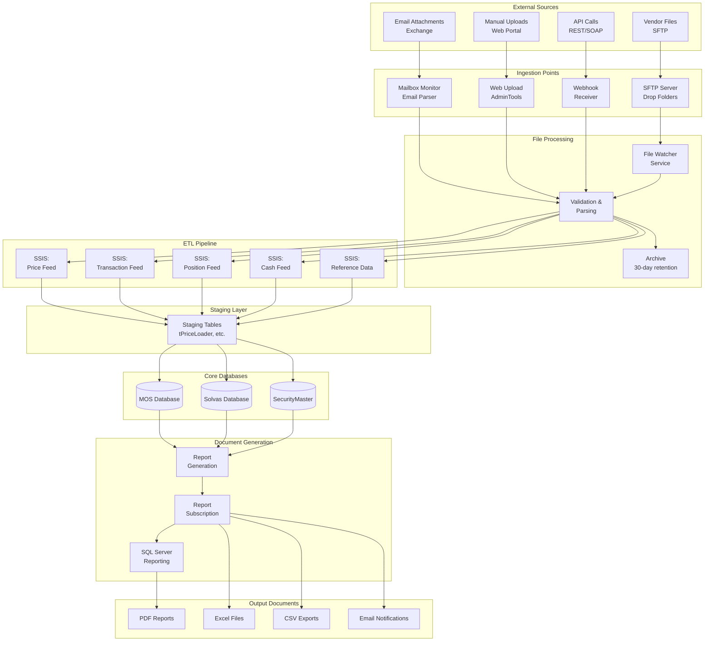
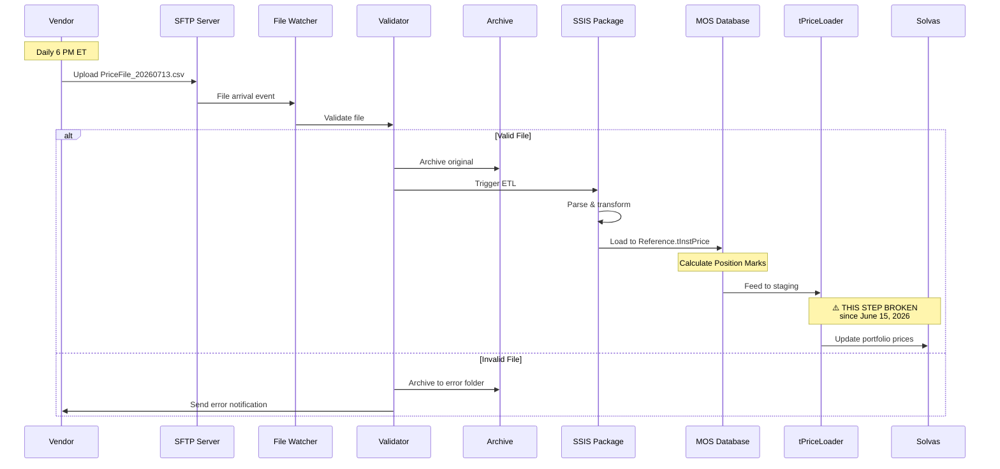
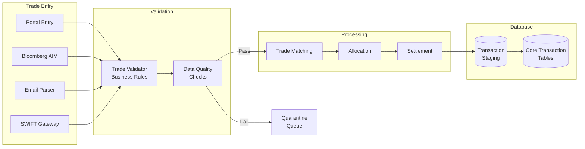
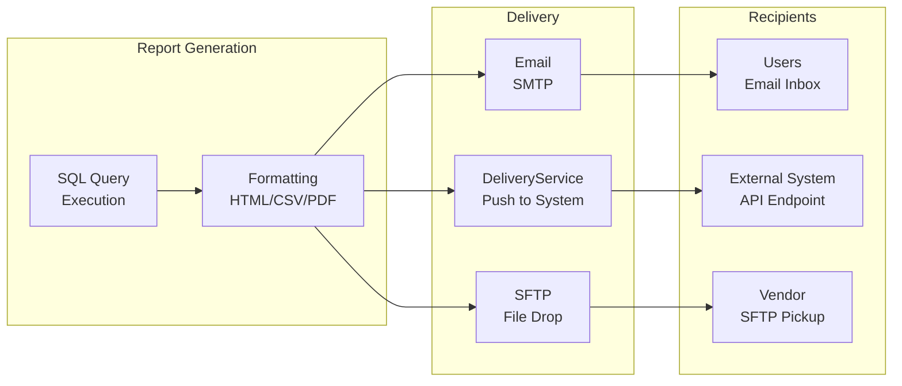
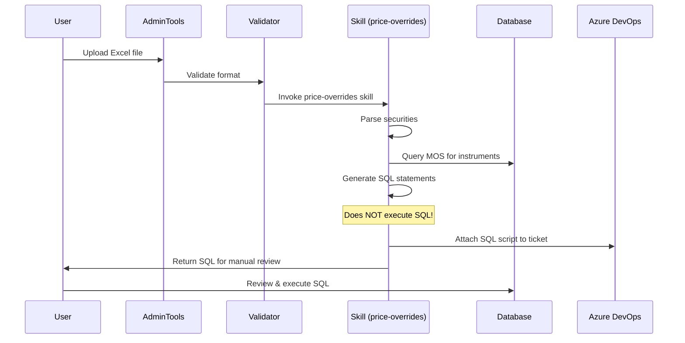
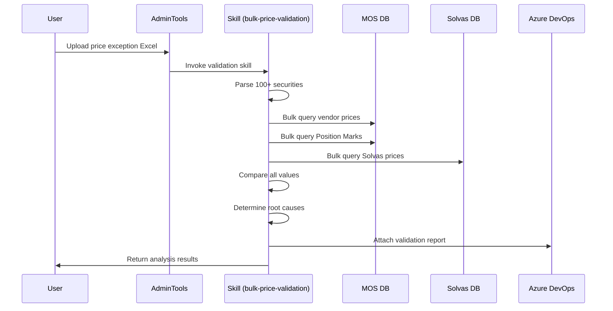

# MOS Document Ingestion & Processing Timeline
**Date:** 2026-07-13  
**Purpose:** Detailed map of all document ingestion processes, showing what gets processed, when, and how everything connects

---

## Overview

This document focuses on **document ingestion workflows** - how files and data flow from external sources into MOS, through processing pipelines, and out to reporting systems.

---

## Document Ingestion Architecture



---

## Ingestion Workflows

### 1. Vendor Price Files (Primary Focus)

#### File Arrival
- **Source**: MarkIt/LSEG, ICE, Bloomberg, etc.
- **Protocol**: SFTP push to dedicated drop folder
- **Schedule**: Daily, typically 6:00-7:00 PM ET
- **Format**: CSV, XML, or fixed-width text

#### Processing Pipeline



#### File Specifications

| Vendor | Filename Pattern | Columns | Row Count | Size |
|--------|------------------|---------|-----------|------|
| MarkIt/LSEG | `markit_loans_YYYYMMDD.csv` | SecurityID, Bid, Ask, Date | 50,000+ | 25 MB |
| ICE | `ice_bonds_YYYYMMDD.csv` | CUSIP, Price, Yield, Date | 100,000+ | 50 MB |
| Bloomberg | `bbg_prices_YYYYMMDD.txt` | Ticker, Price, Volume, Date | 200,000+ | 100 MB |
| SecurityMaster | `secmaster_ref_YYYYMMDD.xml` | XML structure | Varies | 20 MB |

#### Validation Rules
1. **File Format**: Correct delimiter, encoding (UTF-8 or ASCII)
2. **Header Validation**: Expected column names present
3. **Date Check**: Price date = expected trade date (T or T-1)
4. **Completeness**: Row count within expected range (±10%)
5. **Data Quality**: No nulls in required fields, valid price ranges
6. **Duplicate Check**: No duplicate SecurityID + Date combinations

#### Error Handling
- **Missing File**: Alert after 2-hour SLA breach
- **Invalid Format**: Archive to error folder, email support team
- **Partial Data**: Flag for manual review if row count < 90% expected
- **Late File**: Process immediately when arrives, flag in dashboard

---

### 2. Transaction Files

#### Sources
- **Client Portals**: Trades submitted via web interface
- **Bloomberg AIM**: Trade confirmations via Bloomberg terminal
- **Email**: Trade tickets via structured email (parsed)
- **SWIFT**: MT5xx messages for settlements

#### Processing Flow



#### Timing
- **Portal trades**: Real-time processing (within 1 minute)
- **Bloomberg**: 10-minute polling cycle
- **Email**: 5-minute polling cycle
- **SWIFT**: Real-time as messages arrive

---

### 3. Position Files

#### Daily Position Snapshots
- **Source**: Custodian banks (BNY Mellon, State Street, etc.)
- **Schedule**: Daily 7:00 AM ET (overnight processing)
- **Purpose**: Reconcile MOS positions vs custodian records

#### File Structure
```csv
Account,CUSIP,Quantity,MarketValue,SettlementDate
12345,68610BAA2,1000000,1005000.00,2026-07-13
12345,15477CAA3,2500000,2456250.00,2026-07-13
```

#### Reconciliation Process
1. Load custodian positions to staging
2. Compare vs MOS Core.vPosition
3. Identify breaks (quantity or value mismatches)
4. Generate break report
5. Route to operations team for research
6. Track resolution status

---

### 4. Cash Reconciliation Files

#### Sources
- **Bank Statements**: Daily cash balances
- **Wire Reports**: Intraday wire transfers
- **Interest/Fee Files**: Monthly accruals

#### Processing Schedule
| File Type | Frequency | Arrival Time | Processing Window |
|-----------|-----------|--------------|-------------------|
| Bank Balance | Daily | 8:00 AM ET | 8:00-9:00 AM |
| Wires | Real-time | Throughout day | On arrival |
| Interest | Monthly | 1st business day | 9:00-10:00 AM |
| Fees | Monthly | 1st business day | 10:00-11:00 AM |

---

### 5. Reference Data Updates

#### Security Master Updates
- **Source**: SecurityMaster database sync
- **Schedule**: Daily 2:00 AM ET (off-peak)
- **Content**: 
  - New securities (IPOs, new issues)
  - Corporate actions (splits, mergers, dividends)
  - Identifier changes (CUSIP reassignments)

#### Corporate Actions File
```xml
<CorporateAction>
  <SecurityID>68610BAA2</SecurityID>
  <ActionType>Dividend</ActionType>
  <ExDate>2026-07-15</ExDate>
  <PayDate>2026-08-01</PayDate>
  <Amount>0.50</Amount>
  <Currency>USD</Currency>
</CorporateAction>
```

---

## Daily Processing Timeline

### Overnight Batch (12 AM - 8 AM ET)

```mermaid
gantt
    title Overnight Batch Processing
    dateFormat HH:mm
    axisFormat %H:%M
    
    section Reference Data
    SecurityMaster Sync     :02:00, 60min
    Corporate Actions       :03:00, 30min
    
    section Custodian Files
    Position File Arrival   :06:00, 30min
    Position Reconciliation :06:30, 90min
    
    section Cash
    Bank Statement Load     :08:00, 60min
```



### Business Day Processing (8 AM - 8 PM ET)

```mermaid
gantt
    title Business Day Processing
    dateFormat HH:mm
    axisFormat %H:%M
    
    section Trading
    Trade Entry Start       :08:00, 600min
    Bloomberg Polling       :08:00, 600min
    Email Processing        :08:00, 600min
    
    section Cash
    Wire Monitoring         :08:00, 600min
    
    section Reporting
    Morning Reports         :09:00, 60min
    EOD Prep                :17:00, 60min
```



### End-of-Day Batch (6 PM - 10 PM ET)

```mermaid
gantt
    title End-of-Day Batch Processing
    dateFormat HH:mm
    axisFormat %H:%M
    
    section Vendor Files
    Price File Arrival      :18:00, 60min
    SSIS Price Load         :19:00, 60min
    Position Mark Calc      :19:30, 30min
    
    section Staging Feed
    tPriceLoader Feed       :20:00, 30min
    
    section Solvas Update
    Solvas Price Apply      :20:30, 30min
    
    section Reporting
    Price Exception Report  :21:00, 30min
    Email Notifications     :21:30, 30min
```



---

## Document Output & Report Subscription

### Report Subscription System

The **ReportSubscription** system in AdminTools generates and delivers scheduled reports.

#### Report Types

1. **SQL-Generated Grid Reports**
   - **Type**: `CustomGenericGridSql`
   - **Output**: HTML table in email body
   - **Use Case**: Daily summary tables, dashboards
   - **Example**: "Top 10 Price Exceptions"

2. **CSV Attachment Reports**
   - **Type**: `CustomCsvSql`
   - **Output**: CSV file attached to email
   - **Use Case**: Large data exports for analysis
   - **Example**: "All Transactions for Date"

3. **File Attachment Payloads**
   - **Type**: `CustomFileAttachmentPayload`
   - **Output**: PDF, Excel, or other file
   - **Use Case**: Formatted reports, statements
   - **Example**: "Monthly Portfolio Statement (PDF)"

#### Delivery Mechanisms



#### Scheduling Options

- **Cron Expressions**: Full cron syntax support
  - Daily: `0 21 * * *` (9 PM every day)
  - Weekly: `0 9 * * MON` (9 AM every Monday)
  - Monthly: `0 9 1 * *` (9 AM first day of month)
  
- **Offset Handling**: Timezone adjustments
  - Business day awareness (skip weekends/holidays)
  - Lookback periods (T-1, T-5, MTD, YTD)

#### Example Report Configuration

```json
{
  "Name": "Price Exception Report - Sycamore",
  "Description": "Daily price mismatches for Sycamore portfolio",
  "Schedule": "0 21 * * 1-5",
  "DeliveryMechanism": {
    "Type": "Email",
    "Address": "operations@example.com,trading@example.com"
  },
  "DeliveryContent": {
    "Type": "CustomCsvSql",
    "Query": "EXEC Core.pPriceExceptionReport @PortfolioID = 101",
    "Parameters": {
      "PortfolioID": 101,
      "Threshold": 0.05
    }
  }
}
```

---

## Manual Upload Workflows

### Price Override Workflow



### Bulk Price Validation Workflow



---

## Integration Points

### External System Integrations

| System | Direction | Protocol | Frequency | Data Type |
|--------|-----------|----------|-----------|-----------|
| **Bloomberg** | Inbound | Bloomberg API | Real-time | Prices, trades, reference |
| **SWIFT** | Bidirectional | SWIFT Alliance | Real-time | Settlements, confirmations |
| **Custodians** | Inbound | SFTP | Daily | Positions, cash, corp actions |
| **Clients** | Outbound | Email, SFTP, API | Daily/On-demand | Statements, reports |
| **Azure DevOps** | Outbound | REST API | On-demand | Ticket updates, attachments |

### Internal System Integrations

| Source | Target | Mechanism | Timing | Purpose |
|--------|--------|-----------|--------|---------|
| MOS | Solvas | tPriceLoader staging | Daily 8 PM | Price updates |
| MOS | SecurityMaster | Database link | Daily 2 AM | Reference sync |
| AdminTools | MOS | Direct SQL | Real-time | Data queries |
| AdminTools | ADO | REST API | On-demand | Ticket management |
| SSRS | Email | SMTP | Scheduled | Report delivery |

---

## Monitoring & Alerting

### File Arrival Monitoring

```sql
-- Check for expected files
SELECT 
    ExpectedFile,
    ExpectedArrivalTime,
    ActualArrivalTime,
    Status = CASE 
        WHEN ActualArrivalTime IS NULL AND GETDATE() > ExpectedArrivalTime + INTERVAL '2 HOURS'
        THEN 'MISSING - ALERT'
        WHEN ActualArrivalTime > ExpectedArrivalTime + INTERVAL '1 HOUR'
        THEN 'LATE - WARNING'
        ELSE 'ON TIME'
    END
FROM Core.FileArrivalLog
WHERE FileDate = CONVERT(DATE, GETDATE())
```

### Processing Status Dashboard

Key metrics to monitor:
- **File Arrivals**: Expected vs actual, timeliness
- **SSIS Success Rate**: Package executions, failures, duration
- **Staging Table Freshness**: Last update timestamp for tPriceLoader
- **Data Quality**: Row counts, null percentages, outliers
- **Processing Duration**: Track daily trends, alert on anomalies

---

## Disaster Recovery

### File Recovery Procedures

1. **Missing Vendor File**
   - Contact vendor support to request re-delivery
   - Check SFTP archive folder (30-day retention)
   - If unavailable, use T-1 prices with manual adjustments

2. **Corrupted File**
   - Retrieve from archive
   - Request re-delivery from vendor
   - Manual data entry for critical securities

3. **SSIS Failure**
   - Check SSISDB.catalog.executions for error details
   - Review file format changes
   - Manual SQL load to staging as fallback

### Backup & Retention

- **Vendor Files**: 30 days on SFTP, 1 year in cold storage
- **Database Backups**: Daily full, hourly transaction logs
- **Generated Reports**: 90 days in ReportServer, 1 year archived
- **Audit Logs**: 7 years retention (regulatory requirement)

---

## Appendix: Document Templates

### Price Exception Report Format

```csv
SecurityID,CUSIP,Description,PositionMark,VendorBid,Difference,PercentDiff,SolvasPrice,SolvasDiff,PriceWeighting
LX232483,N/A,Loan ABC,100.000,99.925,0.075,0.075%,99.800,0.200,MarkIt Bid
68610BAA2,68610BAA2,Bond XYZ,98.500,98.500,0.000,0.000%,98.500,0.000,ICE Mid
```

### Transaction File Format

```csv
TradeDate,SettleDate,Account,Security,CUSIP,BuySell,Quantity,Price,Amount,Broker
2026-07-13,2026-07-16,ACC12345,Bond ABC,68610BAA2,Buy,1000000,98.50,985000.00,Broker A
2026-07-13,2026-07-20,ACC12345,Loan XYZ,LX232483,Sell,500000,99.925,499625.00,Broker B
```

### Position File Format

```csv
Account,SecurityID,CUSIP,Description,Quantity,MarketValue,AccruedInterest,TotalValue
ACC12345,68610BAA2,68610BAA2,Bond ABC,1000000,985000.00,5000.00,990000.00
ACC12345,LX232483,N/A,Loan XYZ,500000,499625.00,1250.00,500875.00
```

---

**Document Version**: 1.0  
**Last Updated**: 2026-07-13  
**Companion Document**: MOS-Infrastructure-Plan.md
