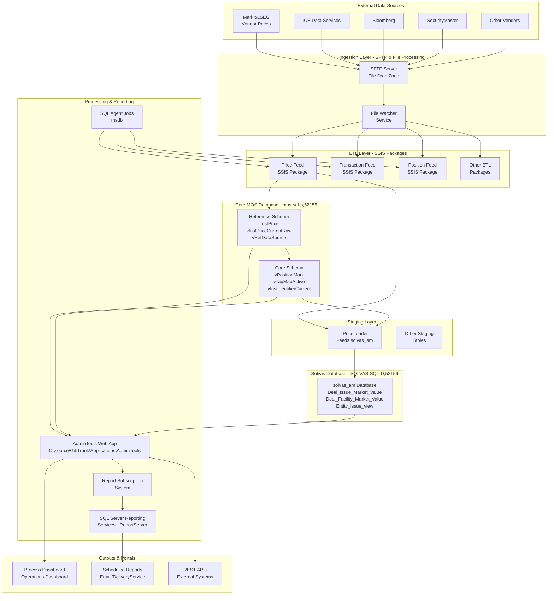
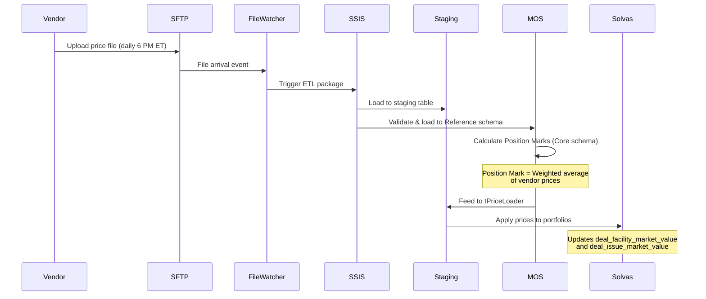
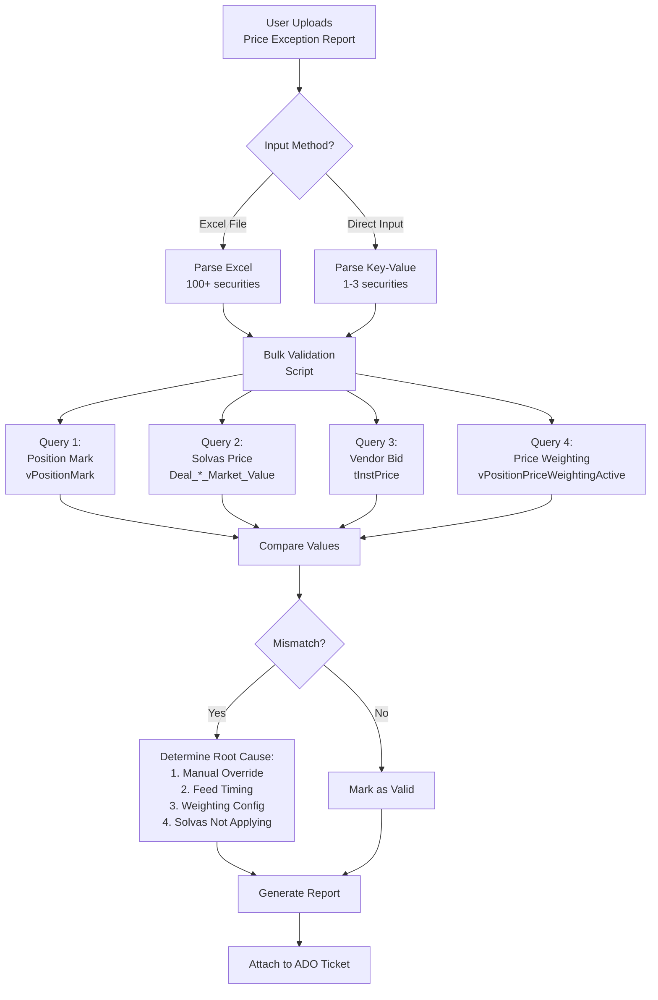

# MOS Back Office Infrastructure Plan
**Date:** 2026-07-13  
**Purpose:** Comprehensive infrastructure map showing data flow from external sources through SFTP, SSIS, databases, and reporting systems

---

## Executive Summary

This document maps the complete MOS (Middle Office System) back office infrastructure, including:
- **Data Sources**: External vendor price feeds (SFTP, API connections)
- **Ingestion Layer**: SSIS packages, file processing, staging tables
- **Core Databases**: MOS (Reference/Core schemas), Solvas, SecurityMaster
- **Processing**: Report Subscription system, scheduled jobs
- **Output**: Reporting portals, dashboards, notifications

---

## Architecture Overview



---

## 1. Data Sources (External Vendors)

### Vendor Price Feeds

| Vendor | Data Type | Delivery Method | Frequency | Coverage |
|--------|-----------|----------------|-----------|----------|
| **MarkIt/LSEG** | Loan prices (bid/ask) | SFTP/API | Daily (EOD) | Syndicated loans |
| **ICE Data Services** | Bond prices | SFTP | Daily | Corporate bonds |
| **Bloomberg** | Market data | Bloomberg API | Real-time/EOD | Multi-asset |
| **SecurityMaster** | Reference data | SFTP/Database sync | Daily | Securities master |

### Data Formats
- CSV files (most vendor feeds)
- XML files (some feeds)
- Fixed-width text files
- JSON (API responses)

### SFTP Server Details
- **Location**: [TBD - SFTP server location]
- **Directories**: Vendor-specific drop folders
- **Retention**: 30 days (typical)
- **Monitoring**: File watcher service

---

## 2. Ingestion Layer

### File Processing Workflow



### SSIS Packages

#### Price Feed Package (Primary Focus)
- **Package Name**: [TBD - searching in Git.Trunk]
- **Purpose**: Process vendor price files → MOS Reference → tPriceLoader → Solvas
- **Schedule**: Daily after vendor file arrival
- **Steps**:
  1. Validate file format
  2. Load to MOS Reference.tInstPrice
  3. Update vInstPriceCurrentRaw views
  4. Calculate Position Marks (Core schema)
  5. Feed to tPriceLoader staging table
  6. Trigger Solvas price update

#### Known Issues
- **CURRENT OUTAGE**: Price feed to tPriceLoader **stopped working June 15, 2026**
- **Impact**: 28 days of missing price data for all Solvas portfolios
- **Root Cause**: Unknown job/process that feeds tPriceLoader has stopped executing
- **Evidence**: tPriceLoader staging table has NO records from June 15 onwards

---

## 3. Database Architecture

### MOS Production Database
**Server**: `mos-sql-p.mos.siepe.local,52155`

#### Reference Schema (Raw Vendor Data)
```sql
-- Vendor price storage
Reference.tInstPrice
  - InstPriceID (PK)
  - InstID (FK to instrument)
  - DataSetID (FK to vRefDataSet - identifies vendor)
  - DataSourceID (FK to vRefDataSource - bid/ask/mid)
  - PriceDate
  - Price (decimal)
  - PriceTypeID
  
-- Current prices view
Reference.vInstPriceCurrentRaw
  - Shows latest price per instrument/vendor/source
  
-- Vendor reference
Reference.vRefDataSource
  - DataSourceID: 1=Bid, 2=Ask, 3=Mid, 4=Last
  
Reference.vRefDataSet
  - DataSetID: 19=MarkIt, 28=ICE, etc.
```

#### Core Schema (Calculated/Processed Data)
```sql
-- Position Marks (weighted prices)
Core.vPositionMark
  - Calculated from vendor prices
  - Uses price weighting configuration
  - This is the "official" MOS price
  
-- Price Weighting Config
Core.vPositionPriceWeightingActive
  - Defines which vendor/source to use per instrument
  - Example: "Use MarkIt Bid for loans, ICE Mid for bonds"
  
-- Instrument identifiers
Core.vInstIdentifierCurrent
  - CUSIP, ISIN, LX codes, etc.
  
-- Tagging for price overrides
Core.vTagMapActive
  - Manual price override tags
```

### Solvas Database
**Server**: `SOLVAS-SQL-D.mos.siepe.local,52156`  
**Database**: `solvas_am`

```sql
-- Bond market values
solvas_am.dbo.Deal_Issue_Market_Value
  - entity_id, issue_id
  - market_value_indent (price × 100)
  - pricing_date
  - last_updated
  
-- Loan market values
solvas_am.dbo.Deal_Facility_Market_Value
  - entity_id, facility_id
  - pricing_type_1 (price as decimal, e.g., 0.99925 = 99.925)
  - pricing_date
  - last_updated
  
-- Manual override log
solvas_am.dbo.deal_facility_market_value_log
  - Tracks manual price corrections
  - Records who/when/what changed
```

### Feeds Database (Staging Layer)
**Server**: `SOLVAS-SQL-D.mos.siepe.local,52156`  
**Database**: `Feeds`

```sql
-- Price staging table (MOS → Solvas)
Feeds.solvas_am.tPriceLoader
  - This is the CRITICAL staging table
  - MOS feeds calculated Position Marks here
  - Solvas reads from here to update portfolio prices
  - **CURRENTLY NOT BEING POPULATED** (since June 15)
  
  Columns:
  - SecurityID (LX identifier)
  - PriceDate
  - Price
  - Source
  - LoadTimestamp
```

---

## 4. Report Subscription System

### AdminTools Web Application
**Location**: `C:\source\Git.Trunk\Applications\AdminTools`  
**Technology**: ASP.NET MVC + AngularJS  
**Purpose**: Internal portal for MOS operations and reporting

#### Key Components

```
AdminTools/
├── Web/
│   ├── Controllers/api/          # REST API controllers
│   ├── js/siepe-angular/         # Angular modules
│   ├── client-specific/          # Client customizations
│   │   ├── 026/                  # MOS client code
│   │   └── [other clients]/
│   └── Web.MOS-Production.config # MOS-specific config
│
├── Services/
│   ├── Application/              # Core services
│   ├── WsoReport/                # Report generation
│   └── PubSub/                   # Event handling
│
├── Models/                       # Data models
├── Data/                         # Data access layer
└── JSTests/specs/reportSubscription/  # Tests
```

#### ReportSubscription Module
**Module**: `siepe.adminTools.reportSubscription` (AngularJS)

Features:
- **Content Types**:
  - `CustomGenericGridSql`: HTML table from SQL query
  - `CustomCsvSql`: CSV attachment from SQL query
  - `CustomFileAttachment`: File attachment payload
  
- **Delivery Mechanisms**:
  - `Email`: Send to email addresses
  - `DeliveryService`: Push to external system
  
- **Scheduling**:
  - Cron expressions for flexible scheduling
  - Offset handling for different timezones
  - Dataset configuration (SQL queries)

---

## 5. Job Scheduling & Timing

### SQL Server Agent Jobs
**Server**: `mos-sql-p.mos.siepe.local,52155` (MOS)  
**Server**: `SOLVAS-SQL-D.mos.siepe.local,52156` (Solvas)

#### Typical Daily Schedule

| Time (ET) | Job | Description | Dependencies |
|-----------|-----|-------------|--------------|
| **6:00 PM** | Vendor File Arrival | MarkIt, ICE, Bloomberg files drop to SFTP | - |
| **6:30 PM** | File Watcher | Detect new files, trigger SSIS | Vendor files |
| **7:00 PM** | SSIS Price Feed | Process files → MOS Reference | File arrival |
| **7:30 PM** | Position Mark Calc | Calculate weighted prices | SSIS complete |
| **8:00 PM** | **tPriceLoader Feed** | MOS → tPriceLoader staging | Position marks ready |
| **8:30 PM** | Solvas Price Update | tPriceLoader → Solvas portfolios | Staging data |
| **9:00 PM** | Validation Reports | Price exception reports | Solvas updated |
| **9:30 PM** | Email Notifications | ReportSubscription sends emails | Reports ready |

> ⚠️ **CRITICAL FAILURE**: The **8:00 PM tPriceLoader Feed job** has not run since **June 15, 2026**  
> This breaks the entire price update pipeline for Solvas portfolios.

---

## 6. Data Flow Diagrams

### Price Feed Flow (Normal Operation)

```mermaid
flowchart LR
    subgraph "6 PM - Vendor Files"
        V[Vendor SFTP<br/>Price Files]
    end
    
    subgraph "7 PM - SSIS Processing"
        S[SSIS Package<br/>Load to MOS]
        R[Reference.tInstPrice<br/>Raw Vendor Data]
    end
    
    subgraph "7:30 PM - Position Marks"
        W[Price Weighting<br/>Configuration]
        P[Core.vPositionMark<br/>Calculated Prices]
    end
    
    subgraph "8 PM - Staging Feed ⚠️ BROKEN"
        J[Unknown Job<br/>❌ NOT RUNNING]
        T[tPriceLoader<br/>Staging Table]
    end
    
    subgraph "8:30 PM - Solvas Update"
        U[Solvas Update Job<br/>Apply Prices]
        SV[Deal_*_Market_Value<br/>Portfolio Prices]
    end
    
    V -->|File arrival| S
    S -->|Load| R
    R -->|Weighted calc| W
    W -->|Calculate| P
    P -->|Feed| J
    J -.->|❌ Stopped<br/>June 15| T
    T -->|Read| U
    U -->|Update| SV
```



### Price Exception Detection Flow



---

## 7. Current Issues & Investigation Status

### ✅ Completed Investigation

#### TASK 83664: Sycamore Loan Price Mismatches
- **Issue**: 101 loan securities have Position Mark ≠ Vendor Bid prices
- **Investigation Date**: July 13, 2026
- **Root Cause**: **Feed Timing Issue** - MOS → Solvas price feed stopped June 15, 2026
- **Evidence**:
  - MarkIt has current prices in MOS Reference (June 15 data exists)
  - MOS calculated Position Marks correctly
  - tPriceLoader staging table has **NO records** from June 15 onwards
  - Solvas prices are frozen at June 14 values
  - All 101 securities affected identically

#### Diagnostic Queries Executed
1. ✅ Solvas override log - No manual corrections found
2. ✅ tPriceLoader staging table - No data since June 15
3. ✅ Current Solvas prices - Frozen at June 14
4. ✅ MOS vendor pricing - MarkIt data current through July 13
5. ✅ Price weighting config - Correct configuration (MarkIt Bid for loans)

#### SSIS Analysis
- ✅ Checked SSISDB.catalog.executions - No failures found
- ✅ Checked SSISDB.catalog.operation_messages - No error messages
- ✅ **Conclusion**: SSIS packages are NOT the issue

### ❌ Unresolved Issues

#### Missing Component: tPriceLoader Feed Job
**Problem**: Cannot identify the specific job/process that feeds tPriceLoader staging table

**Searches Performed**:
- ✅ SQL Agent jobs on MOS server (50 jobs checked)
- ✅ SQL Agent jobs on Solvas server (50 jobs checked)
- ✅ SSIS packages in SSISDB catalog
- ✅ SSRS ReportServer subscriptions
- 🔄 Git.Trunk repository (in progress)

**Next Steps**:
1. Search Git.Trunk Services/Microservices for price feed code
2. Check AdminTools WsoReport service
3. Review ReportSubscription delivery mechanisms
4. Check for scheduled tasks (Windows Task Scheduler)
5. Review PubSub/event-driven components

---

## 8. Infrastructure Gaps & Recommendations

### Documentation Gaps
- [ ] Complete SSIS package inventory
- [ ] SFTP server details and credentials
- [ ] File watcher service configuration
- [ ] Vendor delivery SLAs and schedules
- [ ] SQL Agent job descriptions and dependencies
- [ ] Network topology (firewalls, VPNs, etc.)

### Monitoring Gaps
- [ ] tPriceLoader staging table monitoring (detect when feed stops)
- [ ] File arrival notifications (SFTP)
- [ ] SSIS package failure alerts
- [ ] Price variance alerts (Position Mark vs Vendor)
- [ ] Data freshness checks (flag stale prices)

### Process Improvements
1. **Automated Feed Monitoring**
   - Alert when tPriceLoader has no data for current date
   - Monitor row counts and timestamps
   - Compare expected vs actual file arrivals

2. **Price Validation Dashboard**
   - Real-time view of price pipeline health
   - Show: Vendor File → SSIS → MOS → Staging → Solvas
   - Flag any breaks in the chain

3. **Failover & Recovery**
   - Document manual reprocessing steps
   - Create "catch-up" scripts for missed days
   - Maintain backup of vendor files

4. **Documentation Repository**
   - Centralize all infrastructure docs
   - Include: job schedules, dependencies, contacts
   - Version control in Git

---

## 9. Key Contacts & Resources

### Systems
- **MOS Production**: `mos-sql-p.mos.siepe.local,52155`
- **Solvas Dev**: `SOLVAS-SQL-D.mos.siepe.local,52156`
- **Git.Trunk**: `C:\source\Git.Trunk`
- **AdminTools**: `C:\source\Git.Trunk\Applications\AdminTools`

### Databases
- **MOS**: Reference schema, Core schema
- **Solvas**: solvas_am database
- **Feeds**: Staging tables (tPriceLoader)
- **SSISDB**: SSIS package catalog
- **msdb**: SQL Agent jobs
- **ReportServer**: SSRS subscriptions

### Code Repositories
- **Git.Trunk**: Main codebase
  - Applications/AdminTools - Web portal
  - Services - Background services
  - Microservices - Event-driven components
  - Database - SQL scripts and stored procedures

---

## 10. Next Actions

### Immediate (Fix tPriceLoader Feed)
1. ✅ Root cause identified - Feed timing issue
2. 🔄 Identify specific job/script that feeds tPriceLoader
3. ⏳ Determine why job stopped on June 15
4. ⏳ Fix and restart the feed job
5. ⏳ Reprocess dates June 15 - July 13 (28 days)
6. ⏳ Validate all 101 Sycamore securities updated correctly

### Short-term (Monitoring & Documentation)
1. Document complete infrastructure (this file)
2. Create monitoring for tPriceLoader feed
3. Set up alerts for price pipeline failures
4. Document all SSIS packages and jobs
5. Create runbook for common issues

### Long-term (Strategic Improvements)
1. Migrate from SSIS to modern data pipeline (Azure Data Factory?)
2. Implement event-driven architecture (replace scheduled jobs)
3. Create unified operations dashboard
4. Automate price exception detection and routing
5. Implement automated testing for price calculations

---

## Appendix A: Technology Stack

- **Databases**: SQL Server (MOS, Solvas, SSISDB, msdb, ReportServer)
- **ETL**: SQL Server Integration Services (SSIS)
- **Scheduling**: SQL Server Agent
- **Reporting**: SQL Server Reporting Services (SSRS)
- **Web App**: ASP.NET MVC, AngularJS (AdminTools)
- **Language**: C# (.NET Framework), JavaScript/TypeScript, T-SQL
- **Version Control**: Git (Git.Trunk repository)
- **Configuration**: Web.config transformations, appsettings.json

---

## Appendix B: Glossary

- **Position Mark**: MOS's calculated "official" price for a security (weighted average of vendor prices)
- **Price Weighting**: Configuration defining which vendor/source to use per instrument
- **tPriceLoader**: Critical staging table that receives prices from MOS and feeds Solvas
- **Solvas**: Portfolio accounting system that uses MOS prices for valuations
- **CUSIP**: 9-character security identifier (bonds)
- **LX Code**: Loan identifier used by MarkIt/LSEG
- **Bid/Ask/Mid**: Price types (bid=buy, ask=sell, mid=average)
- **EOD**: End of Day (typical price delivery time)
- **SFTP**: Secure File Transfer Protocol (how vendors deliver files)
- **AdminTools**: Internal web portal for MOS operations

---

**Document Version**: 1.0  
**Last Updated**: 2026-07-13  
**Status**: Initial draft - gaps identified, investigation ongoing
