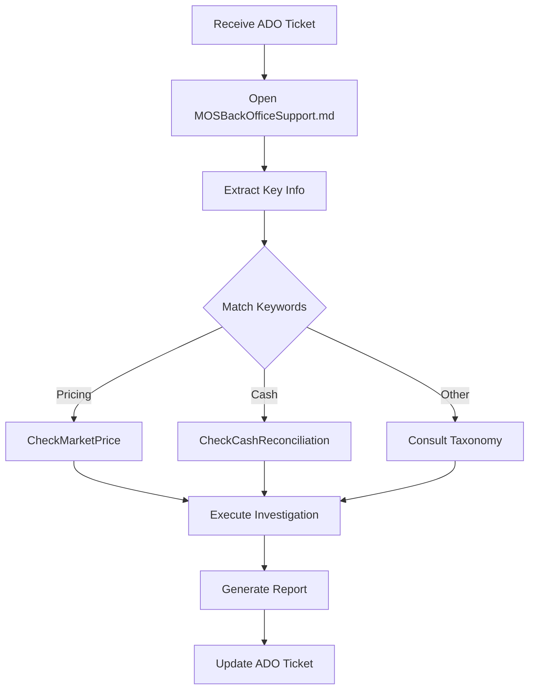

# MOS Back Office Support - AdminTools

**Version:** 1.2  
**Last Updated:** 2026-07-06  
**Purpose:** Agent-based investigation toolkit for MOS support tickets with automatic ADO integration

---

## 🚀 Quick Start

### Invoke the MOS Support Agent

**Method 1: With ADO Ticket Number**
```
@MOS Support Agent investigate ticket #82115
```

**Method 2: With Issue Description**
```
@MOS Support Agent why is Aristotle getting LSEG pricing instead of Markit for CUSIP 83408EAA1?
```

**Method 3: With Problem Type**
```
@MOS Support Agent cash balance mismatch for Brotherhood Mutual on 2026-06-30
```

The agent will:
1. ✅ Parse the ticket/issue
2. ✅ Route to the appropriate skill (with confidence score)
3. ✅ Execute database investigation
4. ✅ Generate markdown report
5. ✅ **Post results as comment to ADO ticket** (automatic!)

**🎲 Confidence Scoring:** Agent calculates routing confidence (0-100%) based on keyword matches. Tickets with < 70% confidence are logged for taxonomy improvement.

**📝 ADO Integration:** When you provide a ticket number (#XXXXX), the agent automatically posts investigation results as a comment to the ticket using Azure CLI.

---

### For Manual Investigation

**If you prefer to investigate manually:**
1. Read the ticket title and description
2. Open [MOSBackOfficeSupport.md](./MOSBackOfficeSupport.md) (Global Controller)
3. Use the routing table to find the right skill
4. Execute the investigation skill
5. Generate report and update ADO ticket

**New to the System?**
- Agent file: [.github/agents/MOSSupport.agent.md](./.github/agents/MOSSupport.agent.md)
- Controller docs: [MOSBackOfficeSupport.md](./MOSBackOfficeSupport.md)
- Learn categories: [MOSSupportTaskTaxonomy.md](./MOSSupportTaskTaxonomy.md)
- Get connections: [MOSSystemConnectionsReference.md](./MOSSystemConnectionsReference.md)

---

## 📁 Folder Structure

```
AdminTools/
├── README.md                            ← You are here
├── MOSBackOfficeSupport.md              ← 🎯 START HERE - Global controller
├── MOSSupportTaskTaxonomy.md            ← Ticket routing & categories (with confidence scoring)
├── MOSSystemConnectionsReference.md     ← Database connections
│
├── .github/
│   ├── agents/
│   │   └── MOSSupport.agent.md          ← 🤖 INVOKABLE AGENT (use @MOS Support Agent)
│   └── skills/
│       ├── check-market-price/
│       │   └── SKILL.md                 ← ✅ Ready (Category 1)
│       ├── check-cash-reconciliation/   ← 🚧 Coming Soon
│       └── ...more skills...
│
├── Output/                              ← Generated reports
│   ├── CheckMarketPrice_*.md            ← Investigation reports
│   └── LowConfidenceTickets.md          ← 📊 Tracking for taxonomy improvement
│
├── Reference/                           ← Supporting docs
│   ├── MOSDatabaseSchema.md
│   ├── MOSPlayers.md
│   └── MOSSupportRole.md
│
└── Archive/                             ← Historical docs
    └── ...archived planning docs...
```

---

## 🎯 Core Files

### 1. [MOSBackOfficeSupport.md](./MOSBackOfficeSupport.md)
**The Global Controller - Start here!**

- Agent orchestration logic
- Ticket parsing workflow
- Skill routing decision tree
- Database connection setup
- ADO integration commands
- Output formatting templates
- Quick start examples

**Use this when:** You need to investigate any MOS support ticket

---

### 2. [MOSSupportTaskTaxonomy.md](./MOSSupportTaskTaxonomy.md)
**Ticket Classification & Routing**

- 10 primary categories (~825 annual tickets)
- Keyword-to-skill mapping
- Investigation patterns per category
- Priority escalation rules
- Skill development roadmap

**Categories:**
1. Market Pricing Issues (~50/year) - ✅ CheckMarketPrice
2. Cash Reconciliation (~120/year) - 🚧 Phase 1
3. Data Normalization (~80/year) - 🚧 Phase 1
4. SSIS/PowerShell Errors (~150/year) - 🚧 Phase 1
5. Portfolio/Fund Setup (~40/year) - 📋 Phase 2
6. Data Quality Issues (~60/year) - 📋 Phase 2
7. Performance Issues (~30/year) - 📋 Phase 2
8. Integration/Feed Issues (~70/year) - 📋 Phase 2
9. Workflow/Approval (~25/year) - 📋 Phase 3
10. Database Schema Changes (~200/year) - 📋 Phase 3

**Use this when:** You need to route a ticket to the right skill or understand issue categories

---

### 3. [MOSSystemConnectionsReference.md](./MOSSystemConnectionsReference.md)
**Database Connection Strings & URLs**

- MOS Production: mos-sql-p.mos.siepe.local,52155
- Solvas Dev: SOLVAS-SQL-D.mos.siepe.local,52156
- **40+ Client Databases:** Aristotle, Diameter, Security Master, Sycamore, etc.
- Connection string formats (C#, PowerShell, SSMS)
- Azure DevOps authentication setup
- Azure DevOps links

**Use this when:** You need database connection info, client database access, or Azure DevOps URLs

---

## 🛠️ Skills Library

### ✅ Production Ready

#### check-market-price
**File:** [.github/skills/check-market-price/SKILL.md](./.github/skills/check-market-price/SKILL.md)  
**Slash Command:** `/check-market-price`  
**Category:** Market Pricing Issues (Category 1)  
**Handles:** ~50 tickets/year  
**Status:** ✅ Production Ready (v1.3)

**Investigates:**
- Missing vendor prices (Markit, LSEG, ICE, Sycamore)
- Price weighting configuration
- Vendor source priority issues
- Root cause identification
- **NEW:** Finding CUSIPs when not provided in ticket (via Enhanced Pricing Report)

**Example Tickets:**
- #82115: "FW: Aristotle - Enhanced Pricing Report Daily"
- Pricing discrepancies, vendor source questions

---

#### check-ssis-errors
**File:** [.github/skills/check-ssis-errors/SKILL.md](./.github/skills/check-ssis-errors/SKILL.md)  
**Slash Command:** `/check-ssis-errors`  
**Category:** SSIS/PowerShell Errors (Category 4)  
**Handles:** ~150 tickets/year  
**Status:** ✅ Production Ready (v1.0)

**Investigates:**
- SSIS pipeline errors (0x80004005, 0xC0202009)
- Lookup component failures (0xC004701A)
- Script Task exceptions (IndexOutOfRange)
- Schema mismatch errors
- OLE DB constraint violations
- Pre-execute phase failures

**Example Tickets:**
- #72342: CitiTrustee SSIS Script Task index out of range
- #73644: MOS SSIS LegalEntityIdentifierType pipeline error
- #70811: Ledger Balance SSIS InstID lookup failure

---

#### remove-process-dashboard-reports
**File:** [.github/skills/remove-process-dashboard-reports/SKILL.md](./.github/skills/remove-process-dashboard-reports/SKILL.md)  
**Slash Command:** `/remove-process-dashboard-reports`  
**Category:** Dashboard/Report Management (Category 11)  
**Handles:** ~15 tickets/year  
**Status:** ✅ Production Ready (v1.0)

**Investigates:**
- Removing reports from Process Dashboard (Operations Dashboard)
- Deleting reports by keyword pattern (e.g., "Cashflow")
- Manual UI removal via AdminTools
- SQL-based removal using stored procedures
- Verification of report deletion

**Safety Features:**
- ⚠️ Domain-specific keyword validation (rejects generic terms like "Report", "Daily")
- ⚠️ Safety threshold (stops if >10 reports match)
- ⚠️ Pre-deletion review checklist
- ✅ Soft delete only (RefRecStatusID = 0, audit preserved)

**Keyword Examples:**
- ✅ "Cashflow" - Domain-specific, acceptable
- ❌ "Report" - Generic, rejected

**Example Tickets:**
- #82117: Remove Cashflow reports from Citi Trustee and MOS Process Dashboard

---

### 🚧 Coming Soon (Phase 1)

**check-data-normalization** (~80 tickets/year, Medium)
- Data mapping issues
- Transformation errors
- Source data validation

**check-cash-reconciliation** (~120 tickets/year, Critical)
- Balance discrepancies
- Transaction matching
- SFR issues
- Approval workflow

---

### 📋 Phase 2 (Backlog)

---

## 🎲 Confidence Tracking System

**Purpose:** Identify taxonomy gaps and improve ticket classification over time.

### How It Works

1. **Agent calculates routing confidence** when matching ticket to skill
   - High (90-100%): 3+ exact keyword matches
   - Medium (60-89%): 1-2 exact keywords
   - Low (30-59%): Partial keyword matches
   - Very Low (0-29%): No clear match

2. **Low confidence tickets (< 70%) are logged** to [Output/LowConfidenceTickets.md](./Output/LowConfidenceTickets.md)

3. **Monthly reviews** identify patterns and taxonomy improvements

### Example Log Entry
```markdown
Ticket #82500 - "Daily NAV calculation mismatch"
Confidence: 65% (Medium-Low)
Routed To: check-data-quality
Keywords Found: "NAV", "calculation", "mismatch"
Recommendation: Add "NAV", "net asset value" to Category 6 keywords
```

### Benefits
- ✅ **Tracks edge cases** that don't fit current categories
- ✅ **Identifies missing keywords** in taxonomy
- ✅ **Suggests new categories** when patterns emerge (10+ similar tickets)
- ✅ **Improves routing accuracy** through iterative refinement
- ✅ **Prioritizes skill development** based on actual ticket patterns

### Monthly Review Process
1. Review [Output/LowConfidenceTickets.md](./Output/LowConfidenceTickets.md)
2. Identify 3+ tickets with similar patterns
3. Update [MOSSupportTaskTaxonomy.md](./MOSSupportTaskTaxonomy.md) keywords
4. Consider new category if 10+ similar tickets
5. Update skill development roadmap

---

## 📊 Output Reports

All investigation reports are saved in `./Output/` folder:

**Naming Convention:** `{SkillName}_{Identifier}_{Date}.md`

**Example:**
- `CheckMarketPrice_83408EAA1_20260630.md`
- `CheckCashReconciliation_AccountID123_20260630.md`

Reports include:
- **Routing confidence score**
- Investigation summary
- Root cause analysis
- SQL query results
- Recommendations
- ADO-ready comment format

**🎯 ADO Integration:**
- Reports are automatically posted as comments to ADO tickets when ticket # is provided
- Requires Azure CLI authentication (`az login`)
- Falls back to copy-paste format if authentication fails

---

## 🔄 Typical Workflow



---

## 🎓 For Skill Developers

### Adding a New Skill

1. **Create skill folder:** `.github/skills/{skill-name}/`
2. **Create skill file:** `.github/skills/{skill-name}/SKILL.md`
3. **Follow template:** Use check-market-price as reference
3. **Include standard sections:**
   - YAML frontmatter (metadata)
   - Purpose & when to use
   - Required inputs
   - Investigation steps (numbered)
   - SQL query templates
   - Output format
   - Example tickets
4. **Test:** Run against real ADO ticket
5. **Update files:**
   - Add to MOSSupportTaskTaxonomy.md routing table
   - Add to MOSBackOfficeSupport.md available skills
   - Update this README
6. **Document:** Create example output in Output/ folder

### Skill Template Structure

```yaml
---
skill_name: skill-kebab-case
title: Human Readable Skill Title
description: What this skill investigates and resolves
version: 1.0
database: mos-prod
output_format: markdown
apply_to:
  - pattern: "**/*"
    when_user_mentions:
      - "keyword1"
      - "keyword2"
---

# Skill Title

## Purpose
[What this skill does]

## When to Use This Skill
[Ticket symptoms that trigger this skill]

## Required Inputs
[Data needed from ticket]

## Database Connection
[Connection info reference]

## Investigation Steps
### Step 1: [First Step]
[SQL query and analysis]

### Step 2: [Second Step]
[SQL query and analysis]

...

## Output Format
[Report template]

## Example Tickets Resolved
- #XXXXX: Description
```

---

## 🔐 Access Requirements

### Database Access
- **MOS Production:** mos-sql-p.mos.siepe.local,52155
  - Requires: Windows authentication with siepe.local domain
  - Databases: Core, Reference, Employee
  
- **Solvas Development:** SOLVAS-SQL-D.mos.siepe.local,52156
  - Requires: Windows authentication
  - Databases: Solvas_AM, Feeds

### Azure DevOps Access
- Organization: https://siepe.visualstudio.com/
- Project: Siepe.Software
- Area Path: Siepe.Software\Back Office SQL Engineers
- Permission: View and comment on work items
- **Authentication:** Run `az login` before using agent for automatic comment posting

**Setup Commands:**
```powershell
# Authenticate to Azure (required for posting comments)
az login

# Set default organization and project
az devops configure --defaults organization=https://siepe.visualstudio.com/ project="Siepe.Software"

# Verify access
az boards work-item show --id {SampleTicketID}
```

**If authentication fails:** Agent will display formatted comment for manual copy-paste into ADO.

### Tools Required
- **sqlcmd:** SQL Server command line (installed with SQL Server)
- **az cli:** Azure CLI with boards extension
- **PowerShell:** 5.1+ or PowerShell Core 7+
- **VS Code:** (optional) For editing markdown and SQL

---

## 📈 Success Metrics

### Current Status (2026-07-01)

| Metric | Target | Current |
|--------|--------|---------|
| Skills coverage | > 70% | 27% (3/11) |
| Avg resolution time | < 30 min | TBD |
| First-time resolution | > 80% | TBD |
| Team adoption | > 50% | TBD |

### Phase Progress

- ✅ **Phase 1:** 3/3 complete (CheckMarketPrice, CheckSSISErrors, RemoveProcessDashboardReports)
- 🚧 **Phase 2:** 0/4 started
- 📋 **Phase 3:** 0/4 planned

---

## 📞 Support

### Questions or Issues?

- **Team:** Back Office SQL Engineers
- **Documentation:** This folder (AdminTools/)
- **ADO Workspace:** Siepe.Software\Back Office SQL Engineers

### Suggest Improvements

To suggest improvements to the agent or skills:
1. Create ADO task
2. Add tag: `agent-improvement`
3. Assign to: Back Office SQL Engineers team

---

## 📝 Version History

| Version | Date | Changes | Skills Added |
|---------|------|---------|--------------|
| 1.2 | 2026-07-06 | Added Process Dashboard report removal skill with domain-specific keyword validation (accepts business terms like "Cashflow", rejects generic terms like "Report") and safety thresholds | RemoveProcessDashboardReports |
| 1.1 | 2026-07-02 | Added automatic ADO comment posting via Azure CLI | - |
| 1.0 | 2026-07-01 | Initial release | CheckMarketPrice, CheckSSISErrors |

---

## 🔗 Quick Links

- [MOSBackOfficeSupport.md](./MOSBackOfficeSupport.md) - Global Controller
- [MOSSupportTaskTaxonomy.md](./MOSSupportTaskTaxonomy.md) - Ticket Categories
- [MOSSystemConnectionsReference.md](./MOSSystemConnectionsReference.md) - Connections
- [.github/skills/check-market-price/SKILL.md](./.github/skills/check-market-price/SKILL.md) - Pricing Skill
- [Output/](./Output/) - Investigation Reports
- [Reference/](./Reference/) - Supporting Docs

---

**Last Updated:** 2026-07-02  
**Next Review:** 2026-10-01 (Quarterly)
