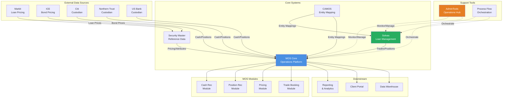
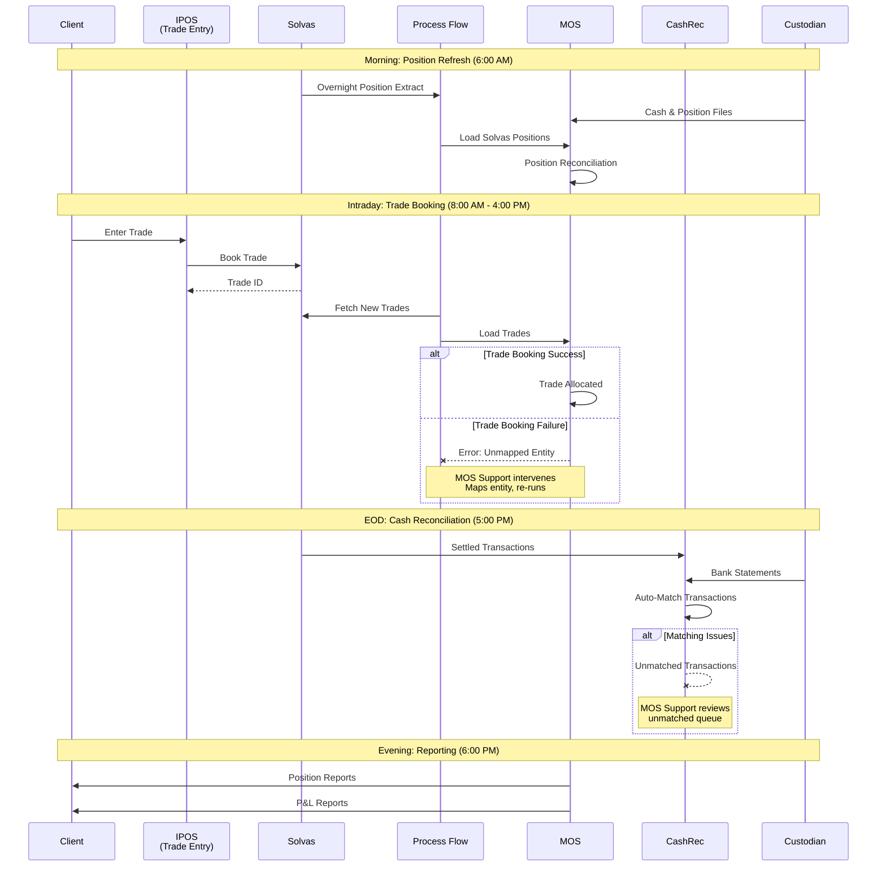
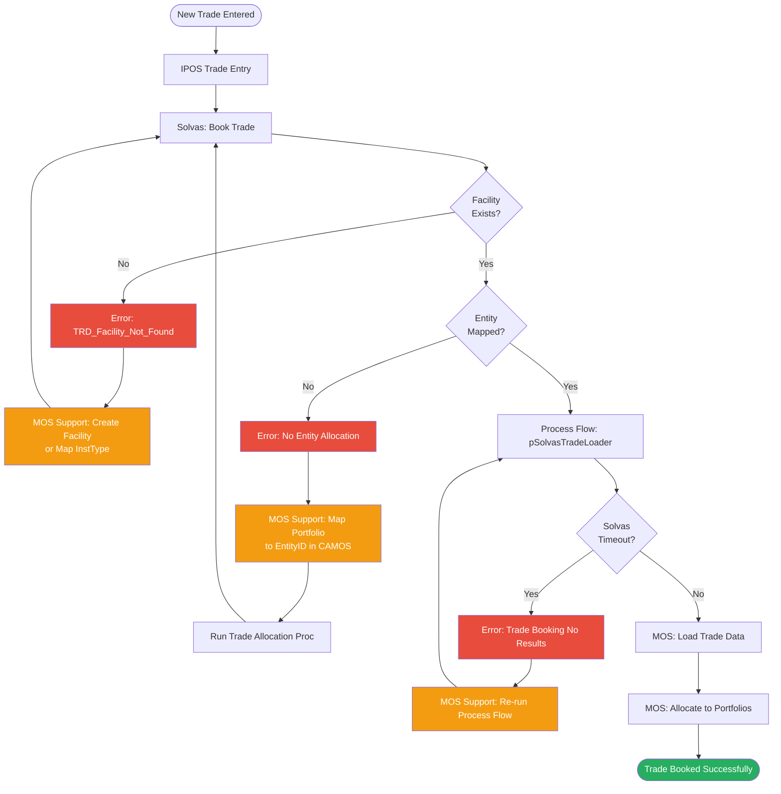
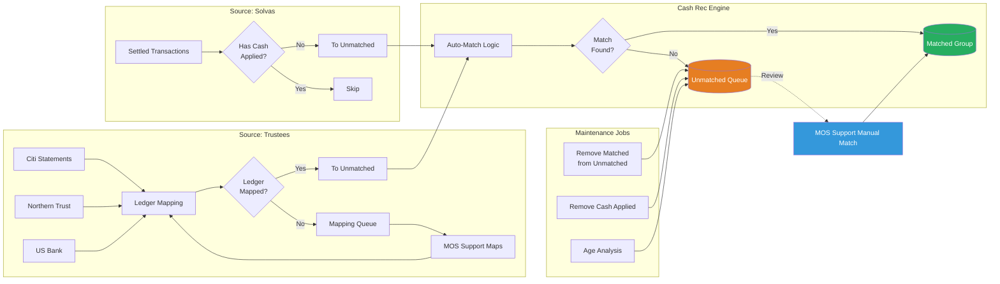
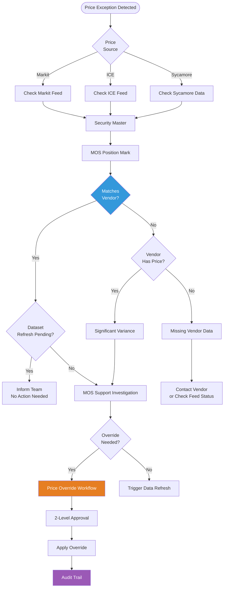
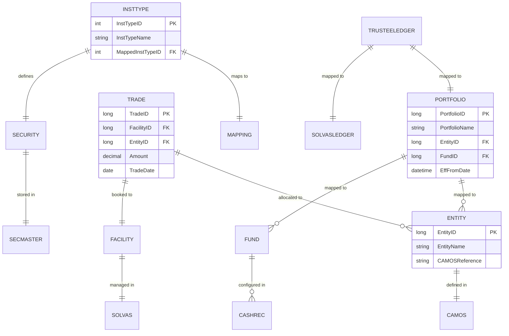
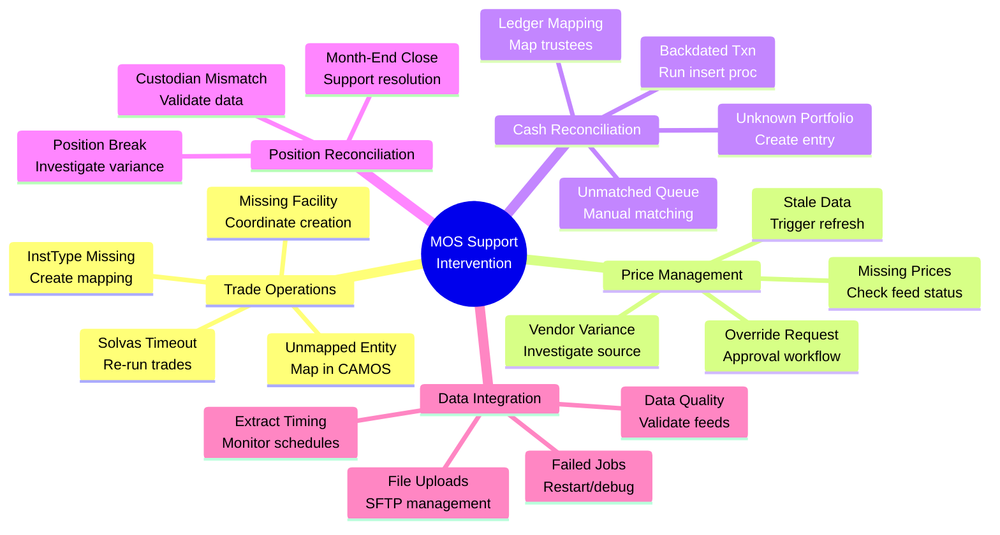
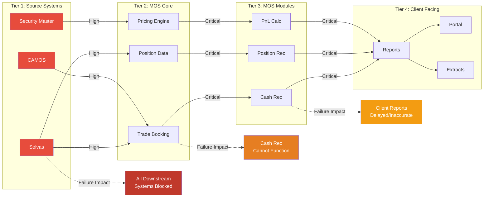
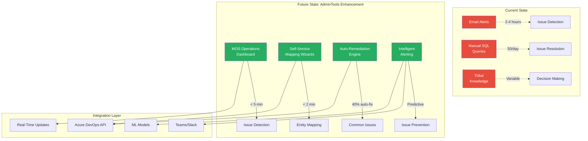

# MOS Support Role Summary

**Date:** 2026-06-30  
**Related Documents:**
- [MOS Client Support Issues Summary](./MOS-Client-Support-Issues-Summary.md)
- [AdminTools Enhancement Plan](./MOS-Support-Enhancement-Plan.md)


### The Future Vision (AdminTools Enhancements)

Instead of being **reactive firefighters**, the goal is to become **proactive monitors**:

**Current State** (2026):
- Find out about problems 2-4 hours AFTER they happen (email alerts)
- Manually investigate with SQL queries
- Fix one issue at a time

**Future State** (2027-2028):
- **Real-time dashboards** show problems within 5 minutes
- **Self-service wizards** let users map entities in 30 seconds (vs. 15 minutes)
- **Auto-remediation** fixes 40% of issues automatically (no human needed)
- **Predictive alerts** warn about problems BEFORE they happen

**Result**: 
- More time for strategic work (not firefighting)
- Faster resolution times
- Better client experience
- Lower stress for support team

---

## Power BI Metrics for MOS Operations Dashboard

### Executive Summary Metrics (Homepage KPIs)

These high-level metrics provide instant visibility into overall system health:

| Metric | Description | Target | Data Source |
|--------|-------------|--------|-------------|
| **Daily Trade Success Rate** | % of trades that book successfully without manual intervention | ≥ 98% | `dbo.vPosition`, Process Flow logs |
| **Cash Rec Match Rate** | % of cash transactions auto-matched (no manual work needed) | ≥ 65% (current)<br/>≥ 85% (target) | `CashRec.tCashRec` |
| **Position Reconciliation Status** | % of positions matching custodian records | ≥ 99.5% | `dbo.vPositionRecActive` |
| **Price Coverage** | % of positions with valid prices from vendors | ≥ 99% | `dbo.vPosition`, Security Master |
| **Issue Detection Time** | Average time from issue occurrence to detection | < 5 minutes (target)<br/>2-4 hours (current) | Process Flow, Alert logs |
| **Issue Resolution Time** | Average time to resolve an issue once detected | < 15 minutes (target)<br/>45-60 min (current) | Support ticket system |

---

### 1. Trade Operations Metrics

#### **Trade Booking Performance**

**Purpose:** Monitor trade flow from IPOS → Solvas → MOS

| Metric | Calculation | Visualization | Why It Matters |
|--------|-------------|---------------|----------------|
| **Daily Trade Volume** | COUNT(Trades) by Date | Line chart (trending) | Understand workload patterns |
| **Trade Booking Success Rate** | (Successful Trades / Total Trades) × 100 | Gauge (98% target) | Primary SLA metric |
| **Failed Trades by Error Type** | COUNT(Trades) GROUP BY ErrorType | Pie chart or bar chart | Identify common failure patterns |
| **Trade Booking Time Distribution** | AVG(Booking Duration) by Hour | Heatmap | Find peak load times |
| **Trades Pending Allocation** | COUNT(Trades WHERE EntityID IS NULL) | Card (real-time) | Active work queue |
| **Solvas Timeout Rate** | (Timeout Errors / Total Calls) × 100 | Line chart (trending) | System performance indicator |

**SQL Example (Trade Success Rate):**
```sql
SELECT 
    CAST(TradeDate AS DATE) as Date,
    COUNT(*) as TotalTrades,
    SUM(CASE WHEN BookedSuccessfully = 1 THEN 1 ELSE 0 END) as SuccessfulTrades,
    CAST(SUM(CASE WHEN BookedSuccessfully = 1 THEN 1 ELSE 0 END) * 100.0 / COUNT(*) AS DECIMAL(5,2)) as SuccessRate
FROM dbo.vTrade
WHERE TradeDate >= DATEADD(day, -30, GETDATE())
GROUP BY CAST(TradeDate AS DATE)
ORDER BY Date
```

#### **Entity Mapping Health**

| Metric | Calculation | Visualization | Why It Matters |
|--------|-------------|---------------|----------------|
| **Unmapped Portfolios** | COUNT(DISTINCT PortfolioID WHERE EntityID IS NULL) | Card (alert if > 0) | Blocks trade allocation |
| **New Portfolios This Month** | COUNT(New Portfolios) by Month | Bar chart | Predict mapping workload |
| **Mapping Completion Time** | AVG(Time from Detection to Resolution) | Line chart | Efficiency metric |
| **Top 10 Unmapped Instruments** | COUNT(Trades) by InstType WHERE Unmapped | Table | Focus remediation efforts |

**SQL Example (Unmapped Portfolios):**
```sql
SELECT 
    p.PortfolioID,
    p.PortfolioName,
    COUNT(DISTINCT t.TradeID) as PendingTrades,
    MIN(t.TradeDate) as OldestPendingTrade
FROM dbo.vPosition p
INNER JOIN dbo.vTrade t ON t.PortfolioID = p.PortfolioID
WHERE p.EntityID IS NULL
    AND p.refdatasetdate = CAST(GETDATE() AS DATE)
GROUP BY p.PortfolioID, p.PortfolioName
ORDER BY PendingTrades DESC
```

---

### 2. Cash Reconciliation Metrics

#### **Matching Performance**

**Purpose:** Track efficiency of cash reconciliation processes

| Metric | Calculation | Visualization | Why It Matters |
|--------|-------------|---------------|----------------|
| **Daily Match Rate** | (Matched Txns / Total Txns) × 100 | Gauge + trend line | Core operational metric |
| **Unmatched Transaction Count** | COUNT(Unmatched) by Date | Area chart | Work queue size |
| **Unmatched Amount (USD)** | SUM(Amount WHERE Status = Unmatched) | Card (large, bold) | Financial exposure |
| **Aging Analysis** | COUNT(Txns) by Age Buckets (0-30, 31-60, 60+ days) | Stacked bar chart | Identify old issues |
| **Match Rate by Custodian** | Match % GROUP BY Custodian | Bar chart (comparison) | Find problem custodians |
| **Match Rate by Fund** | Match % GROUP BY Fund | Table (sortable) | Find problem funds |

**SQL Example (Unmatched Aging):**
```sql
SELECT 
    crf.FundName,
    CASE 
        WHEN DATEDIFF(day, cr.TransactionDate, GETDATE()) <= 30 THEN '0-30 days'
        WHEN DATEDIFF(day, cr.TransactionDate, GETDATE()) <= 60 THEN '31-60 days'
        WHEN DATEDIFF(day, cr.TransactionDate, GETDATE()) <= 90 THEN '61-90 days'
        ELSE '90+ days'
    END as AgeGroup,
    COUNT(*) as TransactionCount,
    SUM(cr.Amount) as TotalAmount
FROM CashRec.tCashRec cr
JOIN CashRec.tCashRecFund crf ON crf.CashRecFundID = cr.CashRecFundID
WHERE cr.MatchStatusID = 1 -- Unmatched
    AND cr.RefRecStatusID = 1 -- Active
GROUP BY crf.FundName, 
    CASE 
        WHEN DATEDIFF(day, cr.TransactionDate, GETDATE()) <= 30 THEN '0-30 days'
        WHEN DATEDIFF(day, cr.TransactionDate, GETDATE()) <= 60 THEN '31-60 days'
        WHEN DATEDIFF(day, cr.TransactionDate, GETDATE()) <= 90 THEN '61-90 days'
        ELSE '90+ days'
    END
ORDER BY crf.FundName, 
    CASE 
        WHEN DATEDIFF(day, cr.TransactionDate, GETDATE()) <= 30 THEN 1
        WHEN DATEDIFF(day, cr.TransactionDate, GETDATE()) <= 60 THEN 2
        WHEN DATEDIFF(day, cr.TransactionDate, GETDATE()) <= 90 THEN 3
        ELSE 4
    END
```

#### **Ledger Mapping Status**

| Metric | Calculation | Visualization | Why It Matters |
|--------|-------------|---------------|----------------|
| **Unmapped Ledgers** | COUNT(Ledgers WHERE Mapping IS NULL) | Card (alert if > 0) | Blocks auto-matching |
| **Ledger Mapping Completion Rate** | (Mapped / Total) × 100 | Progress bar | Setup completion status |
| **New Ledgers This Month** | COUNT(New Ledgers) by Month | Bar chart | Predict mapping work |

---

### 3. Price Exception Metrics

#### **Pricing Data Quality**

**Purpose:** Ensure accurate position valuations

| Metric | Calculation | Visualization | Why It Matters |
|--------|-------------|---------------|----------------|
| **Price Coverage Rate** | (Positions with Price / Total Positions) × 100 | Gauge (99% target) | Valuation accuracy |
| **Missing Prices Count** | COUNT(Positions WHERE Price IS NULL) | Card + drill-through | Valuation gaps |
| **Price Variance Exceptions** | COUNT(Positions WHERE ABS(Price Change) > 5%) | Card + list | Investigate outliers |
| **Average Price Age** | AVG(Days since Last Price Update) | Card | Data freshness |
| **Price Source Breakdown** | COUNT(Positions) by PriceSource | Pie chart | Vendor dependency |
| **Price Overrides** | COUNT(Manual Overrides) by Date | Line chart | Manual intervention tracking |

**SQL Example (Missing Prices by Instrument Type):**
```sql
SELECT 
    s.InstrumentType,
    COUNT(DISTINCT p.PositionID) as PositionCount,
    SUM(p.FaceValue) as TotalFaceValue,
    STRING_AGG(s.SecurityName, ', ') as Examples
FROM dbo.vPosition p
LEFT JOIN dbo.vSecurity s ON s.SecurityID = p.SecurityID
WHERE p.PositionMark IS NULL
    AND p.refdatasetdate = CAST(GETDATE() AS DATE)
    AND p.Quantity > 0
GROUP BY s.InstrumentType
ORDER BY PositionCount DESC
```

#### **Vendor Performance**

| Metric | Calculation | Visualization | Why It Matters |
|--------|-------------|---------------|----------------|
| **Markit Coverage (Loans)** | % Loans with Markit Price | Gauge | Vendor SLA tracking |
| **ICE Coverage (Bonds)** | % Bonds with ICE Price | Gauge | Vendor SLA tracking |
| **Vendor Variance Rate** | % Positions WHERE Price differs from Vendor > 2% | Line chart | Data quality issue |
| **Feed Latency** | Hours since Last Vendor Update | Card (alert if > 24h) | Data freshness |

---

### 4. Position Reconciliation Metrics

#### **Position Accuracy**

**Purpose:** Ensure MOS positions match custodian records

| Metric | Calculation | Visualization | Why It Matters |
|--------|-------------|---------------|----------------|
| **Position Match Rate** | (Matching Positions / Total Positions) × 100 | Gauge (99.5% target) | Accuracy metric |
| **Total Break Count** | COUNT(Positions WHERE Variance ≠ 0) | Card | Open issues |
| **Break Amount (USD)** | SUM(ABS(Variance × Price)) | Card (financial impact) | Dollar exposure |
| **Breaks by Custodian** | COUNT(Breaks) by Custodian | Bar chart | Identify problem source |
| **Breaks by Portfolio** | COUNT(Breaks) by Portfolio | Table (sortable) | Focus remediation |
| **Break Resolution Time** | AVG(Days to Resolve) | Line chart | Efficiency metric |

**SQL Example (Current Position Breaks):**
```sql
SELECT 
    pr.Portfolio,
    pr.Instrument,
    pr.Custodian,
    pr.Quantity as MOSQuantity,
    pr.CustodianQuantity,
    pr.Variance,
    pr.Quantity * pr.Price as MOSValue,
    pr.CustodianQuantity * pr.Price as CustodianValue,
    (pr.Quantity - pr.CustodianQuantity) * pr.Price as BreakAmount,
    pr.RefDatasetDate
FROM dbo.vPositionRecActive pr
WHERE pr.Variance <> 0
    AND pr.RefDatasetDate = CAST(GETDATE() AS DATE)
ORDER BY ABS((pr.Quantity - pr.CustodianQuantity) * pr.Price) DESC
```

---

### 5. Support Team Performance Metrics

#### **Operational Efficiency**

**Purpose:** Track support team productivity and identify bottlenecks

| Metric | Calculation | Visualization | Why It Matters |
|--------|-------------|---------------|----------------|
| **Manual SQL Queries per Day** | COUNT(Queries) by Date | Line chart (target: reduce to 5) | Manual effort indicator |
| **Average Resolution Time** | AVG(Close Time - Open Time) by Issue Type | Bar chart | Efficiency by category |
| **Issues by Category** | COUNT(Issues) GROUP BY Category | Pie chart | Focus improvement areas |
| **Escalations per Day** | COUNT(Escalated Issues) | Line chart | Problem severity tracking |
| **First-Contact Resolution Rate** | (Resolved on First Contact / Total) × 100 | Gauge | Support quality |
| **Support Hours Spent** | SUM(Hours) by Category | Stacked area chart | Resource allocation |

**Example Metrics:**
- **Current State:** ~50 SQL queries/day, 45-60 min avg resolution, 2-4 hour detection lag
- **Target State:** ~5 SQL queries/day, 15 min avg resolution, 5 min detection lag

---

### 6. System Health & Integration Metrics

#### **Data Flow Monitoring**

**Purpose:** Track health of system integrations and data pipelines

| Metric | Calculation | Visualization | Why It Matters |
|--------|-------------|---------------|----------------|
| **Process Flow Success Rate** | (Successful Jobs / Total Jobs) × 100 | Gauge (95% target) | System reliability |
| **Failed Jobs by Type** | COUNT(Failures) by JobType | Bar chart | Problem identification |
| **Data Latency** | Hours since Last Update by Source | Table (color-coded) | Data freshness |
| **Extract Volume Trends** | Record Count by Extract by Date | Line chart (multi-series) | Detect anomalies |
| **System Uptime** | % Time System Available | Gauge (99% target) | Infrastructure health |

**SQL Example (Process Flow Job Status):**
```sql
-- Note: Actual table names depend on Process Flow schema
SELECT 
    JobName,
    COUNT(*) as TotalRuns,
    SUM(CASE WHEN Status = 'Success' THEN 1 ELSE 0 END) as SuccessfulRuns,
    SUM(CASE WHEN Status = 'Failed' THEN 1 ELSE 0 END) as FailedRuns,
    CAST(SUM(CASE WHEN Status = 'Success' THEN 1 ELSE 0 END) * 100.0 / COUNT(*) AS DECIMAL(5,2)) as SuccessRate,
    MAX(EndTime) as LastRunTime
FROM ProcessFlow.JobLog
WHERE RunDate >= DATEADD(day, -7, GETDATE())
GROUP BY JobName
ORDER BY FailedRuns DESC, JobName
```

---

### 7. Trending & Predictive Metrics

#### **Proactive Monitoring**

**Purpose:** Identify patterns and predict issues before they occur

| Metric | Calculation | Visualization | Why It Matters |
|--------|-------------|---------------|----------------|
| **Trade Volume Forecast** | ML Prediction based on historical | Line chart (actual vs. forecast) | Capacity planning |
| **Issue Pattern Analysis** | Time-series clustering | Heatmap (day/hour) | Identify problem times |
| **Anomaly Detection** | Statistical outliers in key metrics | Alert cards | Early warning system |
| **Capacity Utilization** | Current Load / Max Capacity | Gauge | Prevent overload |
| **Week-over-Week Trends** | % Change in Key Metrics | Arrow indicators | Quick trend spotting |

---

### Power BI Dashboard Layout Recommendations

#### **Page 1: Executive Overview**

**Layout:** 
- Top Row: 6 KPI cards (Trade Success, Cash Match, Position Rec, Price Coverage, Detection Time, Resolution Time)
- Middle: 2 Gauges (Overall System Health, Support Team Performance)
- Bottom: Trend lines for each KPI over last 30 days

**Audience:** Senior management, quick health check

---

#### **Page 2: Trade Operations**

**Layout:**
- Top Left: Daily trade volume trend (line chart)
- Top Right: Trade success rate (gauge + 30-day trend)
- Middle Left: Failed trades by error type (bar chart)
- Middle Right: Unmapped portfolios (table with drill-through)
- Bottom: Trade booking time heatmap (hour × day of week)

**Filters:** Date range, Portfolio, Error type
**Audience:** MOS Support team, Operations managers

---

#### **Page 3: Cash Reconciliation**

**Layout:**
- Top: Match rate gauge (large, prominent)
- Middle Left: Unmatched aging (stacked bar chart)
- Middle Right: Unmatched by fund (table, sortable)
- Bottom Left: Match rate trend (line chart)
- Bottom Right: Top 10 oldest unmatched transactions (list)

**Filters:** Fund, Custodian, Date range, Age bucket
**Audience:** Cash Rec team, Fund accountants

---

#### **Page 4: Price Exceptions**

**Layout:**
- Top Row: 3 Cards (Missing prices, Price exceptions, Active overrides)
- Middle: Price variance exceptions (scatter plot: Previous price × Current price)
- Bottom: Missing prices by instrument type (bar chart)

**Filters:** Security type, Price source, Date
**Audience:** Pricing team, Portfolio managers

---

#### **Page 5: Position Reconciliation**

**Layout:**
- Top: Position match rate (gauge) + Break count (card)
- Middle: Position breaks by custodian (bar chart)
- Bottom: Break detail table (sortable, with drill-through)

**Filters:** Custodian, Portfolio, Date
**Audience:** Position Rec team, Client Services

---

#### **Page 6: Support Team Performance**

**Layout:**
- Top Left: Issues by category (pie chart)
- Top Right: Average resolution time by type (bar chart)
- Middle: SQL queries per day trend (line chart)
- Bottom Left: Time spent by category (stacked area chart)
- Bottom Right: Top 10 most time-consuming issues (table)

**Filters:** Date range, Issue category, Team member
**Audience:** Support managers, Process improvement team

---

### Data Refresh Strategy

| Data Source | Refresh Frequency | Reason |
|-------------|-------------------|--------|
| **Trade Data** | Every 30 minutes | Real-time trade monitoring |
| **Cash Rec Data** | Every hour | Intraday updates |
| **Position Data** | Once daily (6 AM) | Overnight position refresh |
| **Price Data** | Once daily (5 PM) | EOD pricing |
| **Support Tickets** | Every 15 minutes | Real-time issue tracking |
| **Process Flow Logs** | Every 30 minutes | Job monitoring |

**Tech Note:** Use DirectQuery or Live Connection for real-time metrics, Import mode for historical analysis

---

### Alert Configuration (Power BI Alerts)

Set up automatic alerts for critical thresholds:

| Alert | Threshold | Recipients |
|-------|-----------|------------|
| **Trade Success Rate** | Falls below 95% | MOS Support team, Operations manager |
| **Cash Match Rate** | Falls below 60% | Cash Rec team, Fund accountants |
| **Unmatched Cash Amount** | Exceeds $5 million | Senior management, Compliance |
| **Position Breaks** | Count exceeds 50 | Position Rec team, Client Services |
| **Missing Prices** | Count exceeds 10 | Pricing team, Portfolio managers |
| **Process Flow Failures** | 3+ failures in 1 hour | IT Infrastructure, MOS Support |

---

### Implementation Priority

**Phase 1 (Weeks 1-2): Core Operational Metrics**
- Trade booking success rate
- Cash rec match rate
- Unmatched transaction aging
- Position reconciliation status

**Phase 2 (Weeks 3-4): Detailed Analysis**
- Error type breakdowns
- Entity mapping health
- Price coverage and exceptions
- Support team performance

**Phase 3 (Weeks 5-6): Predictive & Trending**
- Anomaly detection
- Capacity forecasting
- Pattern analysis
- ML-based predictions

---

## Primary Responsibility

MOS (Management Operating System) Support serves as the **operational bridge** between multiple financial systems, ensuring accurate trade booking, pricing, cash reconciliation, and position management for investment management clients.

Core Functions
1. Trade Operations Management
Monitor daily trade booking processes from Solvas
Resolve trade booking failures (timeouts, mapping issues)
Handle facility creation requests
Manage trade allocation for unmapped portfolios
Coordinate with Asset Admin team for new facilities
2. Price Data Quality & Validation
Validate pricing data against vendor sources (Markit for loans, ICE for bonds)
Investigate price variance exceptions
Process price override requests
Monitor vendor data feed status (Markit, ICE, Sycamore)
Ensure mark-to-market accuracy for client portfolios
3. Cash Reconciliation Operations
Match cash transactions between systems (Solvas ↔ Trustees)
Manage unmatched transaction queue
Configure and monitor 7+ automated cash rec maintenance jobs
Map trustee ledgers to Solvas ledgers
Handle backdated transaction issues
Set up new funds in Cash Rec system
4. Entity & Portfolio Mapping
Map portfolios to entityIDs in CAMOS
Map instrument types (InstType)
Create/update portfolio-fund relationships
Resolve "unmapped entity" issues
Maintain referential integrity across systems
5. Position Reconciliation
Reconcile positions between MOS and custodians
Investigate position breaks
Validate position data quality
Support month-end/quarter-end close processes
6. Data Integration Monitoring
Monitor data flows between systems:
Solvas → MOS (trade/position data)
Security Master → MOS (pricing/asset data)
Custodians (Citi, Northern Trust, US Bank) → MOS (cash/positions)
Aristotle (EOD pricing/positions)
Troubleshoot extract/load timing issues
Handle file upload/download operations
7. Client Support & Escalation Management
Respond to client inquiries about data discrepancies
Resolve urgent pricing/position issues
Provide ad-hoc extracts and reports
Communicate status of ongoing issues
Coordinate with multiple internal teams
Current Operational Challenges
Manual & Reactive:

~50 manual SQL queries executed daily
2-4 hour issue detection time (via email monitoring)
Heavy reliance on "tribal knowledge"
15 min average to map a single entity manually
45-60 min average resolution time for common issues
No centralized visibility into operational metrics
System Complexity:

Must coordinate across 6+ systems
No unified dashboard for monitoring
Limited self-service capabilities for users
Manual intervention required for most exceptions
Skills Required
Technical:

Advanced SQL (query writing, stored procedures)
Understanding of financial instruments (loans, bonds, derivatives)
Database troubleshooting
System integration concepts
Data mapping and normalization
Domain Knowledge:

Investment management operations
Trade lifecycle management
Cash reconciliation principles
Mark-to-market valuation
Position accounting
Regulatory requirements
Soft Skills:

Problem-solving under pressure
Communication with technical and business stakeholders
Time management (juggling multiple urgent issues)
Attention to detail
Documentation skills

Team Interaction Points
Internal:

Asset Admin Team: Facility creation
Development Team: System bugs, enhancements
Data Team: Vendor feed issues
Operations Team: Batch job failures
IT Infrastructure: System performance
External:

Clients: Direct support for data issues
Vendors: Price/data inquiries (Markit, ICE)
Custodians: Cash/position data questions
Success Metrics (Current Performance)
Trade Booking Success Rate: ~98% (23 failures out of 1,270 daily)
Cash Rec Match Rate: ~65% (requires manual intervention for 35%)
Issue Resolution Time: 45-60 min average
Manual SQL Queries: ~50 per day
Client Escalations: High (no baseline documented)
Future Vision (Per Enhancement Plan)
Transform from reactive firefighters to proactive monitors through:

Real-time dashboards (5 min detection vs. 2-4 hours)
Self-service tools (80% reduction in manual SQL)
Automated remediation (40% auto-fix rate)
Predictive alerting (prevent issues before they occur)
20+ hours/week freed for strategic work
In Summary
MOS Support is the operational backbone ensuring:

✅ Trades book correctly
✅ Prices are accurate
✅ Cash reconciles daily
✅ Positions match custodians
✅ Data flows between systems
✅ Clients have confidence in their data


What Solvas Does
Primary Functions:
1. Loan Portfolio Management

Manages loan facilities and commitments
Tracks loan positions and holdings
Handles loan-level accounting
Maintains loan attributes and terms
2. Trade Management

Processes loan trade bookings
Manages trade allocations across entities
Tracks trade lifecycle (from booking to settlement)
Handles trade amendments and cancellations
3. Entity & Portfolio Accounting

Manages entity relationships (funds, portfolios, accounts)
Tracks funded amounts and commitments
Maintains portfolio-level positions
Handles entity-level allocations
4. Data Hub for MOS

Primary source for position data flowing into MOS
Provides trade transaction data
Supplies entity/portfolio mappings
Generates extracts for downstream systems
Solvas in the MOS Ecosystem
Key Integration Points:
Common Solvas-Related Issues (from MOS Support):
1. Trade Booking Timeouts

Solvas can timeout during trade booking processes
Requires re-running trades through Process Flow
Common error: "Process Flow Trade Bookings with No Results"
2. Entity Allocation Issues

Trades that lack entity allocation in Solvas
Requires running Solvas_am.dbo.Facility_Entity_Trade_allocation_put
Often caused by unmapped portfolios
3. Facility Management

Error: "TRD_Facility_Not_Found"
Occurs when loan facility doesn't exist in Solva

---

## MOS Ecosystem: Data Flow & System Integration Diagrams

### 1. High-Level System Architecture



### 2. Daily Operations Data Flow



### 3. Trade Booking Workflow (Detailed)



### 4. Cash Reconciliation Workflow



### 5. Price Exception Management Flow



### 6. Entity Mapping Architecture



### 7. Support Intervention Points



### 8. System Dependencies & Impact



### 9. MOS Support Daily Operations Timeline

```mermaid
gantt
    title MOS Support Daily Operations
    dateFormat HH:mm
    axisFormat %H:%M
    
    section Morning
    Monitor Overnight Batch Jobs           :a1, 06:00, 30m
    Review Email Alerts                    :a2, 06:30, 30m
    Position Refresh Validation            :a3, 07:00, 1h
    Resolve Overnight Failures             :a4, 08:00, 1h
    
    section Intraday
    Monitor Real-Time Trade Booking        :b1, 09:00, 7h
    Handle Trade Booking Failures          :crit, b2, 09:00, 7h
    Map Unmapped Entities (Ad-hoc)         :b3, 10:00, 6h
    Price Exception Investigation          :b4, 11:00, 4h
    
    section EOD
    Cash Rec Review & Matching             :c1, 15:00, 2h
    Position Reconciliation Support        :c2, 16:00, 1h
    Unmatched Transaction Queue Review     :c3, 17:00, 1h
    
    section Evening
    EOD Reports Validation                 :d1, 18:00, 30m
    Document Issues & Resolutions          :d2, 18:30, 30m
    Prepare Handoff Notes                  :d3, 19:00, 30m
```



### 10. Future State: AdminTools Integration



---

## Key Takeaways from Diagrams

### Data Flow Patterns

1. **Hub-and-Spoke Model**: MOS is the central hub receiving data from multiple sources
2. **Sequential Dependencies**: Failures cascade downstream (Solvas ? MOS ? Cash Rec ? Reports)
3. **Bidirectional Integration**: Some systems both send and receive data (e.g., Solvas ? CAMOS)
4. **Real-Time + Batch**: Mix of real-time trade booking and scheduled batch extracts

### Support Bottlenecks (Current State)

1. **Manual Intervention Points**: 5+ critical points requiring human intervention
2. **Detection Lag**: 2-4 hours between issue occurrence and detection
3. **Resolution Time**: 15-60 minutes per issue depending on complexity
4. **Knowledge Dependency**: Relies heavily on experienced support personnel

### Improvement Opportunities (Future State)

1. **Proactive Monitoring**: Real-time dashboards reduce detection time to < 5 minutes
2. **Self-Service**: Wizards reduce mapping time from 15 min to 30 sec
3. **Automation**: 40% of issues can be auto-remediated safely
4. **Intelligence**: ML predicts issues before they occur

### System Criticality

**Tier 1 (Mission Critical):**
- Solvas (all operations depend on it)
- CAMOS (entity mapping required for trades)
- Security Master (pricing required for valuations)

**Tier 2 (High Priority):**
- MOS Core (central processing engine)
- Process Flow (orchestration layer)

**Tier 3 (Important):**
- Cash Rec, Position Rec modules
- Custodian integrations

**Tier 4 (Client Facing):**
- Reports, Portal, Extracts
- Dependent on all upstream tiers

---

## Conclusion

The MOS ecosystem is a **complex, interdependent network** of systems where:

- **Data flows** through multiple tiers and transformations
- **Support intervention** is required at numerous critical junctions
- **System health** depends on proper integration between 10+ systems
- **Client experience** is directly impacted by any upstream failures

The proposed AdminTools enhancements aim to transform this from a **reactive, manual operation** to a **proactive, automated platform** with intelligent monitoring, self-service tools, and predictive capabilities.


---

## Appendix A: Real MOS Database Schema

**Source:** Live query from MOS Production Database  
**Server:** mos-sql-p.mos.siepe.local,52155  
**Queried:** 2026-06-30  
**Note:** This section contains actual database objects used in daily support operations

### Available Databases

The MOS environment consists of two primary databases accessible for support operations:

- **Core** - Main operational database containing positions, trades, cash rec, and process flow tables
- **Reference** - Reference data, mappings, and master data tables

### Core Database Schema

#### Position-Related Tables

**Base Tables:**
- `tPosition` - Core position data
- `tPositionCashFlow` - Position-level cash flows
- `tPositionPL` - Profit & Loss by position
- `tPositionPriceWeighting` - Price weighting configurations
- `tPositionPriceWeightingCriteria` - Weighting criteria rules
- `tPositionRecAttachment` - Position reconciliation attachments
- `tPositionSplitTrade` - Split trade positions
- `tPositionType` - Position type reference
- `tPositionValue` - Position valuations
- `tPositionValueType` - Valuation type reference

**Key Views (for monitoring):**
- `dbo.vPosition` - Current active positions
- `dbo.vPositionActive` - Active positions with full details
- `dbo.vPositionCurrent` - Current position snapshot
- `dbo.vPositionRaw` - Raw position data from source systems
- `dbo.vPositionPLRaw` - Raw P&L data
- `dbo.vPositionRecActive` - Active position reconciliation records

#### Cash Reconciliation Tables

**Base Tables:**
- `CashRec.tCashRec` - Cash reconciliation records
- `CashRec.tCashRecFund` - Funds configured for cash rec
- `CashRec.tAppliedTransaction` - Transactions with cash applied
- `CashRec.tAccountReinvestment` - Reinvestment transactions
- `CashRec.tAccountTransfer` - Transfer transactions
- `CashRec.tAccountTrueUp` - True-up entries
- `CashRec.tCashMovement` - Cash movement records
- `CashRec.tCashMovementStatus` - Movement status types
- `CashRec.tCashMovementType` - Movement type reference
- `CashRec.tBreakCategory` - Break categorization
- `CashRec.tDataSource` - Data source configuration
- `CashRec.tDataSourceType` - Data source types
- `CashRec.tFundDistribution` - Fund distribution records
- `CashRec.tCashRecDiscrepancyNote` - Discrepancy notes
- `CashRec.tCashRecUnapprovalNote` - Unapproval notes

#### Mapping Tables

**Entity & Portfolio Mappings:**
- `tCompanyPersonMap` - Company to person relationships
- `tCompanyPortfolioMap` - Company to portfolio mappings
- `tPortfolioFundMap` - Portfolio to fund mappings
- `tFundCalendarTypeMap` - Fund calendar associations
- `tFundFundAdministratorMap` - Fund administrator mappings
- `tLedgerPortfolioMap` - Ledger to portfolio mappings
- `tLedgerPersonMap` - Ledger to person assignments

**Other Key Mappings:**
- `tEmailMapping` - Email configuration mappings
- `tFieldMapping` - Field mapping rules
- `tAnalystGroupMap` - Analyst group assignments
- `tClientFieldMap` - Client-specific field mappings
- `tExpenseAllocationTypeMap` - Expense allocation mappings
- `tExpenseProjectMap` - Project expense mappings

### Key Stored Procedures for Support Operations

#### Trade Booking Procedures

**OMS Schema:**
- `OMS.pAddTradeConfirmations` - Add trade confirmation records
- `OMS.pAddVconTradeConfirmations` - Add VCON trade confirmations

**Client Schema:**
- `Client.pAnalystTradeExport` - Export trades for analysts
- `Client.pAnalystTrades` - Retrieve analyst trade data

**Portal Schema:**
- `Portal.pAnalystTrades` - Portal view of analyst trades
- `Portal.pClearParPendingTradeMetrics` - ClearPar pending metrics
- `Portal.pClearParSettledTradeMetrics` - ClearPar settled metrics

**Report Schema:**
- `Report.pCashRecon_Solvas_USBank` - Solvas to US Bank cash reconciliation
- `Report.pCashReconMatchedInactiveSolvasDataset` - Matched inactive datasets

**Attribution Schema:**
- `Attribution.pBasketTrades` - Basket trade analysis

#### Cash Reconciliation Procedures

**CashRec Schema:**
- `CashRec.pCashRecI` - Insert cash rec record
- `CashRec.pCashRecD` - Delete cash rec record
- `CashRec.pCashRecFundI` - Insert fund into cash rec system
- `CashRec.pCashRecFundD` - Delete fund from cash rec
- `CashRec.pCashRecFundIU` - Insert/Update cash rec fund
- `CashRec.pCashRecFundsXML` - Get funds as XML
- `CashRec.pCashRecDashboardXML` - Dashboard data as XML
- `CashRec.pApprovedCashRecReport` - Generate approved cash rec report
- `CashRec.pCashRecDiscrepancyNoteIU` - Insert/Update discrepancy notes
- `CashRec.pCashRecUnapprovalNote` - Create unapproval note

**Client Schema:**
- `Client.pCashRecDatasources` - Get cash rec data sources

#### Position & Reconciliation Views

**Position Views:**
- `dbo.vPosition` - Consolidated position view
- `dbo.vPositionActive` - Active positions only
- `dbo.vPositionCurrent` - Current position snapshot
- `dbo.vPositionFlashCurrent` - Flash position data
- `dbo.vPositionRaw` - Raw unprocessed positions
- `dbo.vPositionCashFlowActive` - Active position cash flows
- `dbo.vPositionCashFlowRaw` - Raw cash flow data
- `dbo.vPositionPLRaw` - Raw P&L data
- `dbo.vPositionValue` - Position valuations
- `dbo.vPositionValueRaw` - Raw valuation data

**Reconciliation Views:**
- `dbo.vPositionRecActive` - Active reconciliation records
- `dbo.vPositionReconciliationDashboardFunds` - Recon dashboard by fund

**Price Weighting Views:**
- `dbo.vPositionPriceWeightingActive` - Active price weighting
- `dbo.vPositionPriceWeightingRaw` - Raw weighting data
- `dbo.vPositionPriceWeightingCriteriaActive` - Active criteria
- `dbo.vPositionPriceWeightingCriteriaRaw` - Raw criteria

### Reference Database Schema

**Key Reference Tables:**
- `tAgentBank` - Agent bank master data
- `tAgentBankRole` - Agent bank roles
- `tAgentBankRoleMap` - Role mappings
- `tAmortizationType` - Amortization type reference
- `tAmortizationTypeMap` - Amortization mappings
- `tAnalyst` - Analyst master data
- `tAssignmentType` - Assignment type reference
- `tBroker` - Broker master data
- `tBloombergSEIPortfolioMap` - Bloomberg to SEI portfolio mappings

### Common Support Queries

**Note:** These tables and procedures are frequently used in the 50+ daily SQL queries mentioned in support operations.

#### To Check Unmapped Portfolios:
Query `dbo.vPosition` joined with mapping tables to find NULL entityIDs

#### To Find Unmatched Cash Transactions:
Query `CashRec.tCashRec` where match status indicates unmatched

#### To Monitor Trade Booking Status:
Use Process Flow tables and `dbo.vTrade*` views

#### To Investigate Price Exceptions:
Query `dbo.vPosition` for PositionMark variances against vendor prices

#### To Map Ledgers:
Insert/Update records in `tLedgerPortfolioMap`

---

## Appendix B: Frequently Used SQL Patterns

### Pattern 1: Check for Unmapped Entities

```sql
-- Find portfolios missing entityID
SELECT 
    p.PortfolioID,
    p.PortfolioName,
    p.EntityID,
    CASE WHEN p.EntityID IS NULL THEN 'UNMAPPED' ELSE 'MAPPED' END as Status
FROM dbo.vPosition p
WHERE p.refdatasetdate = CAST(GETDATE() AS DATE)
    AND p.EntityID IS NULL
GROUP BY p.PortfolioID, p.PortfolioName, p.EntityID
```

### Pattern 2: Cash Rec Unmatched Transactions

```sql
-- Get unmatched transactions aging report
SELECT 
    crf.FundName,
    cr.TransactionDate,
    DATEDIFF(day, cr.TransactionDate, GETDATE()) as DaysOld,
    cr.Amount,
    cr.Description,
    ds.DisplayName as DataSource
FROM CashRec.tCashRec cr
JOIN CashRec.tCashRecFund crf ON crf.CashRecFundID = cr.CashRecFundID
JOIN CashRec.tDataSource ds ON ds.DataSourceID = cr.DataSourceID
WHERE cr.MatchStatusID = 1 -- Unmatched
    AND cr.RefRecStatusID = 1 -- Active
ORDER BY DaysOld DESC, crf.FundName
```

### Pattern 3: Position Reconciliation Breaks

```sql
-- Find position reconciliation exceptions
SELECT 
    pr.Portfolio,
    pr.Instrument,
    pr.Quantity as MOSQuantity,
    pr.CustodianQuantity,
    pr.Variance,
    pr.RefDatasetDate
FROM dbo.vPositionRecActive pr
WHERE pr.Variance <> 0
    AND pr.RefDatasetDate = CAST(GETDATE() AS DATE)
ORDER BY ABS(pr.Variance) DESC
```

### Pattern 4: Setup New Fund in Cash Rec

```sql
-- Check if fund exists in Cash Rec
SELECT 
    f.FundID,
    f.FundName,
    CASE WHEN crf.FundID IS NULL 
        THEN 'Not in CashRec' 
        ELSE 'Exists in CashRec since ' + CAST(crf.CreatedDate AS VARCHAR)
    END as CashRecStatus,
    'EXEC CashRec.pCashRecFundI @fundid = ' + CAST(f.FundID AS VARCHAR) as SetupScript
FROM core.dbo.vfund f 
LEFT JOIN CashRec.tCashRecFund crf ON crf.FundID = f.FundID
WHERE f.FundName LIKE '%[search term]%'
```

### Pattern 5: Trade Allocation Check

```sql
-- Find trades missing entity allocation in Solvas
-- (Note: This would be run against Solvas_AM database if accessible)
/*
SELECT
    ft.trade_code,
    ft.ftrade_id,
    ft.original_trade_amount,
    ft.trade_status,
    fta.entity_id,
    CASE WHEN fta.entity_id IS NULL THEN 'NEEDS ALLOCATION' ELSE 'ALLOCATED' END as Status
FROM Solvas_AM.dbo.Facility_Trade ft
LEFT JOIN Solvas_AM.dbo.Facility_Trade_Allocation fta ON fta.ftrade_id = ft.ftrade_id
WHERE fta.entity_id IS NULL
    AND (ft.trade_status NOT IN ('CANC') OR ft.trade_status IS NULL)
    AND ft.created_by = 'IPOS_GENERATE'
*/
```

---

## Appendix C: Real-World Support Scenarios

### Scenario 1: Trade Booking Failure - Solvas Timeout

**Error:** "Process Flow Trade Bookings with No Results"

**Database Investigation:**
1. Check Process Flow execution logs
2. Query for pending trades in source system
3. Verify data load completion status

**Resolution Steps:**
1. Identify failed batch ID from Process Flow tables
2. Re-run using Process Flow orchestration
3. Verify trades loaded into `dbo.vPosition`

### Scenario 2: Unmapped Portfolio

**Error:** Trade cannot allocate - missing entityID

**Database Investigation:**
```sql
-- Find the unmapped portfolio
SELECT * FROM dbo.vPosition 
WHERE PortfolioID = [ID] AND EntityID IS NULL
```

**Resolution Steps:**
1. Look up correct entityID in CAMOS
2. Create mapping in `tPortfolioFundMap`
3. Run trade allocation stored procedure
4. Verify in `dbo.vPosition`

### Scenario 3: Cash Rec - Unmatched Transactions

**Issue:** High volume of unmatched transactions aging > 30 days

**Database Investigation:**
```sql
-- Age analysis
SELECT 
    CASE 
        WHEN DATEDIFF(day, TransactionDate, GETDATE()) <= 30 THEN '0-30 days'
        WHEN DATEDIFF(day, TransactionDate, GETDATE()) <= 60 THEN '31-60 days'
        ELSE '60+ days'
    END as AgeGroup,
    COUNT(*) as TransactionCount,
    SUM(Amount) as TotalAmount
FROM CashRec.tCashRec
WHERE MatchStatusID = 1 -- Unmatched
GROUP BY 
    CASE 
        WHEN DATEDIFF(day, TransactionDate, GETDATE()) <= 30 THEN '0-30 days'
        WHEN DATEDIFF(day, TransactionDate, GETDATE()) <= 60 THEN '31-60 days'
        ELSE '60+ days'
    END
```

**Resolution Steps:**
1. Review unmatched queue in `CashRec.tCashRec`
2. Check for missing ledger mappings in `tLedgerPortfolioMap`
3. Map unmapped ledgers
4. Run auto-match procedures
5. Manually match remaining exceptions

---

## Summary: Database Access for Support

**? Yes, I can access and enrich documentation with real database data!**

The MOS database connection enables:

1. **Real Schema Documentation** - Actual tables, views, and stored procedures
2. **Live Data Analysis** - Query current state for troubleshooting
3. **Pattern Identification** - Find common issues in historical data
4. **Validation** - Verify documentation against actual database objects
5. **Enhanced Training** - Real-world examples for new team members

**Next Steps:**
- Add more specific query examples based on frequent support scenarios
- Document data volumes and performance considerations
- Create query library for common support tasks
- Build monitoring queries for AdminTools dashboard integration

